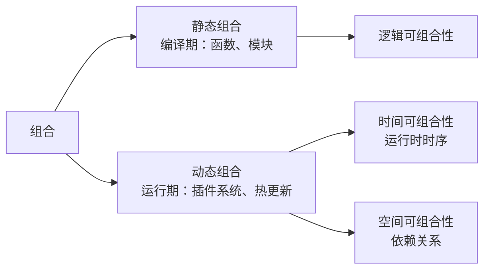
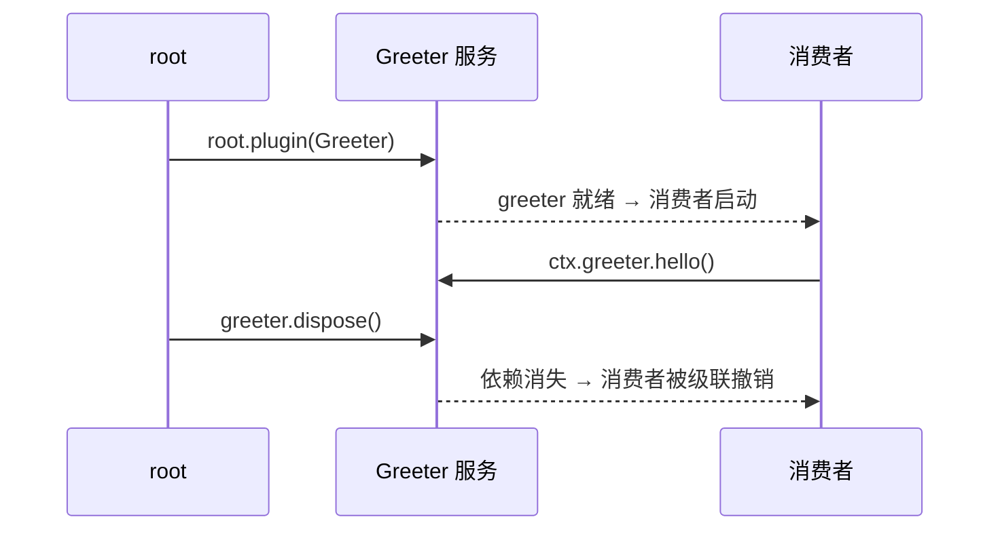

import { Canvas, Controls, Meta } from '@storybook/addon-docs/blocks';
import * as IntroStories from './intro.stories';

<Meta of={IntroStories} name="Docs" />

# 认识 cordis

cordis 是 [cordiverse](https://github.com/cordiverse) 开源的元框架（meta-framework），官方口号是 **A Meta-Framework of Spatiotemporal Composibility**——时空可组合的元框架。它不提供组件、路由或数据库，而是提供一块「把功能做成可装载、可拆卸、可互相依赖的插件」的底座：用它搭出自己的应用框架，或给现有系统装上一个完全可逆的插件系统。本课建立三个直觉：cordis 的定位与 Koishi 渊源、「时空可组合性」两个维度各自解决什么问题、官方 monorepo 里每个包管什么。后续课程里的每个机制，都可以放回这两条坐标轴上定位。

cordis 处理的是**动态组合**——图中右半边的两个维度：



| 维度 | 回答的问题 | 核心机制 | 论文术语 |
| --- | --- | --- | --- |
| 时间可组合性 | 插件销毁时，它产生的副作用能否被完全撤销？ | `ctx.effect()` 注册可逆副作用，销毁时自动执行撤销 | revertible effects（可逆效应） |
| 空间可组合性 | 插件之间如何声明依赖？生命周期由谁决定？ | `Service` 提供服务，`inject` 声明依赖 | reactive coeffects（反应式协效应） |

## 定位：元框架

「元框架」按字面理解：构建框架的框架。React、Express 这类框架提供写应用的具体能力——渲染、路由、中间件；cordis 提供的是组织这些能力的运行时规则——插件如何注册、副作用如何回收、依赖如何解析。HTTP 服务器、数据库、Web UI 在 cordis 的世界观里都不是核心，而是挂在核心上的插件或独立包（官方 `http`、`server`、`database`、`webui` 仓库即是例证）。

核心包刻意保持极小：`cordis` 的运行时依赖只有 `cosmokit`（工具函数）和 `@standard-schema/spec`（校验规范类型），没有 Node 专有依赖，浏览器与 Node 同构运行——本课下面的 Canvas 实例，就是在浏览器里直接 `import { Context } from 'cordis'` 跑起来的。

核心的公开模块对应后续「核心概念」各课：`context`（上下文）、`registry`（插件注册表）、`fiber`（插件运行时载体）、`events`（事件）、`service`（服务）、`reflect`（服务解析）、`logger`（日志）、`utils`。

### Koishi 渊源

Koishi 是跨平台聊天机器人框架，其 4.x 的 `@koishijs/core` 直接依赖 `cordis@^3`——Koishi 插件开发者熟悉的 Context、服务、`inject` 都来自 cordis。cordis 4.0 是完全重写线：插件运行时载体从 3.x 的 Scope 体系（`EffectScope` / `ForkScope` / `MainScope`）换成 `Fiber`，事件与注册表同步重写。本手册以 4.0 为主线，与 3.x 的差异只在必要处注明；如果你写过 Koishi 插件，可以理解为「概念同源、实现全新」。

## 时空可组合性

官方设计文档从「组合」出发：编程的本质是组合。静态组合发生在编译期（函数、模块），只考验逻辑可组合性；动态组合发生在运行期（插件系统、热更新），引入两个新的评价维度——**时间**（能否灵活、安全地控制组合的运行时时序）与**空间**（能否灵活、安全地管理组合的依赖关系）。论文进一步把两者形式化为 revertible effects 与 reactive coeffects，并统一进单一的 context type；形式化细节在路线 6.1「论文导读」展开。

两个维度各有著名的反例（来自官方哲学文档）：VSCode 的扩展有 `deactivate` 钩子，但卸载或更新扩展常常仍要重启编辑器——开发者必须手动把每个 `Disposable` 存进 `context.subscriptions`，忘了一个就泄漏，这是时间维不可逆；Webpack 高度插件化，但插件的启动顺序与依赖关系成为复杂度瓶颈，这是空间维无法表达依赖。cordis 的解法概括成三句话：**副作用都处于插件中、依赖通过服务声明、生命周期仅由依赖决定。**

### 时间：副作用可撤销

插件不自己调用 `setInterval`、`addEventListener` 然后记着回头清理，而是通过 `ctx` 上的 API 注册副作用并交出撤销函数（disposer）。框架把 disposer 挂在插件自己的运行时载体上，销毁插件时自动执行——副作用「注册即托管」。演示插件的最小形态：

```ts
import type { Context } from 'cordis';

function demoPlugin(ctx: Context) {
  ctx.on('ping', () => { /* 响应事件 */ });   // 监听器：销毁时自动移除
  ctx.effect(() => {                          // 副作用：注册时执行
    const timer = setInterval(heartbeat, 1000);
    return () => clearInterval(timer);        // 撤销函数：销毁时自动执行
  });
}
```

注意两处都没有保存返回的清理函数——清理是框架的事。下面的实例把这套代码放进了浏览器：插件注册了一个每秒跳动的心跳定时器和一个 `ping` 事件监听器，用开关体验完整的注册-销毁往返。

<Canvas of={IntroStories.PluginLifecycle} />
<Controls of={IntroStories.PluginLifecycle} />

| 读者操作 | 可观察证据 |
| --- | --- |
| 等待 | 「心跳次数」每秒 +1——定时器副作用在运行 |
| 点击画布 | 「已响应 ping」+1——事件监听器在工作 |
| 关闭「注册插件」 | 状态变「已销毁」，「活动副作用」归零、心跳停止 |
| 已销毁时点击画布 | 「已响应 ping」不再增长——监听器已被自动撤销 |
| 重新打开「注册插件」 | 三个计数从当前值恢复变化——行为完全恢复 |

销毁插件只调用了一次 `fiber.dispose()`：副作用撤销、监听器移除都由框架完成。「能装上」不稀奇，「拆下来不留痕迹」才是 cordis 在时间维上卖的东西。`ctx.effect()` 接受同步、异步和可迭代的撤销函数等细节，在 3.1「可逆副作用」和 2.5「生命周期」展开。

### 空间：依赖可组合

设计文档把「不完全插件化」归为空间维的失败：只有外围功能下放插件、核心功能硬编码，且插件之间无法表达依赖。cordis 的机制是：每个能力是一个**具名服务**，消费者用 `inject` 声明「我需要哪些服务」；框架保证依赖就绪前消费者不启动、依赖消失时消费者被级联撤销——生命周期由依赖图决定，而不是启动顺序。

最小算例（Node 与浏览器皆可运行，输出已按 cordis 4.0.0-rc.8 核对）：

```ts
import { Context, Service } from 'cordis';

class Greeter extends Service {
  constructor(ctx: Context) {
    super(ctx, 'greeter');            // 声明提供名为 greeter 的服务
  }
  hello(name: string) {
    return `hello ${name}`;
  }
}

const root = new Context();
const greeter = await root.plugin(Greeter);  // 注册服务提供者

// 声明依赖：greeter 就绪后消费者才启动
await root.inject(['greeter'], (ctx) => {
  console.log(ctx.greeter.hello('cordis'));
  return ctx.effect(() => () => console.log('消费者已撤销'));
});

await greeter.dispose();                    // 销毁服务
console.log('root.greeter =', root.greeter);
```

输出：

```text
hello cordis
消费者已撤销
root.greeter = undefined
```

三行输出各说明一件事：消费者拿到的是就绪后的依赖；服务销毁时消费者被自动撤销（我们从未手写它的清理代码）；服务名从上下文上消失。整个生命周期像下面这样随依赖变化：



服务的声明合并、`static inject`、隔离（isolate）等机制在 2.3「服务」与 2.4「依赖注入」展开。

## 官方生态

[cordiverse/cordis](https://github.com/cordiverse/cordis) monorepo 里除核心外还有 8 个官方包，覆盖从脚手架到运行时插件的常见工程需求：

| 目录 | npm 包 | 职责 |
| --- | --- | --- |
| packages/core | `cordis` | 核心框架：Context、插件注册、effect、事件、服务、Fiber |
| packages/create | `create-cordis` | 脚手架：`npm init cordis` 生成可运行模板 |
| packages/loader | `@cordisjs/plugin-loader` | 配置驱动的插件组装与配置调和（reconciliation） |
| packages/hmr | `@cordisjs/plugin-hmr` | 原生 Node.js 下的 CJS/ESM 热重载，保存即生效 |
| packages/include | `@cordisjs/plugin-include` | 把插件清单外置为 JSON/YAML 文件，支持补丁 |
| packages/group | `@cordisjs/plugin-group` | 插件分组：一组插件配置统一启停 |
| packages/timer | `@cordisjs/plugin-timer` | 定时器服务：`ctx.timeout` / `interval` / `throttle` / `debounce` |
| packages/logger-console | `@cordisjs/plugin-logger-console` | 日志的终端导出器 |
| packages/utils | `@cordisjs/utils` | 可撤销数据结构等工具，如 `List` |

两个交叉事实帮助理解包之间的关系：

- `cordis` 核心把 loader 与 include 声明为**可选 peer 依赖**——装上就获得配置驱动的组装能力，不装它就是一个纯库。
- 官方插件自己也建立在时间可组合性上：`@cordisjs/plugin-timer` 的 `ctx.timeout()` 内部就是包了一层 `ctx.effect()`，定时器随插件销毁自动清除。

组织下另有文档仓库 `docs`、论文仓库 `paper`、应用模板 `boilerplate` 以及 `webui`、`http`、`server` 等独立仓库，分别在参考资料和路线 5.x 各课出现。

版本状态：本手册主线是 4.0.0-rc.8（npm dist-tag `latest` 当前即指向它）；核心 README 明确声明 API 尚不稳定、可能随时变化。因此手册内所有 API 以安装版本的类型与源码为准，官方文档仅作交叉参考。

## 常见问题

- 跟着 Koishi 或旧资料写 `new App()`，在 cordis 4 里找不到 `App` 导出。
  `App` 不是 cordis 核心的导出——无论 3.x 还是 4.0，cordis 本体的根对象都是 `new Context()`；`App` 是 Koishi 在 cordis 之上定义的应用类（`@koishijs/core`）。4.0 中「应用」的组装（读配置、起入口）由 `@cordisjs/plugin-loader` 与脚手架承担，见 1.2「安装与运行」。

## 总结回顾

摘要：

cordis 是把运行期组合做成一等能力的元框架：核心只定义组合规则（插件、副作用、依赖），HTTP、数据库等具体能力全部下放为插件。能力地图沿两个正交维度展开——时间维上，副作用通过 `ctx.effect()` 注册即托管，插件销毁时自动撤销；空间维上，能力以具名服务提供，消费者用 `inject` 声明依赖，生命周期由依赖图决定。官方 monorepo 用 9 个包覆盖核心与脚手架、加载、热重载、定时器等工程需求；Koishi 4.x 基于 cordis 3.x，4.0 是概念同源的完全重写线，当前处于 rc 阶段。

一句话：

> cordis 把「运行期组合」做成一等能力：时间维上副作用注册即托管、销毁即撤销；空间维上依赖声明决定插件的生命周期。

知识要点：

- cordis 的「元框架」定位是什么？与 React、Express 这类应用框架差在哪？
- 「时空可组合性」的两个维度分别回答什么问题？
- 插件销毁后，`ctx.effect()` 注册的副作用和 `ctx.on()` 注册的监听器会发生什么？
- 消费者插件什么时候启动？它依赖的服务销毁时又会怎样？
- 官方 monorepo 的 9 个包各自负责什么？
- cordis 4.0 与 Koishi 是什么关系？当前版本的稳定程度如何？

## 参考资料

- [cordiverse/cordis 仓库](https://github.com/cordiverse/cordis)：monorepo 源码与各包 `package.json`（本文包名、职责与版本的事实来源）
- [packages/core README](https://github.com/cordiverse/cordis/tree/master/packages/core)：定位口号、API 未稳定声明与论文入口
- [官方设计文档：时空可组合性](https://github.com/cordiverse/docs/blob/main/zh-CN/design/composibility.md)：静态/动态组合的划分与两个维度的定义
- [官方文档哲学篇](https://github.com/cordiverse/docs/blob/main/zh-CN/guide/philosophy/index.md)：资源回收的退化与可逆插件系统
- [cordiverse/paper 论文仓库](https://github.com/cordiverse/paper)：《A Programming Paradigm for Spatiotemporal Composibility》摘要
- [npm：cordis](https://www.npmjs.com/package/cordis)：版本记录与 dist-tag 状态
