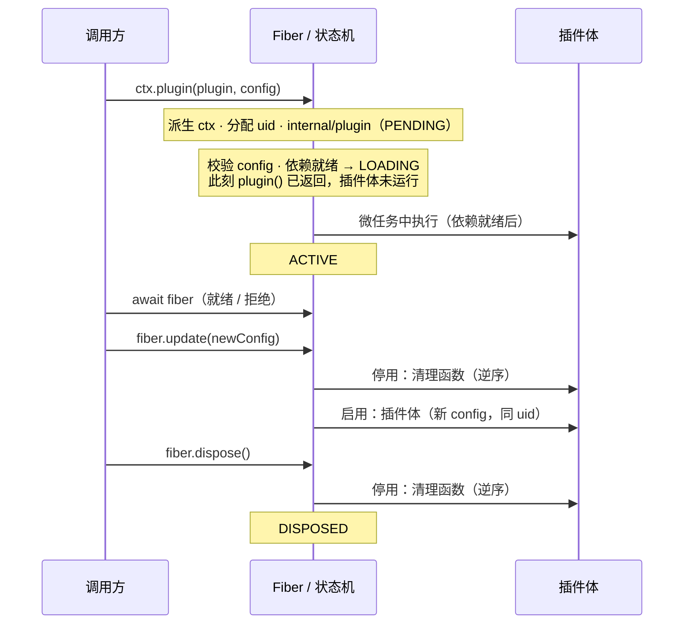

import { Canvas, Controls, Meta } from '@storybook/addon-docs/blocks';
import * as LifecycleStories from './lifecycle.stories';

<Meta of={LifecycleStories} name="Docs" />

# 生命周期

生命周期回答一个问题：**一个插件实例从注册到销毁，每一步发生在什么时刻、我能写什么代码响应它。**cordis 里这件事由 Fiber 状态机驱动：注册后插件体总在微任务里、依赖就绪后才运行；一切重载（配置更新、依赖变化）都是「先整段撤销、再整段重跑」，实例（uid）不变；销毁就是撤销之后不再重跑。插件能写的时机钩子只有插件体和清理函数两面，调用方用 `await fiber` 对齐时机，观察者用 `internal/*` 事件旁观全程。

本课所有断言均按安装版本 cordis 4.0.0-rc.8 的源码逐一核对，关键时序在 Node 与浏览器实测；官方 fiber.md 有三处描述与该版本源码不一致，正文已逐处注明。相邻主题的边界：注册表 API 与多实例语义见[插件](?path=/docs/plugins--docs)，上下文树与作用域见[上下文](?path=/docs/context--docs)，`inject` 声明与依赖语义见[依赖注入](?path=/docs/dependency-injection--docs)，`ctx.effect` 的完整形态见[可逆副作用](?path=/docs/effects--docs)，HMR 工作流见[分组与热重载](?path=/docs/group-and-hmr--docs)。



| 时机 | 此刻的状态 / 行为 | 回查要点 |
| --- | --- | --- |
| `ctx.plugin()` 返回时 | LOADING（依赖未就绪则 PENDING） | 插件体尚未运行——一切启用动作都隔一个微任务 |
| 插件体执行 | LOADING | 体内读 `ctx.fiber.state` 得到 1 而不是 2；异步插件体完成前不进 ACTIVE |
| `await fiber` | 到达非惰性状态 | ACTIVE 解决；依赖未就绪的 PENDING 也立即解决；FAILED 以原错误拒绝 |
| 清理函数执行 | UNLOADING | 逆序**启动**；同一 `ctx.effect` 内串行，跨 effect 并发等待 |
| `internal/plugin` | 注册时 PENDING；移除时 uid 已为 null | 移除事件发出时 `state` 仍是旧值 |
| `internal/status` | 每次状态迁移 | 第二个参数是旧状态，可完整还原序列 |
| FAILED | 仅启用阶段出错会进入 | 停用阶段出错只记日志；FAILED 实例仍可 dispose，也可经 `update` 复活 |

## 快速上手

把一个带钩子的插件走完「注册 → 更新 → 销毁」，用日志数组看到完整时序（Node.js ≥ 20 或浏览器控制台，输出按 4.0.0-rc.8 实测）：

```ts
import { Context } from 'cordis';

const root = new Context();
const order: string[] = [];

// 箭头函数插件：插件体返回的函数才会被收集为清理函数（见 2.1）
const watched = (ctx: Context) => {
  order.push(`插件体运行（state=${ctx.fiber.state}）`);
  ctx.effect(() => () => order.push('ctx.effect 的清理'));
  return () => order.push('插件体返回的清理');
};

const fiber = root.plugin(watched); // 返回时插件体尚未运行
await fiber;                        // 等到 ACTIVE
fiber.update({});                   // 同一实例整段重启（uid 不变）
await fiber;
await fiber.dispose();

console.log(order.join('\n'));
```

```text
插件体运行（state=LOADING）
插件体返回的清理      ← 重载的停用段：后收集的先执行（LIFO）
ctx.effect 的清理
插件体运行（state=LOADING）   ← 重载的启用段：插件体重跑，config 为新值
插件体返回的清理      ← 销毁的停用段
ctx.effect 的清理
```

这六行输出就是本课的全部主线：**启用 / 停用两个钩子面，加上「停用 → 启用」的往返**。

## 加载时序

`ctx.plugin(plugin, config)` 从调用到 ACTIVE，按源码顺序经过这些步骤：

1. **解析与运行时**：`registry.resolve()` 解析出 callback，首次注册时建立 Runtime（读取 `name` 与 `Config`；`inject` 在创建每个实例时解析，细节见 2.1）。
2. **构造 Fiber（同步）**：分配不复用的 `uid`；用 `parent.extend({ fiber })` 派生插件专属上下文（见 2.2）；发出 `internal/plugin`（此刻 state 还是 PENDING）；逐个检查 `inject` 依赖是否就绪；最后把**整个插件生命周期作为一个 effect 挂到父 fiber 上**（源码中的 label 就是 `'ctx.plugin()'`）——这就是销毁会级联的来源。
3. **effect 立即执行（父作用域存活时同步）**：实例压入 `runtime.fibers`；`resolveConfig` 用 `Config` schema 校验并规范化 config（无 schema 时原样透传）；计算依赖 epoch。
4. **进入 LOADING**：依赖就绪（或本就无依赖）时状态变为 LOADING——`plugin()` 就在这里返回，**此刻插件体一次都没运行**。
5. **微任务边界**：源码里 `_reload` 的第一步是 `await Promise.resolve()`——即使插件全是同步代码，插件体也在微任务中执行；`function` 声明走 `new` 调用并执行 `[Service.init]`，箭头函数直接调用（见 2.1 / 2.3）。
6. **进入 ACTIVE**：插件体同步返回（或其返回的 Promise 完成）、清理函数收集完毕后，状态迁移到 ACTIVE。

由此得到三个容易踩的时刻事实（均实测）：

- **不 `await` 就继续，副作用还不存在。** `plugin()` 返回与插件体运行之间隔着一个微任务——注册后立即访问插件提供的服务，拿到的是 `undefined`。
- **插件体里读 `ctx.fiber.state` 是 LOADING（1），不是 ACTIVE（2）。** 判断「自己已启用」不要依赖 state，注册进来的副作用本身就说明你在启用段。
- **schema 校验失败走特殊路径。** 有 `Config` 的插件传入不合法 config 时，`await fiber` 以 `ValidationError` 拒绝，但 `fiber.state` **停留在 PENDING**（源码中该分支只记录 `_error`，不触发状态迁移），实例留在注册表里、可以正常 dispose。这是「校验失败 ≠ 启用失败」的差异，故障排查时以 `await fiber` 的拒绝为准。

### 等待依赖

声明了 `inject` 的插件在依赖未就绪时停在 PENDING：插件体不运行，但 `await fiber` **立即解决**（它只等非惰性状态，PENDING 也是非惰性）。依赖就绪与失效驱动插件在 PENDING 与 ACTIVE 之间往返（实测状态序列）：

```text
服务上线：  PENDING → LOADING → ACTIVE
服务下线：  ACTIVE → UNLOADING → PENDING（清理函数在 UNLOADING 期间执行）
服务回归：  PENDING → LOADING → ACTIVE（uid 与 config 全程不变——还是同一个实例）
```

触发方是服务的 `provide` / 撤销：框架遍历注册表，对所有注入了该服务的实例重新计算依赖并刷新。`inject` 的声明语法、就绪条件与「用依赖表达加载顺序」见[依赖注入](?path=/docs/dependency-injection--docs)，本课只借用它的时序结论。

## 时机钩子

rc.8 的核心**没有** `onReady` / `onDispose` 这类独立钩子 API（Koishi 时代的习惯在这里不适用）。一切时机落在四个面上：

| 钩子 | 写法 | 触发时机 |
| --- | --- | --- |
| 插件体 | `(ctx, config) => {…}` | 每次启用段：注册后的首次加载，以及每次重载的重新加载 |
| 清理函数 | 插件体 return 的函数、`ctx.effect` 返回的撤销函数 | 每次停用段：重载的撤销与销毁共用同一套 |
| `await fiber` / `fiber.await()` | 调用方 | 到达非惰性状态；FAILED 以原错误拒绝 |
| `ctx.on('internal/update', …)` | 插件内 | 本实例的 `update` waterfall：`this` 是 fiber，参数 `(config, noSave, next)`，须调用 `next()` 才会落地并重启 |
| `ctx.on('internal/plugin' / 'internal/status', …)` | 观察者 | 注册与移除、每次状态迁移（`internal/status` 的第二参数是旧状态） |
| `[Service.init]` | 类插件实例 | `new` 之后、ACTIVE 之前的异步初始化（见[服务](?path=/docs/services--docs)） |

`ctx.inject(deps, callback)` 是「带依赖声明的临时插件」的语法糖，它的 callback 就是一个插件体，走完全相同的生命周期（见 2.4）。

「插件体 + 清理函数」是成对的启停面：重载时先整段撤销再整段重跑，所以**清理函数不止在销毁时执行**——它同样服务于配置更新。观察者侧的最小写法：

```ts
const root = new Context();

root.on('internal/plugin', (fiber) => {
  console.log(fiber.uid === null ? `移除 ${fiber.name}` : `注册 ${fiber.name}#${fiber.uid}`);
});
root.on('internal/status', (fiber, old) => {
  console.log(`${fiber.name}：${old} -> ${fiber.state}`);
});
```

插件内拦截自己的配置更新（实测输出见注释）：

```ts
const hooked = (ctx: Context) => {
  ctx.on('internal/update', function (config, noSave, next) {
    console.log('更新前钩子', config, noSave); // { n: 2 } false；this === ctx.fiber
    next(); // 不调用 next()：config 不落地、插件体不重跑（实测 runs=1、config 保持旧值）
  });
};
```

下面的实例把这些钩子全部接上日志，放进浏览器。插件 `watched` 带一个插件体、两种来源的清理函数与一个心跳定时器；读数与日志直接来自真实的状态机与内部事件。

<Canvas of={LifecycleStories.Timeline} />
<Controls of={LifecycleStories.Timeline} />

| 读者操作 | 可观察证据 |
| --- | --- |
| 等待初始加载 | 日志依序出现 `internal/plugin：实例注册（uid=1）` → `PENDING → LOADING` → `插件体运行 config={interval:1000}（state=LOADING）` → `心跳定时器启动` → `LOADING → ACTIVE` → `await fiber 就绪`；「心跳次数」按间隔增长 |
| 拖动「心跳间隔」 | `fiber.update({interval:…})` → `ACTIVE → UNLOADING` → 两个清理函数逆序运行（插件体返回的清理先于心跳撤销）→ `UNLOADING → LOADING` → 插件体以新 interval 运行 → `ACTIVE`；uid 读数不变、「插件体运行」+1——同一实例整段重启 |
| 只开「插件体抛错」 | 触发一次 `fiber.update`（interval 未变——同 config 也重启的证据）→ `ACTIVE → UNLOADING` → 清理逆序运行 → `UNLOADING → LOADING` → 插件体运行、心跳定时器启动、随即抛错 → `LOADING → UNLOADING`（本轮已收集的心跳定时器被回收）→ `UNLOADING → FAILED` → `await fiber 拒绝：演示错误`；uid 保留 |
| 关闭「插件体抛错」并再改一次间隔 | `FAILED → LOADING → ACTIVE`：`update` 清除了错误状态，实例以同 uid 复活 |
| 关闭「加载插件」 | `internal/plugin：实例移除（uid=null）`（此时 state 尚未变）→ `ACTIVE → UNLOADING` → 清理逆序运行 → `UNLOADING → DISPOSED` → `await dispose 完成`；uid 读数变为 `null` |
| 在 FAILED 状态关闭「加载插件」 | 销毁照常完成（uid 置 null、注册表清空），但**不再出现 UNLOADING**——失败路径已回收过副作用，最终状态停在 FAILED |
| 重新打开「加载插件」 | 全流程以新的 uid 重新走一遍 |
| 打开 Show code | 看到该 Canvas 实际执行的 `plugin-timeline.ts` |

## 重载

`fiber.update(config)` 的语义是「同一实例的整段重启」，实测时序：

```text
ACTIVE → UNLOADING（清理函数逆序执行）→ LOADING（插件体以新 config 重跑）→ ACTIVE
```

关键判断：

- **不是新实例。** uid、runtime、父 fiber、专属上下文全部不变；变的只有 config 与「插件体重跑了一遍」。需要「新实例」时先 `await fiber.dispose()` 再注册（2.1 的多实例语义）。
- **rc.8 核心没有同值跳过。** 传入与旧值相同的 config 也照样重启（实测：同 config `update` 后插件体运行次数 +1）。官方 fiber.md 写「默认 deepEqual 检查，可经 internal/update 控制」——本地 4.0.0-rc.8 源码中没有这个检查，以源码为准，升级时复核。
- **更新先过 waterfall。** `update` 在内部以 `internal/update` 事件走一遍瀑布流（`this` 为 fiber），插件可用上一节的钩子介入；不调用 `next()` 则配置不落地、不重启。`noSave` 参数由核心原样转发：loader 在这个钩子里决定是否把变更写回配置文件，`noSave` 为 true 时跳过回写（见[加载器](?path=/docs/loader--docs)）。

触发整段重启的途径一共三种：

| 途径 | 写法 | 说明 |
| --- | --- | --- |
| 配置更新 | `fiber.update(config)` | 先校验（schema 失败同步抛 `ValidationError`），再重启 |
| 显式重启 | `fiber.restart()` | 官方标注实验性；等效「先停用再启用」，不动 config |
| 依赖变化 | 框架自动 | 服务上下线驱动 PENDING ↔ ACTIVE 往返（见「等待依赖」） |

**惰性状态（LOADING / UNLOADING）**是重载时序里最不直观的部分：官方文档称它们为 inert state——处于其中一个方向时，反向迁移会推迟到下一个非惰性状态再执行，或者被直接丢弃。实测两例：

- 过渡期连续两次 `update`：合并为一次重启，插件体以**最后一次** config 运行。
- LOADING 进行中再 `update`：新 config 已写入 `fiber.config`，但这一轮加载不会重启（反向迁移被丢弃）——插件体实际用的是旧 config。

结论：不要在重载过渡期依赖中间态；连续变更以最后一次为准，需要确定性时先 `await fiber` 再继续。

## 销毁时序

`await fiber.dispose()` 的时序视角（注册表视角的四步分解见 2.1）：

1. 发出 `internal/plugin`——此刻 `uid` 已置 `null`，但 `state` 还是 ACTIVE（事件先于状态迁移，观察日志里能看到这个窗口）；
2. 从 `runtime.fibers` 摘除实例，最后一个实例离开时连同运行时移除；
3. 进入 UNLOADING：**全部清理函数执行**；
4. 进入 DISPOSED，`await dispose` 返回。

清理函数的执行顺序值得单独记（实测）：

- **逆序启动**：后注册的先执行（LIFO）——「插件体返回的清理」在「先注册的 `ctx.effect` 清理」之前；
- **同一 effect 内串行**：一次 `ctx.effect` 返回多个清理函数（数组 / 迭代器）时逐个逆序执行，前一个完成才轮到下一个；
- **跨 effect 并发等待**：不同 effect 注册的异步清理同时启动、并发等待（实测两个异步清理：B 先启动、A 后启动，B 先完成）。

三处边界：

- **停用阶段抛错不会 FAILED。** 清理函数抛出的错误被捕获后只进 `ctx.logger.error`（默认写内存缓冲，见 1.2），状态照常迁移到 DISPOSED，其他清理照常执行。官方 fiber.md 写「停用出错进入 FAILED」——与 rc.8 源码不符，以源码为准。
- **级联销毁的顺序**：子插件的整个生命周期是父实例 effect 列表里的一项，所以父插件自己的清理先执行，子插件的销毁在其后完成（2.1 实测 `parent-off → child-off`）。
- **根 fiber 例外**：`root.fiber.dispose()` 回收全部副作用、清空注册表但不进 DISPOSED，等效回到 `new Context()`（见 2.2）。

## 失败路径

启用阶段（LOADING）抛错是进入 FAILED 的唯一途径，实测完整序列：

```text
LOADING → UNLOADING（已收集的副作用先回收）→ FAILED
```

FAILED 之后的事实清单（全部实测）：

- `await fiber` 以**原错误**拒绝；错误同时经 `ctx.logger.error` 记录。
- **实例不消失**：uid 保留、仍在注册表里、专属上下文还在，`fiber.dispose()` 正常工作（清理早已在失败路径回收过，所以不再出现 UNLOADING；dispose 后 `state` 停留在 FAILED 而非 DISPOSED——该路径的状态迁移被吸收，判断存活看 uid 是否为 null）。
- **FAILED 不是终局**：`fiber.update(config)` 会先清除 `_error` 再重启，修复后的插件以同 uid 复活（实测 `FAILED → LOADING → ACTIVE`）。官方 fiber.md 称 FAILED「无法恢复」——与 rc.8 源码不符，以源码为准。
- **更新一个重启会失败的实例，会产生一条未观察的 Promise 拒绝。** rc.8 的 `update()` 类型标注为 `void`、实际也不返回内部重启链；启用失败时那条链无人观察（实测 Node 触发 `unhandledRejection`，浏览器控制台出现未处理拒绝）。事后 `await fiber` 并 try/catch 只能捕获自己的拒绝，拦不到它——进程层需要挂 `unhandledRejection` 兜底，也尽量不要对明知会失败的插件调 `update`。
- schema 校验失败是另一条路径：`await fiber` 以 `ValidationError` 拒绝，但状态停留在 PENDING（见「加载时序」）。

## 最佳实践

- **调用方对齐时机用 `await`。** 注册后要立刻使用插件能力就 `const fiber = await ctx.plugin(...)`；长生命周期回调里使用前检查 `fiber.state === 2`（或捕获使用处的异常）。不 await 就继续是「注册了但没启用」的主要来源。
- **跨重载的状态不要放在插件体闭包里。** 重载会整段重跑插件体，闭包变量随之重建。需要跨重载保留的计数器、缓存、连接池放在模块作用域，或沉淀为服务（2.3）。
- **顺序敏感的清理合并进单个 `ctx.effect`。** 同一 effect 内的多个清理保证串行 LIFO；跨 effect 只有「启动顺序」保证，异步清理会并发。清理函数自身不要抛错（抛了只留日志）。
- **过渡期不要连环 `update`。** 惰性状态会合并或丢弃过渡期的变更，最后一次生效；需要确定性时 `await fiber` 后再更新。
- **FAILED 的两种出路。** 捕获 `await` 的拒绝后按场景二选一：`await fiber.dispose()` 移除实例，或修正输入后 `fiber.update(config)` 原地重试。

## 常见问题

- 注册插件后立刻访问它提供的服务或副作用，拿到 `undefined` 或「没生效」。
  `ctx.plugin()` 返回时插件体还没运行（隔一个微任务），副作用尚不存在。`await fiber` 之后再访问；依赖注入场景改用 `inject` 声明等待（2.4）。
- `fiber.update()` 之后插件里的计数器、缓存「丢了」。
  重载是整段重启：插件体重跑、闭包重建，这是设计行为而非 bug。跨重载要保留的状态外移到模块作用域或服务。
- 清理函数里抛了错，但外面既没有异常、状态也没变 FAILED。
  停用阶段的错误被捕获后只写入日志（默认在内存缓冲里，控制台看不到），不影响其他清理与状态迁移。清理逻辑自身保证健壮；排查时给 logger 挂输出（1.2）。
- `internal/plugin` 事件里读到 `state` 是 ACTIVE，dispose 之后读到 `state` 还是 FAILED，与预期对不上。
  事件触发点与状态字段的更新点不同步：移除事件发出时迁移尚未发生；FAILED 实例的销毁不产生新迁移。判断实例存活用 `fiber.uid === null`，还原时序用 `internal/status` 的旧值参数。
- 同样的 config 调 `update`，插件好像也重启了？
  rc.8 核心对相同配置同样整段重启（源码无 deepEqual 检查；官方 fiber.md 的描述对应其他版本线）。不希望重启就别调 `update`；依赖「同值跳过」前先在目标版本上复核。
- 对启用会失败的插件调 `fiber.update()`，进程出现 unhandledRejection，但代码里找不到抛出点。
  rc.8 的 `update()` 返回 `void`，内部经 `internal/update` 触发的重启链在启用失败时无人观察，拒绝只能到达进程层。给进程挂 `unhandledRejection` 处理器兜底；对本课实例，开启「插件体抛错」后的那次更新在 DevTools 里也能看到同款未处理拒绝。

## 总结回顾

摘要：

插件实例的生命周期由 Fiber 状态机驱动：注册在同步段完成 uid 分配、上下文派生与依赖检查，`plugin()` 返回于 LOADING 而插件体在微任务中才运行，启用完成才进 ACTIVE。时机钩子只有插件体与清理函数两个成对面，调用方用 `await fiber` 等到非惰性状态，观察者用 `internal/plugin` 与 `internal/status` 还原全程，插件还可用 `internal/update` 介入自己的更新。重载（update / restart / 依赖变化）都是同一实例「先整段撤销、再整段重跑」，uid 不变；惰性状态会合并或丢弃过渡期的反向迁移。销毁在 UNLOADING 中逆序启动全部清理（同 effect 串行、跨 effect 并发）后进入 DISPOSED；只有启用阶段出错才进 FAILED，FAILED 实例仍可销毁，也能经 `update` 复活。

一句话：

> 插件生命周期是「插件体 / 清理函数」两个钩子面加上一条状态机时序：重载是同实例的整段往返，`await fiber` 是调用方对齐时机的唯一手段。

知识要点：

- `ctx.plugin()` 返回时插件处于什么状态？插件体什么时候才运行？
- 插件体内读 `ctx.fiber.state` 会得到什么？为什么？
- `await fiber` 在哪些状态下解决、什么时候拒绝？依赖未就绪时的行为是什么？
- 一个插件实例能写哪些时机钩子？`internal/update` 钩子的参数是什么、不调 `next()` 会怎样？
- `fiber.update()` 的完整状态序列是什么？uid、运行时、闭包分别会发生什么？
- 哪三种途径会触发整段重启？惰性状态如何处理过渡期的变更？
- 销毁时清理函数按什么顺序执行？同一 effect 内与跨 effect 有何差别？停用抛错会怎样？
- FAILED 如何进入、能否恢复？schema 校验失败与启用失败有什么差别？

## 参考资料

- [官方文档：生命周期](https://github.com/cordiverse/docs/blob/main/zh-CN/guide/advanced/lifecycle.md)——状态机表与惰性状态（inert state）语义
- [官方 API 参考：Fiber](https://github.com/cordiverse/docs/blob/main/zh-CN/api/core/fiber.md)——`fiber.effect` / `update` / `restart` / `dispose` / `then` 的文档语义（三处与 rc.8 源码不一致处正文已注明）
- [cordis 源码：packages/core](https://github.com/cordiverse/cordis/tree/master/packages/core)——`fiber.ts` / `registry.ts` / `events.ts`（本课按本地安装的 4.0.0-rc.8 逐项核对并实测）
