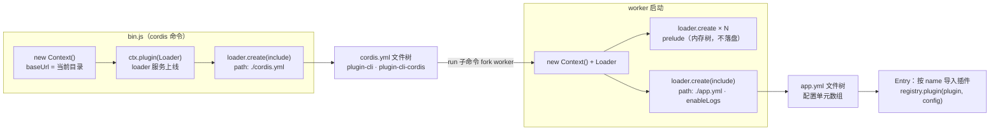
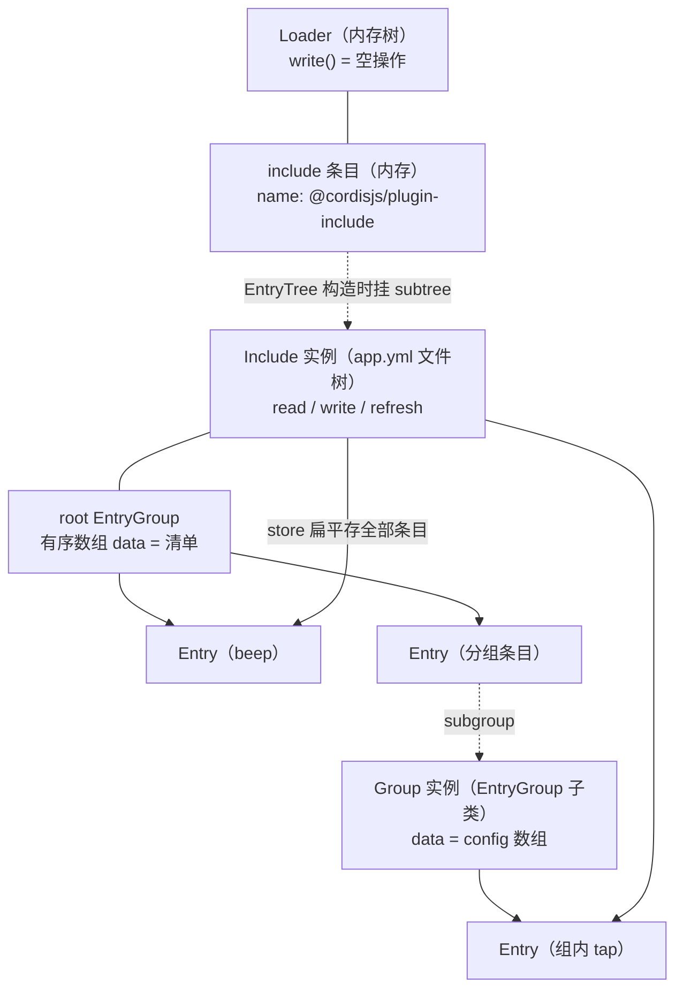
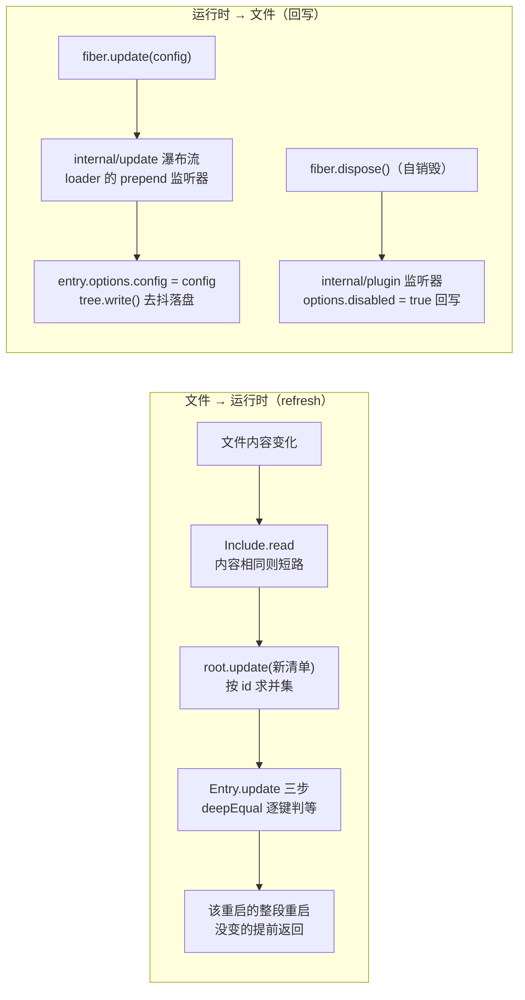

import { Canvas, Controls, Meta } from '@storybook/addon-docs/blocks';
import * as LoaderStories from './loader.stories';

<Meta of={LoaderStories} name="Docs" />

# 加载器

[工程组织](?path=/docs/project-structure--docs)说过：应用是配置驱动的运行壳，`app.yml` 里写什么就跑什么。本课讲这个承诺的执行者——loader。它是一个普通插件（npm 包 `@cordisjs/plugin-loader`，注册后提供 `ctx.loader` 服务），职责只有一句话：**把配置文件变成插件实例的清单，并在文件与运行时之间保持双向同步**。读取时，清单里的每个配置单元按 `name` 导入成插件、按 `id` 记住身份；此后两个方向都有通道——文件变了，loader 按 `id` 对新旧清单做差集、用 deepEqual 逐键判等，只动变化的部分（该重启的整段重启，没变的连碰都不碰）；插件自己改了配置，loader 又会把新值回写进配置文件。本课所有断言按 cordis 4.0.0-rc.8 + `@cordisjs/plugin-loader` 1.0.0-rc.5（master，与 npm 发布版一致）的源码逐一核对，关键行为在 Node 24 实测；官方 loader 文档章节目前多为占位或 3.x 旧口径（正文逐处注明），以源码与实测为准。



配置单元（`EntryOptions`）是贯穿全课的数据形态，先给速查表：

| 字段 | 类型 / 默认值 | 回查要点 |
| --- | --- | --- |
| `name` | `string`，必需 | 插件来源：npm 包名、包的子路径导出、相对 `baseUrl` 的路径（见「name」小节） |
| `id` | `string` / 随机 8 位 hex | 调和的身份键：新旧清单按它对得上号；缺省时生成，首次写回时持久化 |
| `config` | 任意 | 插件配置，注册时走 [2.6](?path=/docs/config--docs) 的校验链；分组条目下是子条目数组；值支持 `!!js` 表达式 |
| `disabled` | `boolean` / `false` | 禁用：条目保留在清单里，fiber 销毁；祖先禁用会级联到后代 |
| `group` | `boolean` | 标记分组条目（配合 `@cordisjs/plugin-group`）；分组自身恒视为启用 |
| `label` | `string` | 显示名（供 [5.3](?path=/docs/official-plugins--docs) 的 webui 控制台展示），不参与运行时行为 |
| `inject` | `object` | 条目级追加依赖声明，作用于该条目下的 fiber |
| `isolate` | `Dict<true \| string>` | 服务隔离：`true` 为条目本地，字符串为全局标签（见「隔离与拦截」） |
| `intercept` | `object` | 服务拦截配置，沿祖先条目链以原型链合并（见「隔离与拦截」） |

## 快速上手

最小闭环：一个应用目录、一份清单、一个本地插件，用 `bin.js` 同款的引导把它拉起来（Node ≥ 20；需安装 `cordis`、`@cordisjs/plugin-loader`、`@cordisjs/plugin-include`——loader 是 cordis 的 optional peer，不会随核心自动安装）。文件布局：

```text
boot.mjs                  # 引导脚本（在 my-app 的上级目录运行）
my-app/
├── app.yml               # 插件清单
└── plugins/
    └── beep.mjs          # 本地插件，apply 里打一行日志
```

```yaml title=app.yml
- name: ./plugins/beep.mjs   # 相对路径引用本地插件
  config:
    interval: 300
```

```js title=plugins/beep.mjs
let runs = 0
export default (ctx, config) => {
  console.log(`beep 启动 uid=${ctx.fiber.uid} config=${JSON.stringify(config)}`)
  if (++runs === 1) {
    // 演示：100ms 后自改一次配置（只会触发一次，避免循环）
    setTimeout(() => ctx.fiber.update({ interval: 700 }), 100)
  }
}
```

引导脚本（`node boot.mjs`，这就是 `bin.js` 去掉命令行外壳后的全部）：

```ts
import { Context } from 'cordis'
import { pathToFileURL } from 'node:url'
import Loader from '@cordisjs/plugin-loader'

const root = new Context()
root.baseUrl = pathToFileURL(process.cwd() + '/my-app/').href

await root.plugin(Loader)                  // ① loader 作为一个普通插件上线，ctx.loader 可用
await root.loader.create({                 // ② 在 loader 的内存树里创建一个 include 条目
  name: '@cordisjs/plugin-include',
  config: { path: './app.yml' },           //    include 是「文件树」插件：负责读写 YAML
})
await root.loader.await()                  // ③ 等整棵树的条目全部就位
```

实测输出（cordis 4.0.0-rc.8 + loader 1.0.0-rc.5，`node boot.mjs` 后等一秒）：

```text
beep 启动 uid=4 config={"interval":300}
beep 启动 uid=4 config={"interval":700}      ← 自更新后：同一实例整段重启（uid 不变）
```

再看 `app.yml`——它已经被 loader 回写成带 `id` 的新样子（实测）：

```yaml title=app.yml（插件自更新后被 loader 回写）
- id: a6d5f6f1
  name: ./plugins/beep.mjs
  config:
    interval: 700
```

读、组装、调和、回写——这四件事就是本课的全部主线。下面按「引导链路 → 配置单元 → 树与分组 → 运行期调和 → loader 服务」展开。

## 引导链路

`cordis` 命令来自核心包的 `bin.js`，rc.8 全文如下（shebang 与空行略去；[1.3](?path=/docs/project-structure--docs)讲过命令链路，这里看 loader 视角）：

```ts title=cordis/bin.js（4.0.0-rc.8 全文）
import { Context } from 'cordis'
import { pathToFileURL } from 'node:url'
import Loader from '@cordisjs/plugin-loader'

const ctx = new Context()
ctx.baseUrl = pathToFileURL(process.cwd()).href + '/'

await ctx.plugin(Loader)          // loader 上线：一个普通插件，提供 ctx.loader 服务
await ctx.loader.create({
  name: '@cordisjs/plugin-include',
  config: {
    path: './cordis.yml',         // 引导配置交给文件树插件 include 读取
  },
})
```

两件事值得停一下：**loader 自己就是一个插件**（`ctx.plugin(Loader)`，Service 子类，服务名 `'loader'`）——yakumo 用同一套形态管构建是 cordiverse 的统一做法（1.3）；**bin.js 不解析任何子命令**，它只负责把 `cordis.yml` 这棵树立起来。`cordis.yml` 里的 `plugin-cli-cordis` 拿到 `config.path`（`./app.yml`）后，由它的 `run` 子命令拉起真正的应用进程（直接模式同进程、守护模式 fork worker），worker 的启动函数（`@cordisjs/plugin-cli-cordis/src/worker/index.ts` 节选）：

```ts
export async function start(config: Config) {
  const ctx = new Context()
  ctx.baseUrl = config.baseUrl
  if (config.daemon.enabled) {
    await ctx.plugin(daemon, config.daemon)
  }
  await ctx.plugin(Loader)
  for (const plugin of config.prelude ?? []) {
    await ctx.loader.create(plugin)        // prelude（env、logger-console）：内存树条目
  }
  await ctx.loader.create({
    name: '@cordisjs/plugin-include',
    config: {
      path: config.path,                   // ./app.yml：真正的应用清单
      enableLogs: true,                    // 只有这棵树输出 apply/reload 日志
    },
  })
}
```

### 两份配置与内存树

同一条 `loader.create → include` 链路被用了三次，产生了三棵不同性质的树：

| 树 | 创建方式 | 写回目标 | 日志 |
| --- | --- | --- | --- |
| Loader 自身的树 | `ctx.plugin(Loader)` | 无——`Loader.write()` 是空操作，根树纯内存 | 无 |
| prelude 条目 | worker 里 `loader.create(plugin)` | 落在 Loader 内存树 | 无 |
| `cordis.yml` / `app.yml` | `loader.create(include, { path })` | 磁盘上的 YAML 文件（include 的 `write()`） | 仅 `app.yml` 树（`enableLogs: true`） |

这解释了两个日常现象：`cordis.yml` 通常不带 `id`——它是手写的引导清单，里面的插件（plugin-cli、plugin-cli-cordis）不自改配置，因此从不触发回写去补 id；而控制台那句 `apply plugin @cordisjs/plugin-timer` 只在 worker 加载 `app.yml` 时出现——`showLog` 只对 `enableLogs` 的树生效（嵌套子树会继承该标记）。include 只接受 `.yml` / `.yaml` / `.json` 三种扩展名，文件不可写（`access W_OK` 失败）时整棵树变为只读；其他格式在构造时直接抛错——官方文档里「JS 配置只读」「`--immutable`」是 3.x 旧口径，当前源码里没有这些分支。

## 配置单元

清单的最顶层是数组，每个元素是一个配置单元。它先被读成普通对象（`EntryOptions`），再由 loader 为每个单元派生一个 `Entry`——条目是配置单元的运行时形态：持有 `options`（清单里那份数据）、专属上下文 `ctx`（挂上 `Symbol.for('cordis.entry')` 标记）和加载成功后的 `fiber`。三个关键字段各有一小节。

### id

`id` 是调和的身份键：新旧清单按它配对，配不上的就是新建或销毁。源码只有几行（`EntryTree.ensureId`）：

```ts
ensureId(options: Partial<EntryOptions>) {
  if (!options.id) {
    do {
      options.id = Math.random().toString(16).slice(2, 10)
    } while (this.store[options.id])
  }
  return options.id!
}
```

- **缺省会生成**：读取清单时每个无 `id` 的单元在内存里立即补一个 8 位随机 hex；首次发生任何写回时随整份清单落盘（快速上手里看到的回写就是这样）。手写清单可以不写 `id`，但跨重启的身份稳定性依赖落盘后的它。
- **完整 id 是树链**：条目对自己的 `options.id` 之外还有一个带路径的完整 id——`Entry.id` getter 在条目属于某棵子树时拼接 `父条目id:自身id`。实测（`app.yml` 挂在 include 条目 `516beb13` 下）：

```text
options.id=c319f543  完整 id=516beb13:c319f543
locate(fiber) = 516beb13:c319f543     ← loader.locate 从任意 fiber 沿上下文向上找到所属条目
```

  这套 `:` 链是跨树寻址的语法：`loader.resolve('516beb13:c319f543')` 逐段走进子树；每棵树的 `store` 内部仍以不带前缀的 `options.id` 为键。
- **同插件多实例靠它区分**：清单里两份 `name` 相同、`id` 不同的单元就是两个独立实例（实测第二份配置生成了新 fiber），这正是一个插件可被多次加载的配置面入口（[2.1](?path=/docs/plugins--docs)）。

### name

`name` 回答「插件从哪来」。当前源码支持三种形态（`EntryTree.import`）：

```yaml title=app.yml
- id: b1
  name: '@cordisjs/plugin-timer'          # ① npm 包名：走 Node 模块解析
- id: b2
  name: 'my-plugin/src/index.ts'          # ② 包的子路径导出：开发期直连 TS 源码（需 tsx，见 1.3）
- id: b3
  name: './plugins/beep.mjs'              # ③ 相对路径：以条目所在树的 baseUrl 解析成 URL 再导入
```

导入的分流逻辑（节选）：`cordis:` 前缀的名字查 `loader.builtins`（内置插件预留位，当前生态没有填充者，官方文档里的 `loader:group` 写法属旧口径）；有 Node 内部模块加载器（22+ 经 `--expose-internals`，worker 自动附加）时走它并以 `ctx.baseUrl` 为父 URL——这是 HMR 能接管模块缓存的前提（[5.2](?path=/docs/group-and-hmr--docs)）；否则 `'.'` 开头的按 URL 解析、裸包名直接 `import()`。拿到模块后过一道 `unwrapExports`：取 `exports.default ?? exports` 并按 `__esModule` 再解一层——所以 CJS 与 esbuild 产物都能直接作为插件载体。

导入失败不会炸应用：错误交给 `ctx.logger.error`，条目停留在「有 options、无 fiber」的状态（默认日志在内存缓冲里，控制台看不到，排查时先挂 logger 输出，[1.2](?path=/docs/getting-started--docs)）；下次配置调和该条目仍会被重试。导入成功后走注册：

```ts
this.fiber = this.ctx.registry.plugin(plugin, this._resolveConfig(plugin), this.getOuterStack)
```

第三个参数 `getOuterStack` 按条目生成外层栈帧（`at 树的 baseUrl#条目id`，嵌套条目逐级向上），把错误定位回清单里的条目——这是配置驱动应用里「报错来自哪个单元」的线索来源。

### config

`config` 是插件的配置，注册时原样进入 [2.6](?path=/docs/config--docs) 的校验链（`registry.plugin(plugin, config)` → schema → `fiber.config`）。两个 loader 特有的加工：

**表达式插值。** YAML 里可以写 JavaScript 表达式，include 读文件时把 `!!js` 标签的值标成 `{ __jsExpr }`，注册前由 `interpolate` 递归求值——求值环境就是条目上下文（`with (ctx) eval(expr)`）。实测：

```yaml title=app.yml
- name: ./plugins/beep.mjs
  config:
    interval: !!js "2 * 150"      # 表达式
    origin: !!js "baseUrl"        # ctx 上的属性可直接引用
```

```text
beep 启动 config={"interval":300,"origin":"file:///…/my-app/"}
```

**分组的 config 是子清单。** 分组条目（`name: '@cordisjs/plugin-group'`）的 `config` 是配置单元数组，注册时原样使用（`_resolveConfig` 对分组键的插件直接返回 `options.config`，不走插值），由分组机制展开成子条目——见下一节。

## 树与分组

把前面的零散事实拼成对象模型（`config/` 目录下的四个类）：



- **`EntryTree`** 是「一棵配置树」的抽象：`store` 扁平存放树内全部条目（含组内子条目，键为 `options.id`）、`entries()` 深度优先枚举、`await()` 等待全部任务落定。它有两个实现：**`Loader`** 的根树（`write()` 空操作，纯内存）和 **`Include`**（文件背书：`read` 带「文件内容未变则跳过」的短路，`write` 发出 `loader/config-update` 事件、去抖后经「写 `.tmp` 再 rename」原子落盘）。在某个条目的上下文里构造 `EntryTree` 时，它会自动挂成该条目的 `subtree`——include 挂在内存条目下、嵌套 include 挂在外层条目下，`:` 链由此而来。
- **`EntryGroup`** 是「树中一个有序分组」：`data` 就是有序的配置单元数组（顶层是树的 root group，分组条目各带一个）。调和入口 `update(config)` 在「运行期调和」一节展开。
- **`Entry`** 是单个配置单元的运行时：构造时从 `loader.ctx` 派生专属上下文；`_patchContext` 在每次调和时把条目上下文的原型重挂到当前父级上下文（`Object.setPrototypeOf(this.ctx, this.parent.ctx)`）——条目被移动分组时，其下全部插件的作用域跟随迁移。

### 分组条目

分组是清单的一等公民：boilerplate 的 `app.yml` 用它组织 Database、SSO、WebUI、Development 四个区块。机制上，`@cordisjs/plugin-group` 只是 loader 导出的 `Group` 类的重导出（`Group extends EntryGroup`），作为插件注册后，它把 `config` 数组当作子清单调和，自己就是一个 `EntryGroup`（挂为条目的 `subgroup`）。分组相关的运行事实（均按源码与测试核实）：

- **分组自身恒视为启用**：`Entry.disabled` 对 `group` 条目直接返回 `false`——给分组加 `disabled` 不会销毁分组自己的 fiber，但后代条目沿祖先链判定时读的是原始 `options.disabled` 字段，所以**子条目会全部级联销毁**，复活同理（实测见「调和决策」实例）。
- **子条目的调和入口是分组条目自己的 `fiber.update`**：`Group` 构造时监听 `internal/update`，把自己的新 `config` 数组交给 `EntryGroup.update` 展开成对子条目的增删改。分组条目在 `_patchContext` 里恒走 `fiber.update`（`diff.includes('config') || this.options.group`），所以子清单任何变化都能触发。
- **条目可以在分组间移动**：`loader.update(id, options, parent)` 会把条目从源分组摘下、插入目标分组并触发两端写回；`EntryTree.update` 的 `parent` 传 `null` 表示移到**调用者这棵树**的顶层（在 loader 上调用就是内存树——想让条目留在文件里，要在对应的 include 树上调用）。
- 分组的实践用法（`label` 组织区块、Development 分组挂 HMR、include 的 `initial` / `patches` 等文件树配置）归[分组与热重载](?path=/docs/group-and-hmr--docs)。

## 运行期调和

配置和运行时是同一份事实的两个投影，调和就是让它们重新对齐。两个方向各有一条通道：



### 文件到运行时

谁来调 `refresh()`？真实应用里是 HMR 插件 watching `app.yml`（`root` 配置包含它，[5.2](?path=/docs/group-and-hmr--docs)）；手动场景直接拿 include 实例调用。核心算法在 `EntryGroup.update`（新清单与旧清单按 `id` 建映射、取并集，两边都有的走 `create` 即 `Entry.update`，只在旧清单的走 `remove`）加 `Entry.update` 的三步（源码节选）：

```ts
async update(options: Partial<EntryOptions>, create = false, force = false) {
  const legacy = { ...this.options }

  // step 1: 更新 options（create 替换；合并时 null/undefined 删除该键）+ sortKeys 规整键序
  ...
  // step 2: 禁用处置——disabled 时销毁 fiber 后直接返回
  if (this.disabled) {
    this.fiber?.dispose()
    return
  }
  // step 3: diff 判等——逐键 deepEqual，无变化且未强制则提前返回
  if (this.fiber?.uid) {
    const diff = Object
      .keys({ ...this.options, ...legacy })
      .filter(key => !deepEqual(this.options[key], legacy[key]))
    if (!diff.length && !force) return
    this.context.emit('loader/partial-dispose', this, legacy, true)
    this._patchContext(diff)
  } else {
    await this.init()   // 此前没有 fiber（新建 / 复活）：导入插件并注册
  }
}
```

实测一次完整的 refresh（编辑 `app.yml`：组内 `tick` 的 `times` 2→5、顶层 `beep` 加 `disabled: true`，然后调用 `include.refresh()`）：

```text
---- 编辑前运行的条目 ----
    [beep apply] uid=4 config={"interval":300}
    [tick apply] uid=6 config={"times":2}
---- refresh() 之后 ----
    [beep cleanup]                    ← disabled：step 2 销毁，条目保留在清单
    [tick cleanup]                    ← times 变化：diff = ["config"]
    [tick apply] uid=6 config={"times":5}   ← 同一实例整段重启（uid 不变，2.5 的时序）
    （app.yml 文件本身不被重写）
```

三条判读：只有 `config` 变了的条目重启（uid 不变，先撤销再重跑，完整时序见[生命周期](?path=/docs/lifecycle--docs)）；`disabled` 走的是「销毁」而不是「重启」；纯读取不产生任何写回。

### 运行时到文件

插件侧的变更沿 `internal/update` 瀑布流（[2.5](?path=/docs/lifecycle--docs)：插件可以在这个瀑布上拦截自己的更新）到达 loader。Loader 构造时注册了一个 `prepend: true` 的全局监听器（源码节选）：

```ts
ctx.on('internal/update', function (config, noSave, next) {
  if (!this.entry || noSave || this.parent.fiber?.entry === this.entry) return next()
  const unparse = this.runtime?.Config?.['simplify']
  this.entry.options.config = unparse ? unparse(config) : config
  this.entry.parent.tree.write()
  return next()
}, { global: true, prepend: true })
```

三个跳过条件就是回写的边界：更新的 fiber 不属于任何条目（普通 `ctx.plugin` 注册的插件，loader 不管）；显式传了 `noSave`；更新者是**同一条目内部的子插件**（`parent.fiber` 的条目与自己相同）——子插件不是配置单元，它的配置不落盘（实测：插件体内 `ctx.plugin(...)` 注册的子插件 `fiber.update` 后文件无变化）。落盘前有一道可选还原：schema 上带 `simplify` 方法时先用它把（可能被校验收敛过的）`fiber.config` 还原成适合序列化的形态。

自销毁的回写走另一个监听器：插件调 `ctx.fiber.dispose()` 时，`internal/plugin` 事件里 loader 通过六个 case 过滤（排除新建、非条目 fiber、条目内子插件、loader 发起的移除、树整体销毁），确认是「插件自己不想跑了」就把 `options.disabled = true` 写进条目并落盘。实测两种回写（组内条目自更新 / 自销毁后，`app.yml` 的变化）：

```text
[tick cleanup] → [tick apply] uid=6 config={"times":9}
  config: { times: 9 }               ← fiber.update({times: 9}) 回写进了嵌套清单

[tick cleanup]                        ← fiber.dispose()
  disabled: true                      ← 条目没被删除，而是标记禁用后落盘
```

`noSave` 的分工由此清楚：`fiber.update(config, true)` 只改运行时（实测 `interval: 900` 生效、文件停在 `700`），演示性变更、外部系统已经持久化的变更用它；要让变更随清单存活就默认走回写。写回总是整份清单序列化（键序被 `sortKeys` 规整为 `id, name` 在前、`config` 最后、其余按键名字母序——`label` 落在 `name` 之后、`disabled` 之前），去抖合并同一tick 内的多次写回，落盘走 `.tmp` + rename 原子替换。

### 判等

[2.6](?path=/docs/config--docs)留了一个伏笔：官方 fiber.md 说 `fiber.update` 默认 deepEqual 判等，但 rc.8 核心源码里没有。位置现在可以钉死：**判等在 loader 层**——就是上面 `Entry.update` step 3 的 `deepEqual`（来自 cosmokit，loader 的同源依赖）。两层分工：核心的 `fiber.update` 给什么重启什么（同值也重启，2.5 实测）；loader 在决定**要不要调用** `fiber.update` 之前先用 deepEqual 比较新旧 `options`，没变就提前返回——「同值跳过」是 loader 给配置文件场景加的优化。diff 的去向还有一个不直观的分支：只有 `diff` 含 `config`（或分组条目）才触发 `fiber.update`——**同 id 换 `name` 只更新条目记录，运行中的插件不变**（实测：换名后插件体不再执行、fiber 的 runtime 仍是旧插件），要真正换插件得删除条目再新增（或重启进程）。

下面的实例把这套决策算法放进浏览器：固定一份当前清单，勾选任意变更组合，逐条目查看处置与依据。

<Canvas of={LoaderStories.Board} />
<Controls of={LoaderStories.Board} />

| 读者操作 | 可观察证据 |
| --- | --- |
| 只勾「echo 改 config」 | echo 的徽章为「重启」，依据行显示 `diff = ["config"]`；分组与 hop「保持」（未变化的分组不展开子条目） |
| 只勾「echo 同值重写」 | 所有条目「保持」——等值新对象被 deepEqual 判等挡下，插件不动 |
| 只勾「echo 换 name」 | echo 徽章为「只记录」，依据 `diff = ["name"]`：不含 config → 运行中的插件不变 |
| 只勾「禁用分组」 | 分组条目「调和子条目」（自身 fiber 存活），组内 tap、qux 沿祖先链级联「销毁」 |
| 只勾「复活 hop」 | hop 徽章为「重建」：无 fiber → `init()` 重新导入（新 uid），与「重启」区分 |
| 勾「组内 tap 改 config」 | 分组「调和子条目」+ tap「重启」+ qux「保持」——子条目调和的入口是分组自身的 `fiber.update` |
| 组合勾选「删除组内 qux」与「新增 flip」 | qux「销毁」（按 id 移除）、flip「新建」（新 id）；读数统计各处置数量 |
| 打开 Show code | 看到该 Canvas 实际执行的 `reconcile-board.ts`（判定算法与 loader 源码逐分支对应） |

实例说明：浏览器里跑不了文件读写与模块导入（那部分的真实行为以上文 Node 实测为准），实例展示的是决策算法本身——`deepEqual` 直接来自 cosmokit（loader 的同源依赖），`Entry.update` / `EntryGroup.update` / 祖先级联的分支逻辑按源码等价移植。一个值得留意的细节：分组自身没变化时画布不会展开它的子条目——源码里组的 diff 为空就不调 `fiber.update`，子条目连被触碰的机会都没有。

## loader 服务

`ctx.loader` 是 loader 暴露的全部公共面（类型上由 `@cordisjs/plugin-loader` 的声明合并补进 `Context`）。按用途分组：

| 成员 | 签名 / 值 | 回查要点 |
| --- | --- | --- |
| `create(options, parent?, position?)` | `Promise<string>` | 新增条目并立即加载，返回完整 id；`parent` 为目标分组的 id（跨树用完整 id），省略则落在当前树顶层 |
| `update(id, options, parent?, position?)` | `Promise<void>` | 更新条目（强制走一次 `Entry.update`）；`parent` 不为 `undefined` 时同时移动分组 |
| `remove(id)` | `void` | 移除条目并写回——**对含 `:` 的完整 id 静默无操作**（见常见问题） |
| `resolve(id)` / `resolveGroup(id)` | `Entry` / `EntryGroup` | 按 `:` 链跨树解析；`resolveGroup(null)` 返回本树 root |
| `entries()` | `Generator<Entry>` | 深度优先枚举整棵树（含子树与组内条目） |
| `await()` | `Promise<void>` | 等全部条目的 init / 惰性任务落定（引导脚本第 ③ 步） |
| `locate(fiber?)` | `string \| undefined` | 从 fiber 沿上下文向上找到所属条目的完整 id |
| `envData` | `object` | 跨进程共享数据：daemon 场景经 `CORDIS_SHARED` 环境变量继承（如 `startTime` 跨重启保留） |
| `builtins` | `Dict` | `cordis:` 前缀名字的解析表，当前无填充者（预留） |
| `unwrapExports(exports)` | `any` | default 解包逻辑，自定义加载器复用 |
| `write()` / `exit()` | 空方法 | 根树不落盘；`exit` 是 HMR 判定框架文件变化时的重启钩子，当前为空实现 |

事件面（均由 loader 发出，可在外部插件里监听）：`loader/config-update`（某棵文件树落盘后）、`loader/entry-init`（条目构造，isolate 用它给条目上下文建隔离层）、`loader/partial-dispose`（条目调和的撤销段，`(entry, legacy, active)`）、`loader/patch-context`（条目上下文原型重挂的瀑布，`(entry, next)`）。

两个与服务语义相关的机制：

- **`await` 拦截**：loader 的服务检查（`[Service.check]`）在 `intercept: { loader: { await: true } }` 时返回「未就绪」，于是一个 `inject: ['loader']` 的插件会停在 PENDING，直到整棵树没有进行中的任务——「等全部插件就绪再启动」的配置面表达。
- **`ctx.loader` 的读取时机**：loader 本身经 `ctx.reflect.provide('loader', this)` 提供，注入语义（何时可见、影子上下文）就是 [2.3](?path=/docs/services--docs)的服务模型。

### 隔离与拦截

`isolate` 与 `intercept` 是配置单元上两个作用于服务模型的字段，完整机制较深，这里给到回查级语义（源码 `config/isolate.ts`；深入服务本身见[服务](?path=/docs/services--docs)与[依赖注入](?path=/docs/dependency-injection--docs)）：

- **`isolate: { 服务名: true | '标签' }`**——服务隔离。同一个服务名可以被隔离成多个符号域：`true` 是条目本地域（后缀 `#条目id`，该条目独享一份实例），字符串是全局域（后缀 `@标签`，同标签的条目共享）。典型场景：两个数据类插件都注入 `database`，但希望它们各用一份实例。修改相关条目的 isolate 会触发受影响条目重载（服务实现或注入方任一侧变更都算，官方测试逐一覆盖）。
- **`intercept: { 服务名: 配置 }`**——服务拦截。沿祖先条目链以原型链合并（子条目的值覆盖祖先），供 inject 该服务的插件按作用域读取配置——在同一棵清单树的不同层级为同一个服务声明不同配置。上面的 `intercept: { loader: { await: true } }` 就是一例。
- **`inject: { 服务名: … }`**（条目级）——为该条目下的 fiber 追加依赖声明（与插件自身的 `inject` 合并），配合 `intercept` 使用。

## 最佳实践

- **手写清单时带上 `id`。** id 是调和的身份键：有它，改配置就是原地重启；没它，身份要等首次写回才稳定。让 loader 生成也可以，但首次落盘前避免依赖跨重启的条目身份。
- **长驻能力走清单，一次性组装用 `ctx.plugin`。** 清单条目享有调和、回写、控制台管理；一次性组装的插件不受 loader 管理（无条目、不回写），两者不要混用同一个插件实例。
- **会改自身配置的插件，想清楚回写语义。** 默认回写是特性也是约束：配置文件必须可写、schema 收敛过的值要能序列化（必要时提供 `simplify`）；演示性变更显式传 `noSave: true`。
- **组是作用域也是开关。** 禁用一个分组等于批量下线子条目（级联销毁、条目保留），比逐个禁用子条目更符合清单的读法；移动条目到分组会迁移其作用域，确认没有依赖祖先拦截配置的逻辑后再动。
- **改 `name` 不是换插件。** 同 id 换 name 只改记录（实测）；要换插件用「删除条目 + 新增条目」表达。

## 常见问题

- 改了 `app.yml`，运行中的应用没有反应。
  文件变化不会自己触发调和：正常开发由 HMR 插件监听 `app.yml`（其 `root` 配置需包含该文件，见[5.2](?path=/docs/group-and-hmr--docs)）；没有 HMR 时需要拿到对应 include 实例调用 `refresh()`。另外确认文件确实变了——`read` 按文件内容短路，内容相同不会重新调和。
- 插件里改了配置，配置文件没有被更新。
  依次检查：是否传了 `noSave`；更新的 fiber 是否属于某个条目（普通 `ctx.plugin` 注册的不回写）；是否是条目内部的子插件在更新（不回写）；配置文件是否只读（`access W_OK` 失败时整棵树静默变为只读）。
- 同一个条目改了 `name`，跑起来的还是旧插件。
  当前实现里 diff 不含 `config` 就不调用 `fiber.update`，name-only 变更只更新条目记录（实测行为）。用「删除条目再新增」或重启进程来真正换插件。
- `loader.remove(id)` 调了但条目还在。
  传了带 `:` 的完整 id 时，`resolve` 能找到条目，但内部 `EntryGroup.remove` 用完整 id 查 `store`（键是不带前缀的 `options.id`）落空，静默返回（实测）。正确姿势：在条目**所在的树**上（`entry.subtree` 即 include 实例，或经 `loader.resolve` 拿到条目后用其 `parent.tree`）以 `options.id` 调用 remove。
- 配置文件被「重新排版」了。
  正常写回行为：`sortKeys` 把键序规整为 `id`、`name` 在前，其余按键名字母序，`config` 段总在最后；缺省的 `id` 也在此时补上。序列化只在写回时发生，纯读取不动文件。
- 控制台看不到插件加载日志。
  `apply plugin …` / `reload plugin …` 日志只对 `enableLogs` 的树输出（worker 加载 `app.yml` 的那棵），且分组条目本身不打日志；引导阶段与 prelude 是静默的。
- 报错堆栈里带有 `…#c319f543` 这样的帧，是什么。
  loader 注册条目插件时传入的 `getOuterStack` 生成的外层栈帧：按「树的 `baseUrl` + 条目 `id`」拼出定位行，嵌套条目逐级向上，用来回答「这份错误来自清单里的哪个单元」。

## 总结回顾

摘要：

loader 是把「应用 = 配置文件」落地的插件：`ctx.plugin(Loader)` 后经 `loader.create(include)` 建起文件树，`cordis.yml` 与 `app.yml` 就是这条链路的两棵（worker 里 app.yml 带 `enableLogs`），prelude 与 include 条目本身活在 Loader 的内存树。清单的每个配置单元成为一个 `Entry`：`name` 决定插件来源（包名 / 子路径 / 相对路径，失败只记日志、条目无 fiber），`id` 是调和的身份键（缺省生成、首次写回落盘，完整 id 以 `:` 连接子树链），`config` 走 2.6 的校验链并支持 `!!js` 表达式插值；分组条目（`@cordisjs/plugin-group`）以 `config` 数组展开子清单，自身恒启用、禁用时级联销毁子条目。运行期双向调和：文件方向由 `refresh` 触发，按 id 求并集后 `Entry.update` 三步处置（禁用销毁、deepEqual 逐键判等、无 diff 提前返回，含 config 才整段重启，name-only 只记录）；插件方向的 `fiber.update` 经 `internal/update` 的 prepend 监听器回写（`noSave` 与子插件不回写），自销毁回写为 `disabled: true`。判等的 deepEqual 在 loader 层而非核心。`ctx.loader` 提供 create / update / remove / resolve / entries / await / locate 等管理面，`isolate` / `intercept` 把服务隔离与作用域配置带进清单。

一句话：

> 配置文件是插件实例的清单：loader 按 name 把单元变成插件、按 id 记住身份，文件与运行时靠「id 差集 + deepEqual 判等」与「internal/update 回写」双向对齐。

知识要点：

- `cordis` 命令按下之后，`cordis.yml` 和 `app.yml` 分别是怎么被读进来的？内存树和文件树差在哪？
- 一个配置单元有哪些字段？`id`、`name`、`config` 各自的语义与缺省行为是什么？
- `name` 的三种写法分别解析到哪里？导入失败会怎样？
- 完整 id 的 `:` 链是怎么来的？`locate` / `resolve` / `store` 分别用什么形式的 id？
- 文件变更后的调和里，哪些条目会重启、哪些销毁、哪些保持？判等发生在哪一层？
- 插件自改配置何时回写文件？哪三种情况明确不回写？自销毁在清单里留下什么？
- 同 id 换 name 会发生什么？正确的换插件方式是什么？
- 分组条目的禁用语义和普通条目有何不同？子条目怎么感知祖先禁用？
- `ctx.loader` 的常用管理 API 有哪些？`remove` 对嵌套 id 的行为是什么？
- `isolate` 与 `intercept` 分别解决什么问题？`intercept: { loader: { await: true } }` 有什么用？

## 参考资料

- [cordis 源码：packages/loader](https://github.com/cordiverse/cordis/tree/master/packages/loader)——本课主依据：`src/index.ts`（Loader 服务与回写监听器）、`src/config/entry.ts`（Entry.update 与 deepEqual 判等）、`src/config/tree.ts`（EntryTree / import / ensureId）、`src/config/group.ts`（Group）、`src/config/isolate.ts`（隔离与拦截），按 1.0.0-rc.5 与本地实测核对
- [cordis 源码：packages/include](https://github.com/cordiverse/cordis/tree/master/packages/include)——文件树插件：read 短路、`!!js` 标签、去抖原子写回（1.0.4）
- [cordis 源码：packages/core/bin.js](https://github.com/cordiverse/cordis/blob/master/packages/core/bin.js)——引导入口全文（本地安装 4.0.0-rc.8 核对）
- [cordiverse/cli 仓库（@cordisjs/plugin-cli-cordis）](https://github.com/cordiverse/cli)——`run` 命令、daemon worker 与 `start()` 启动函数（1.0.5）
- [官方指南：配置文件（starter/config）](https://github.com/cordiverse/docs/blob/main/zh-CN/guide/starter/config.md)——配置单元字段表（`label` 等）；「JS 配置只读 / --immutable」部分为旧口径
- [官方指南：加载器目录](https://github.com/cordiverse/docs/blob/main/zh-CN/guide/loader/index.md)——`index.md` 为空占位，`group.md` 使用 `loader:group` 旧名，`service.md`（隔离与拦截）与 `hmr.md` 内容简略，均以源码为准
- [npm：@cordisjs/plugin-loader](https://www.npmjs.com/package/@cordisjs/plugin-loader)——版本线与 peer 约束（cordis ^4.0.0-rc.8，optional peer 不随核心安装）
- [cordiverse/boilerplate app.yml](https://github.com/cordiverse/boilerplate/blob/master/app.yml)——真实清单样例：分组组织、`label`、`disabled` 预置项
