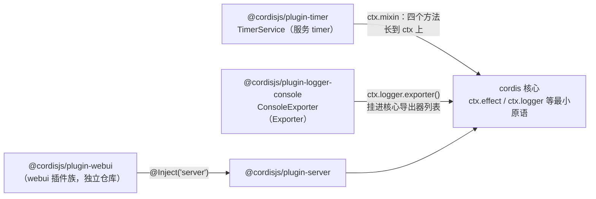

import { Canvas, Controls, Meta } from '@storybook/addon-docs/blocks';
import * as OfficialPluginsStories from './official-plugins.stories';

<Meta of={OfficialPluginsStories} name="Docs" />

# 官方插件

cordis 核心刻意保持最小：没有内置定时器、没有可见日志输出、没有管理界面——[可逆副作用](?path=/docs/effects--docs)课手写的 `ctx.effect(() => setInterval(...))` 心跳就是这种「最小」的代价。官方生态包补上这些现成能力。本课是 [认识 cordis](?path=/docs/intro--docs) 九包全景的正文速查：收编尚未展开的运行时三件套——**@cordisjs/plugin-timer**（定时器服务）、**@cordisjs/plugin-logger-console**（控制台日志导出）、**@cordisjs/plugin-webui**（网页管理界面），外加未发布的 **@cordisjs/utils**。它们展示了官方插件接入核心的三种范式：把能力**混入 ctx**、把导出器**挂进协议**、把插件族**叠在服务上**。

本课证据形态：timer 行为断言来自独立工程的 Node 实测（npm 安装 1.1.2）与下方 Canvas（浏览器运行同一源码副本）；logger-console 来自 Node 实测（1.0.0，浏览器入口为源码结论）；webui 为仓库与官方模板的元信息核对，未运行。相邻边界：loader 归[加载器](?path=/docs/loader--docs)，group / include / hmr 归[分组与热重载](?path=/docs/group-and-hmr--docs)，create-cordis / boilerplate 归[安装与运行](?path=/docs/getting-started--docs)，核心 `ctx.logger` 四个方法归各机制课。



| monorepo 包 | npm 包（版本） | 职责 | 深入入口 |
| --- | --- | --- | --- |
| core | `cordis`（4.0.0-rc.8） | 框架核心：Context、effect、事件、服务、Fiber | 2–4 章全部课程 |
| create | `create-cordis` | 脚手架：`npm init cordis` | [安装与运行](?path=/docs/getting-started--docs) |
| loader | `@cordisjs/plugin-loader`（1.0.0-rc.5） | 配置驱动的插件组装与调和 | [加载器](?path=/docs/loader--docs) |
| group | `@cordisjs/plugin-group`（1.0.0） | 一组插件整体启停 | [分组与热重载](?path=/docs/group-and-hmr--docs) |
| include | `@cordisjs/plugin-include`（1.0.4） | 清单外置为 JSON/YAML 文件 | [分组与热重载](?path=/docs/group-and-hmr--docs) |
| hmr | `@cordisjs/plugin-hmr`（1.0.15） | 插件级热重载 | [分组与热重载](?path=/docs/group-and-hmr--docs) |
| timer | `@cordisjs/plugin-timer`（1.1.2） | 定时器服务：timeout / interval / throttle / debounce | 本课 |
| logger-console | `@cordisjs/plugin-logger-console`（1.0.0） | 核心 logger 的控制台导出器 | 本课 |
| utils | `@cordisjs/utils`（未发布） | 可撤销数据结构 List | 本课 |
| （独立仓库 webui） | `@cordisjs/plugin-webui`（0.8.2） | Cordis App 的网页管理界面 | 本课 |

## 定时器 timer

**@cordisjs/plugin-timer** 是一个服务插件：`TimerService` 以 `'timer'` 为服务名注册，构造器一行 `ctx.mixin('timer', [...])` 把四个方法直接混入每个 ctx，并配套声明合并（`Context` 接口扩展出这些方法与 `timer` 属性）——这是「服务 + 混入」接入范式（模式讲解见[服务](?path=/docs/services--docs)与[TypeScript 模式](?path=/docs/ts-patterns--docs)）的标准范例。

```ts
import { Context } from 'cordis'
import TimerService from '@cordisjs/plugin-timer'

const root = new Context()
await root.plugin(TimerService)
// 或 loader 清单里一项：- name: '@cordisjs/plugin-timer'
// 官方模板 app.yml 的第一项就是它（hmr 的 peer 依赖也声明了它）
```

四个方法**全部是 `ctx.effect()` 的薄包装**（[认识 cordis](?path=/docs/intro--docs) 已预告这一点）：内部用固定 label 注册 effect——`'ctx.timeout()'`、`'ctx.interval()'`、`'ctx.throttle()'`、`'ctx.debounce()'`——因此定时器随作用域销毁自动清理，且能在 `fiber.getEffects()` 记账树里按名回查。`setTimeout` / `setInterval` 两个旧名仍可用但已标 `@deprecated`，内部直接转发到 `timeout` / `interval`。

一个实测确认的使用门槛：**插件体内消费 timer 必须声明 `inject`**——fiber 内的服务访问被运行时追踪，未声明会抛 `cannot get property "timer" without inject`；在 fiber 外（根上下文顶层、普通脚本）直接调用则不受限。

| 方法 | 重载 | 返回 | 语义 |
| --- | --- | --- | --- |
| `ctx.timeout(callback, delay)` | 回调 | disposer | 一次性延时：到点先自我撤销再执行回调 |
| `ctx.timeout(delay)` | Promise | `Promise<void>` | 可取消的延时：`await` 即等待；作用域先销毁则 reject |
| `ctx.interval(callback, delay)` | 回调 | disposer | 心跳：周期执行，调用 disposer 停止 |
| `ctx.interval(delay)` | 迭代器 | `AsyncIterableIterator<void>` | `for await` 消费：每个周期产出一项 |
| `ctx.throttle(callback, delay, noTrailing?)` | 包装 | wrapper + `.dispose` | 窗口起点立即执行 + 至多一次尾随 |
| `ctx.debounce(callback, delay)` | 包装 | wrapper + `.dispose` | 触发停止 delay 后执行一次 |

### 延时与心跳 timeout / interval

两个方法的形态由第一个参数判别：是**函数**走回调形态，拿 disposer；是**数字**走可等待形态——`timeout` 交出 Promise，`interval` 交出异步迭代器。可等待形态把「等一下」变成随作用域可撤销的语言结构：

```ts
// Promise 形态：可取消的 sleep——await ctx.timeout(500)
// 作用域销毁时 pending 的等待 reject Error('Context has been disposed')

// 迭代器形态：心跳驱动的循环，break 即撤销
ctx.effect(async function* () {
  let round = 0
  for await (const _ of ctx.timer.interval(300)) {
    round += 1
    if (round === 2) break   // break → 迭代器 return() → effect 撤销
  }
}, '迭代器消费者')
```

回调形态的细节在撤销时机上：`timeout` 到点时**先调用自身的 dispose 再执行回调**——该 effect 随即从记账树消失，所以「到点即忘」的一次时时不占撤销账目；`interval` 的 disposer 随时可调，手动停止后作用域销毁不会重复执行（幂等，见[可逆副作用](?path=/docs/effects--docs)）。

```text title=实测（Node，@cordisjs/plugin-timer 1.1.2：双形态与撤销）
+   2ms 消费者插件体运行（inject: ['timer'] 已声明）
+ 303ms interval 迭代器第 1 次产出
+ 353ms timeout(350) 的 Promise resolve
+ 404ms interval 心跳
+ 604ms timeout 回调执行
+ 604ms interval 迭代器第 2 次产出
+ 604ms interval 迭代器 break → 撤销
+ 757ms --- 手动撤销 timeout 与 interval（此后不应再有对应输出）---
+ 792ms 作用域销毁后 timeout Promise reject：Context has been disposed
```

### 节流与防抖 throttle / debounce

两个方法返回的都是「与原函数同签名的包装函数」，附带 `.dispose()`（类型 `WithDispose<F>`）——包装函数可以随意传递给事件监听等调用方，撤销时调 `.dispose()`。每次触发都会先清掉尚未执行的尾随定时器，语义差异在执行时机：

- **throttle(callback, delay, noTrailing?)**：窗口起点立即执行（leading）；窗口内的后续触发合并为**一次尾随执行**（trailing），携带**最后一次**触发的参数；`noTrailing: true` 直接丢弃尾随。适合「按固定节奏执行、又不想丢最新数据」的状态上报。
- **debounce(callback, delay)**：每次触发都重置定时器，**安静 delay 毫秒后**才执行一次。适合输入联想等「只在停下来后处理」的场景；持续高频触发（间隔小于 delay）会让它永远等不到安静——一次都不执行。

```text title=实测（Node：同一时刻连发 6 次触发，窗口 / 延迟均为 500ms）
+  54ms 连发 6 次触发 throttle 与 debounce
+  54ms throttle 执行（参数来自触发 #1）    ← leading：第一次立即执行
+ 556ms throttle 执行（参数来自触发 #6）    ← trailing：窗口结束时一次，携带最后参数
+ 556ms debounce 执行（距最后一次触发 500ms）← 连发被合并为一次
```

内部实现（`_schedule`）同样经 `ctx.effect` 记账（label 即方法名），`isDisposed` 守卫保证 `.dispose()` 之后不再排新的尾随定时器——但守卫只盖住尾随分支，leading 分支不受限（见常见问题）。

持续触发下的节奏差异（自动流每 120ms 触发，窗口 / 延迟 800ms）：

```text title=实测（Node：自动流下 throttle 按窗口执行、debounce 饿死）
+ 122ms throttle 执行（触发 #1）     ← 流的起点
+ 922ms throttle 执行（触发 #7）     ← 此后约每个窗口执行一次
+1724ms throttle 执行（触发 #14）
+2004ms 自动流关闭
+2523ms throttle 执行（触发 #16）    ← 已排定的尾随照常执行，携带最后参数
                                     ← 流持续的 2s 内 debounce 一次都没执行（被不断重置）
+2749ms debounce 执行                ← 流停止 800ms 后补执行一次
```

下面的实例把四个方法装进同一个插件（Canvas 里的 `timer-source.ts` 是该包 1.1.2 源码的逐字副本——工作区未安装该包，副本仅供浏览器运行，实际项目直接 `npm i @cordisjs/plugin-timer`）：

<Canvas of={OfficialPluginsStories.TimerLab} />
<Controls of={OfficialPluginsStories.TimerLab} />

| 读者操作 | 可观察证据 |
| --- | --- |
| 等待初始加载 | 「心跳次数」按周期 +1；约 2s 后日志出现「ctx.timeout 到点」，同时「effect 标签」里的 `ctx.timeout()` 消失（一次性 effect 自我撤销） |
| 打开「触发连发」 | ◆ throttle 执行 #1 立即出现；窗口结束时 ◆ 第二次（参数为连发最后一次）；◇ debounce 执行出现在最后一次触发的一个窗口之后 |
| 打开「自动触发流」 | 持续触发下 throttle 约每窗口 ◆ 一次、debounce 持续无 ◇（被不断重置）；关闭流后 ◇ 补执行一次——「防抖饿死」的直接证据 |
| 调整「节流窗口 / 防抖延迟」 | 日志出现「重建定时器（窗口 / 延迟变化）」，尾随与防抖的延时随之伸缩——重建用的正是 disposer 与 `.dispose` |
| 关闭「加载插件」 | 心跳停止、「effect 标签」清空；重新打开则 uid 换新、计数归零 |
| 打开 Show code | 看到该 Canvas 实际执行的 `timer-lab.ts` |

## 控制台日志 logger-console

核心的 `ctx.logger` 只有 error / info / warn / debug 四个方法，而且默认只往**内存缓冲**里记（容量 1000 条，[安装与运行](?path=/docs/getting-started--docs)已见）——要「看见」日志，需要一个导出器。**@cordisjs/plugin-logger-console**（npm 描述 "Console logger exporter for cordis"）就是官方的控制台出口。

```ts
import { Context } from 'cordis'
import ConsoleExporter from '@cordisjs/plugin-logger-console'

const root = new Context()
await root.plugin(ConsoleExporter)        // 默认导出即类；static name = 'logger-console'
root.logger('app').info('现在能在终端看到了')
```

包的入口按环境二选一（package.json `exports`）：`node` 条件走 `lib/index.js`，浏览器（`default`）走 `lib/browser.js`——两者共享同一 Config 与构造器，输出方式不同（见[输出与配置](#输出与配置)）。

### 挂接核心 logger

挂接动作只有一行，发生在构造器里：`ctx.logger.exporter(this)`。它把实例注册进 `LoggerService` 的 exporters Map，注册本身经 `ctx.effect` 记账（label `'ctx.logger.exporter()'`，[Fiber](?path=/docs/fiber--docs)课实测过）——插件卸载时自动摘除。

导出器实现的是核心定义的 **Exporter 协议**（`cordis/lib/logger.d.ts`）：

```ts
interface Exporter {
  colors?: number | false          // ANSI 色彩级别 0-3；标签色由名字哈希稳定生成
  maxLength?: number               // 单行截断长度，默认 10240
  levels?: Record<string, number>  // 级别过滤：按 logger 名或 default
  formatters?: Record<string, Formatter>  // 覆盖 %o / %O 等格式符
  export(message: Message): void   // 收到过滤后的消息
}
```

要点是 **`levels` 与 `maxLength` 由核心的 `Logger` 消费，不归导出器自己管**：分发时核心对每个导出器计算 `targetLevel = levels[name] ?? levels.default ?? logger.level ?? 2`（0/1/2/3 对应 E/W/I/D），`targetLevel < level` 就跳过该导出器——所以默认看不到 debug。每条消息会广播给**所有**导出器：核心自带的内存导出器与 logger-console 并存不悖。

```text title=实测（Node：多导出器广播与内存缓冲共存）
无导出器：buffer.length = 2（bufferSize 上限 1000）    # 只进缓冲，终端无输出
装了 logger-console：buffer.length = 2 —— 两个导出器同时收到同一条消息
```

`Message` 的形状：`{ sn, ts, name, type, level, args, fiber? }`——序号、时间戳、logger 名、级别类型、参数数组与来源 fiber 的弱引用。Error 参数的处理在核心：单个 Error 走 stack，带 `cause` 的先递归记 cause，AggregateError 逐个展开。

### 输出与配置

| 配置 | 类型 / 默认 | 作用 |
| --- | --- | --- |
| `colors` | `false \| 0-3` / `false` | 色彩级别；Node 入口默认探测 `supports-color`（非 TTY 为 0） |
| `maxLength` | number / 10240 | 单行截断，超出部分替换为 `...`（核心协议默认值） |
| `levels` | `Record<string, number>` / 未设 | 级别过滤，默认相当于 INFO（2）——`{ default: 3 }` 放行 debug，按名单独收紧 |
| `showDiff` | boolean / `false` | 行尾追加与上一条消息的时间差 `+ms` |
| `showTime` | string / `'yyyy-MM-dd hh:mm:ss '` | 时间前缀（cosmokit `Time` 模板）；空串关闭 |
| `label` | `{ width?, margin?(1), align?('left') }` | 标签列对齐；`width` 补齐短标签，长标签不截断 |

Node 入口把每条消息 render 成单行再 `console.log`。输出形态与三项配置的实测：

```text title=实测（Node：默认输出——时间在前、级别首字母、标签、内容）
2026-08-16 19:55:20 [I] app 默认输出一行：时间 [级别] 标签 内容
2026-08-16 19:55:20 [W] app warn 级别
2026-08-16 19:55:20 [E] app Error: error 级别（Error 对象走 stack）
                            at file:///tmp/cordis-official-plugins-lab/logger.mjs:12:11
                            ...（多行内容续行缩进对齐）
# 同一段里的 app.debug 没有出现：默认级别 INFO 把它过滤了

# levels: { default: 3, quiet: 1 } ——整体放行、按名收紧：
2026-08-16 19:55:20 [D] noisy noisy 的 debug 可见
2026-08-16 19:55:20 [W] quiet quiet 的 warn 可见（1 = WARN 及以上）
2026-08-16 19:55:20 [E] quiet quiet 的 error 可见
#（quiet 的 debug / info 被过滤，未出现）

# showDiff: true + showTime: 'hh:mm:ss '：
19:55:20 [I] diff 第一条（无 diff 基准前） +0ms
19:55:20 [I] diff 第二条（+300ms 左右） +302ms

# label: { width: 16, align: 'right', margin: 2 } + maxLength: 24：
           short  [I]  短标签右对齐
a-very-long-logger-name  [I]  这条消息非常长，超过 24 字符的部分会被 ma...
```

浏览器入口（`lib/browser.js`）**绕过 render**：`console[method]('[I] name', ...args)`——级别映射到 `console.error` / `warn` / `log`，参数原样交给 devtools（对象可交互展开）。因此 `levels` 这类核心分发层的配置两个入口都生效，而 `showTime` / `label` / `showDiff` / `colors` / `maxLength` 这些 render 层配置只影响 Node 入口。

取具名 logger 用 `ctx.logger('app')`；插件内不传名时默认取插件名（`hyphenate(fiber.name)`），让日志天然带上来源标签。

## 网页控制台 webui

**webui** 是 Cordis App 的网页管理界面，住在**独立仓库** [cordiverse/webui](https://github.com/cordiverse/webui)（npm 包 `@cordisjs/plugin-webui` 0.8.2——npm 描述仍写着 "Web User Interface for Koishi"，是它从 Koishi 生态抽出来的出身痕迹）。它不是一个插件而是一个**插件族**：

- 基础三包：`@cordisjs/client`（浏览器端插件框架，webui 的 peer 依赖）、`@cordisjs/components`、`@cordisjs/registry`。
- 官方插件：`plugin-database-webui`、`plugin-http-webui`、`plugin-insight`、`plugin-loader-webui`（网页上启停插件）、`plugin-logger-webui`（网页上看日志）、`plugin-market`（插件市场）、`plugin-notifier`、`plugin-server-webui`、`plugin-webui-sso`。

启用入口是 `@Inject('server')`——webui 需要 `@cordisjs/plugin-server` 提供的 HTTP 服务，因此清单里它排在 server 之后。官方启用方式就是 boilerplate 的 WebUI 分组（一个 group 项装下整族，分组启停语义见[分组与热重载](?path=/docs/group-and-hmr--docs)）：

```yaml title=app.yml（boilerplate 的 WebUI 分组节选）
- id: 0c9db8e2
  label: WebUI
  name: '@cordisjs/plugin-group'
  config:
    - id: 4430a808
      name: '@cordisjs/plugin-webui'
    - id: 7c7aff7a
      name: '@cordisjs/plugin-loader-webui'
    - id: 7adac547
      name: '@cordisjs/plugin-logger-webui'
    - id: afe4937f
      name: '@cordisjs/plugin-market'
    # ……共 10 项
```

主插件配置速查（`NodeWebUI.Config`，源码核对）：`uiPath`（默认 `''`，界面路径前缀）、`apiPath`（`'/api'`）、`selfUrl`（`''`，对外地址）、`open`（为真时启动后自动开浏览器）、`heartbeat`（连接心跳 `interval` 30s / `timeout` 60s）、`devMode`（`NODE_ENV === 'development'` 时默认开，本地起 Vite dev server，缓存目录 `cache/vite`）。

文档现状是本课最大的资料缺口：docs 仓库的 guide/webui 四页与 manual 版块全部是「尚未完成」占位——webui 的用法以仓库 README、源码与 boilerplate 为准。本课到此入口为止，client 端开发与界面扩展不展开。

## 工具库 utils

monorepo 第九包 **@cordisjs/utils** 在 package.json 里标着 `private: true`、**未发布 npm**（`npm view` 404）——只能以源码方式引用（monorepo 内部或直接拷贝）。目前唯一导出是 `List<T>`，一个**可撤销列表**：

```ts title=packages/utils/src/index.ts（push 节选）
push(value: T) {
  this.ctx.effect(() => {
    this.inner.set(++this.sn, value)
    return () => this.inner.delete(this.sn)   // 作用域销毁 → 元素自动移除
  }, `${this.trace}.push()`)
}
```

`push` 经 `ctx.effect` 记账（label 带调用方 trace），`filter` / `map` 是生成器，可迭代；构造器用 `Service.tracker` 把 `ctx` 标为追踪属性。它的教学价值大于工具价值：这是官方「如何在自己的数据结构里做可撤销状态」的范例——往列表里放元素的那个作用域死掉，元素就消失。

## 最佳实践

- **插件内消费 timer（或任何混入服务）先声明 inject。** 对象插件 `inject: ['timer']`、类插件 `static inject`、函数式插件挂 `inject` 属性皆可；fiber 内未声明的服务访问直接抛错，而异步 effect 体内的失败是静默路径——排查时先装 logger-console 或检查内存缓冲。
- **心跳 / 轮询优先 `ctx.interval`、延时优先 `ctx.timeout`，不写裸 `setInterval`。** 自动撤销 + 记账树可回查是白拿的保障；只有需要自定义 label、把多个资源组成依赖链、或渐进收集（async generator）时才值得手写 `ctx.effect`（形态见[可逆副作用](?path=/docs/effects--docs)）。
- **节流与防抖按「丢不丢中间数据」选。** 需要保持执行节奏且携带最新参数用 throttle（尾随保证最后一个参数必达）；只需在安静后处理一次用 debounce——持续高频流会把它饿死（上方 Canvas 可复现），此时 debounce 是错误选择。
- **日志级别用 levels 集中配置，不改代码。** 开发环境 `levels: { default: 3 }` 看全量 debug，生产收紧到 1 或按名单独降噪——比到处增删 `logger.debug` 调用便宜得多。

## 常见问题

- 插件里调 `ctx.interval` 抛 `cannot get property "timer" without inject`，或者干脆什么都没发生。
  给消费 timer 的插件补 inject 声明（三种写法见最佳实践）。「什么都没发生」是异步 effect 体内的静默失败——错误只进 logger 内存缓冲，装上 logger-console 或检查 `root.logger.buffer` 才能看到原因。
- 装了 logger-console，`logger.debug` 一条都不出现。
  默认级别是 INFO（2），debug（3）在核心分发层就被过滤，与导出器无关。配置 `levels: { default: 3 }` 放行，或按名 `levels: { noisy-lib: 3 }` 精确放开。
- `ctx.setTimeout` / `ctx.setInterval` 的返回值上调不了 `.dispose()`。
  这两个是废弃别名，内部转发到 `timeout` / `interval`，返回**普通 disposer 函数**（直接调用即撤销）；带 `.dispose` 属性的包装函数只有 `throttle` / `debounce` 返回。新代码直接用新名。
- 插件销毁后，事件监听里还在调之前拿到的 throttle 包装函数，回调居然还执行。
  `.dispose()` 的守卫只盖住尾随分支：距上次执行超过窗口时，下一次调用的 leading 分支照样执行（实测）。包装函数要连同使用它的事件监听一起交回 effect 记账，销毁才会两边同时安静。

## 总结回顾

摘要：

官方生态包是「用核心原语写成的官方成品」。timer 以 `'timer'` 服务注册并把 timeout / interval / throttle / debounce 混入 ctx：前两者按首参形态二分——函数拿 disposer（timeout 到点先自我撤销、interval 手动可停）、数字拿可等待对象（Promise 在作用域销毁时 reject、异步迭代器 break 即撤销）；后两者返回带 `.dispose` 的包装函数，throttle 窗口首尾各至多一次执行且尾随携带最后参数，debounce 在安静一个延迟后执行一次、持续触发会饿死。全部方法内部是带方法名 label 的 `ctx.effect`，插件体内消费需声明 inject。logger-console 在构造器里 `ctx.logger.exporter(this)` 挂进核心导出器协议：levels 与 maxLength 由核心消费（默认 INFO，debug 需放开），Node 入口 render 单行（时间、级别首字母、标签、内容，色彩由名字哈希稳定生成），浏览器入口绕过 render 直接交给 devtools；它与核心 1000 条内存缓冲并存广播。webui 是独立仓库的插件族，`@Inject('server')` 叠在 server 服务上，boilerplate 以一个 WebUI 分组整族启用，官方文档尚为占位。utils 未发布 npm，`List` 是可撤销数据结构的官方范例。

一句话：

> 官方插件不是框架的附属品，而是核心原语的官方成品——装 timer 就是装「别人替你写好的 effect」，装 logger-console 就是装「挂进协议的导出器」，装 webui 就是装「叠在服务上的应用族」。

知识要点：

- 官方生态包全景里九个 monorepo 包各自叫什么、在手册哪里深入？三种接入范式分别是什么？
- timer 怎么装？四个方法的六种重载各自返回什么？effect label 是什么、在哪回查？
- `ctx.timeout(delay)` 与 `ctx.interval(delay)` 的可等待形态在作用域销毁时表现如何？迭代器 break 会发生什么？
- throttle 的尾随执行携带哪一次的参数？`noTrailing` 改变什么？debounce 在持续触发下表现如何？
- 插件体内消费 timer 为什么必须声明 inject？错误的可见路径是什么？
- logger-console 怎么挂进核心 logger？Exporter 协议有哪五个字段，哪些由核心消费？
- logger-console 六项配置的默认值是什么？为什么默认看不到 debug？
- Node 与浏览器入口的输出形态差异是什么？哪些配置对浏览器入口无效？
- webui 靠什么服务启用？boilerplate 怎么组织它？官方文档现状如何？
- utils 发布了吗？`List` 的可撤销性靠什么实现？

## 参考资料

- [cordiverse/cordis 仓库：packages/timer 源码](https://github.com/cordiverse/cordis/tree/master/packages/timer/src)（本课 timer 断言的一手依据，已对照 npm 安装版 1.1.2 逐行核对）
- [cordiverse/cordis 仓库：packages/logger-console 源码](https://github.com/cordiverse/cordis/tree/master/packages/logger-console/src)（Node / browser 双入口与 render 实现，对照 npm 1.0.0）
- [cordis 核心 logger 源码（本地安装 4.0.0-rc.8）](https://github.com/cordiverse/cordis/tree/master/packages/core/src)——Exporter 协议、levels / maxLength 消费与内存缓冲
- [cordiverse/cordis 仓库：packages/utils 源码](https://github.com/cordiverse/cordis/tree/master/packages/utils/src)（List 的可撤销实现；包未发布 npm）
- [cordiverse/webui 仓库](https://github.com/cordiverse/webui)（README 包清单、plugins/webui 的 Config 与 `@Inject('server')`）
- [cordiverse/boilerplate：app.yml](https://github.com/cordiverse/boilerplate)（timer 首位加载与 WebUI 分组的官方启用方式）
- [Cordis 文档：guide/webui](https://github.com/cordiverse/docs/tree/main/zh-CN/guide/webui)（各页为「尚未完成」占位——本课 webui 一节的缺口记录）
- [npm：@cordisjs/plugin-timer / plugin-logger-console / plugin-webui](https://www.npmjs.com/package/@cordisjs/plugin-timer)（版本、peer 依赖与描述元信息）
