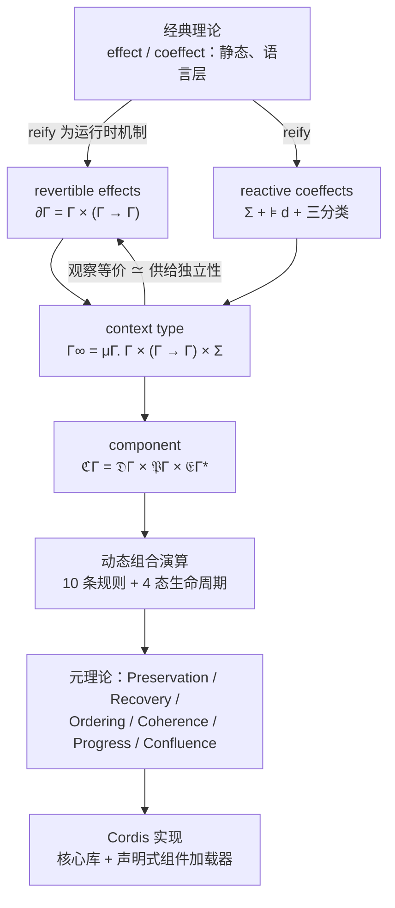

import { Meta } from '@storybook/addon-docs/blocks';

<Meta id="paper" title="进阶/论文导读" name="Docs" />

# 论文导读

[设计理念](?path=/docs/philosophy--docs)一课用摘要级口径讲清了时空可组合性的动机链，并把「演算与元理论」留给了本课。本课进入论文《A Programming Paradigm for Spatiotemporal Composability》的正文本身，回答四个问题：**论文形式化了什么、记号怎么读、元理论证明了什么、与手册已讲的工程面如何逐项对照**。读完本课，任何一条 cordis 机制都应该能沿映射表放回论文里的一个定义或定理上定位。工程面断言沿用本手册已按 cordis 4.0.0-rc.8 核对的课程，内链直达；论文侧内容忠实转述，不添加论文没有的论断。

| 项 | 值 |
| --- | --- |
| 标题 | A Programming Paradigm for Spatiotemporal Composability |
| 作者 | Yifan Shi（北京大学 / DeepSeek-AI）、Wei Zhang（北京大学）、Tianyi Cui（DeepSeek-AI） |
| 版本 | 2026-08-13 预印本**草稿**（官方声明 content may change substantially）；本课按此版转述，编号引用均出自该版 |
| 规模 | 88 页 PDF（Typst 排版）；8 章；编号条目（定义 / 定理 / 引理 / 推论）连续排到 74；10 条演算规则；10 个算法；2 张总表 |
| 获取 | [cordiverse/paper 仓库](https://github.com/cordiverse/paper)（master 分支 paper.pdf） |



记号速查（全文按此读）：

| 记号 | 名称 | 含义 |
| --- | --- | --- |
| `Γ` / `γ` | 上下文 / 状态 | 环境（一切共享状态的载体）；`γ ∈ Γ` 是一个具体状态 |
| `∂Γ` | 作用上下文 | `Γ × (Γ → Γ)`：状态 + 累积器 |
| `φ` | 累积器 | 迄今执行过的作用的逆之复合——把上下文恢复到初态的函数 |
| `𝔗Γ` | 扭曲复合幺半群 | 变换对 `(f, g)` 配「正向照常、逆向反向」的复合 |
| `𝔈Γ` / `𝔈Γ*` | 作用函数 / 带见证 | `Γ → Γ × (Γ → Γ)`；星号 = 逐状态满足 `g(δ) = γ` |
| `⋄` | 作用复合 | 作用函数之间的复合（先右后左，逆照样反向累积） |
| `Σ` / `𝒱k` | 余作用上下文 / 类型族 | 键到带类型值的有限偏函数；`𝒱k` 是键 `k` 的值类型 |
| `⊧` | 满足 | `σ ⊧ d`：规格 `d` 的每个键都在 `σ` 里 |
| `Γ∞` | 上下文类型 | `μΓ. Γ × (Γ → Γ) × Σ`——时间维与空间维的统一体 |
| `≃` / `≈` | 观察等价 / 不可区分 | 模「无观察者能区分」读等式 |
| `ℭΓ` | 组件 | `𝔇Γ × 𝔓Γ × 𝔈Γ*`：读声明 × 写声明 × 作用函数 |
| `ω` / `θ` / `τ` | 已提交视图 / 生命周期 / 退役标记 | fiber 的三个控制字段 |
| `𝔐(e)` | 变换单群 | `e` 的正向映射与它产出的一切逆生成的子幺半群 |

## 论文地图

| 章 | 内容 | 对本手册的意义 |
| --- | --- | --- |
| §1 Introduction | 时间 / 空间两个正交维度；动机案例（VSCode 前 100 扩展中 87 个含可执行代码、仅 7 个声明 extensionDependencies；自进化 agent harness；进程 / 容器粒度的粗粒度兜底）；五条贡献 | 动机链已由 4.2 展开，本课只引用编号 |
| §2 Preliminaries | effect 系统（`Γ ⊢ t : T effect`；单子作用、代数作用）与 coeffect 系统（`Γ coeffect ⊢ t : T`；余单子、graded）的记号铺垫 | 「静态、语言层」的对照面 |
| §3 Revertible Effects and Reactive Coeffects | 理论核心上：`∂Γ`、`𝔈Γ`、`Σ`、`⊧`、`Γ∞`、`≃` | 本课主体 |
| §4 A Calculus of Dynamic Composition | 理论核心下：组件、fiber、registry、10 条规则、4 态生命周期、元理论 | 本课主体 |
| §5 Implementation and Case Study | Table 2 理论-实现对应表；算法 1–10；加载器；Koishi 案例 | 与工程面对照的权威来源 |
| §6 Discussion | 系统边界、服务多路复用、访问控制、语言无关性、互依赖、版本化、协同设计 | 回查表（见[论文的其余部分](#论文的其余部分)） |
| §7 Related Work | 时间维四家族、空间维三家族的定位 | 定位论文与既有工作的差异 |
| §8 Conclusion | 摘要重述 | — |

五条贡献（§1.3 原文结构）恰好构成论文的骨架：形式化 revertible effects（局部时间可组合性）；形式化 reactive coeffects（局部空间可组合性）；统一为单一 context type（观察等价供给独立性，构成编程范式）；给出动态组合演算（元理论把可组合性从单组件推广到交错组件系统）；实现为 Cordis（核心库 + 声明式组件加载器）。

**阅读路径建议**（首次精读的最短闭环）：Abstract 与 §1.3 → §3.1.1–3.1.2（记号核心）→ §5 开篇的 Table 2（先建立理论-工程锚点）→ §4.1–4.2 与 §4.4 各定理的陈述（跳过证明）→ 按需进入 §4.3 四小节、§5 算法与 §6/§7。元理论证明占 §4.4 大半篇幅，初读全部可跳。

**与官方设计文档的关系**：`design/` 五篇是论文的先声，论文在其上做了三处实质推进：

| 设计文档（4.2 已转述） | 论文 | 推进 |
| --- | --- | --- |
| effect / restore，逆为双边 `f⁻¹` | track / recover + `𝔈Γ*`，逆为**逐状态左逆** `g` | 撤销只需在应用点成立，不必全局可逆 |
| 递归式 `C = C × (C → C)`（两分量） | `Γ∞ = μΓ. Γ × (Γ → Γ) × Σ`（三分量） | 空间维显式进入类型 |
| 直觉论证（「可证明 effect 是同态」） | 完整元理论（定理 4–73） | 保证从单组件提升到交错系统 |

设计文档的 `effect f = (c, h) ↦ (f(c), h ∘ f⁻¹)` 与论文的 `track(f, g) = (γ, φ) ↦ (f(γ), φ ∘ g)` 同构：新的逆复合在累积器右侧、恢复时先执行——LIFO 在两边都是定义的直接后果。

## 可逆作用的形式化

### 作用上下文：∂Γ 与 track / recover

论文从「把不纯函数变纯」起步：任何 `f_impure : X → Y` 可改写为 `f : Γ × X → Γ × Y`，全部副作用表现为对 Γ 的变换；固定输入后 `γ ↦ pr1(f(γ, x))` 就是副作用本身。于是「作用」就是 `Γ → Γ` 的元素，在复合下构成幺半群（封闭、结合、单位 `idΓ`——论文把三条公理逐条读成作用的性质）。要能撤销，就给每个变换 `f` 配一个逆 `g`——论文明确 `g` 是**左逆**：只对 `g ∘ f` 提要求，从不对 `f ∘ g` 提。

变换对有自己的复合——定义 1（twisted composition）：

```text
(f1, g1) ∘ (f2, g2) ≔ (f1 ∘ f2, g2 ∘ g1)
```

正向照常复合，逆向反向累积；带单位 `(idΓ, idΓ)` 构成扭曲复合幺半群 `𝔗Γ`。在此之上定义 2 给出**作用上下文**：

```text
∂Γ ≔ Γ × (Γ → Γ)        —— 二元组 (γ, φ)
γ ：当前上下文状态
φ ：累积器——迄今所有作用之逆的复合，恢复初态的函数
初始作用上下文为 (γ0, idΓ)；还可叠塔：∂²Γ = ∂Γ × (∂Γ → ∂Γ)，以此类推
```

追踪与恢复各是一个变换（定义 3、定义 6）：

```text
track(f, g)  = (γ, φ) ↦ (f(γ), φ ∘ g)     —— 状态被 f 前推，逆 g 记进账本
recover      = (γ, φ) ↦ (φ(γ), idΓ)       —— 执行累积器并清账
```

算例：Γ 取「已监听端口集合」，两步作用从初态走一个来回：

| 步骤 | γ | φ |
| --- | --- | --- |
| 初始 | `{}` | `id` |
| `track(加80, 删80)` | `{80}` | `g1` |
| `track(加443, 删443)` | `{80, 443}` | `g1 ∘ g2` |
| `recover` | `{}` | `id` |

注意 φ 的书写序：`g2` 复合在右侧，恢复时**先执行** `g2` 再执行 `g1`——LIFO 不是实现选择，而是 `φ ∘ g` 这个定义的直接后果（复合之逆 = 逆序复合）。三条定理把直觉钉死：

- **定理 5**：track 是 `𝔗Γ` 到 `∂Γ → ∂Γ` 的幺半群同态——「先 track 两笔再复合」等于「先复合再 track」，记账与复合可交换。
- **定理 7**：只要 `g(f(γ)) = γ`，则 `recover ∘ track(f, g) = recover`——每记一笔账，恢复的落点不变。
- 论文把 `φ(γ) = γ0` 称为 **soundness invariant**（健全性不变量）：任何经 track 到达的状态，其累积器都指回初态。

### 作用函数：𝔈Γ 与 ⋄

track / recover 模型有两个论文自己点破的工程性缺陷：逆是**先验固定**的（一个 `g` 要服务所有状态）；recover 是**全有或全无**（不能选择性撤销一个作用）。定义 8 把两端各升一级：

```text
𝔈Γ  ≔ Γ → Γ × (Γ → Γ)          —— 作用函数：在应用点交出新状态与逆
𝔈Γ* 是其「带见证」细化：e ∈ 𝔈Γ* 要求对每个 γ，写 (δ, g) = e(γ)，有 g(δ) = γ
```

读法：**作用在应用点交出自己的逆**。见证条件只在应用点成立——`g` 只承诺撤销「这一次应用」，对其他状态的 `g` 毫无约束。这正是 `ctx.effect(生产者)` 的形式化：生产者拿到的状态与交回的 disposer 一一配对（五种注册形态见[可逆副作用](?path=/docs/effects--docs)）。

`𝔈Γ` 的元素不再是 Γ 的自同态，需要新复合——定义 9：

```text
(f ⋄ g)(γ) = let (δ, s) = g(γ) in let (ε, t) = f(δ) in (ε, s ∘ t)
（先跑右操作数 g，再跑左操作数 f；逆照样反向累积）
```

定理 10：`(𝔈Γ, ⋄)` 是幺半群，单位 `ηΓ ≔ γ ↦ (γ, idΓ)`；定理 11：见证在 `⋄` 下保持。定义 12 再把作用函数升格到作用上下文上：

```text
effect(e) = (γ, φ) ↦ ((δ, φ ∘ g), track(g, pr1 ∘ e))
```

点睛之处：**撤销一个作用，本身也是一个作用**。升格后的逆是 `track(g, pr1 ∘ e)`——状态被 `g` 变换，而「撤销『撤销』」就是把原作用重做一遍（`pr1 ∘ e`）。定理 15 给出精确刻画：对带见证的 `e`，升格后的逆作用执行后，状态恢复为 `γ` 一模一样，累积器恢复为 `φ ∘ g ∘ f`——整个升格也带见证，当且仅当 `g ∘ f = idΓ`。定理 16 收尾本节：**按应用逆序撤销，每个逆都会拿到「自己应用时产出的那个状态」**——LIFO 语义的定理化。

### 独立性：任意序撤销的条件

定理 16 只覆盖「按应用逆序撤」。两个新场景需要更多（§3.1.3 开篇）：一个组件在系统运行中途被撤走（它之后还有别的作用在场）；多个组件的作用交错（A 的逆被 B 的应用隔开）。此时逆会碰到**被外来作用移动过的状态**——还撤得掉吗？这是交换性问题。

- 定义 17：`𝔐(e)` ≔ `e` 的正向映射与它在一切状态产出的逆，共同生成的变换单群。
- 定义 19：`e1`、`e2` **独立** ≡ (1) 两单群的元素两两交换；(2) 一方的变换不扰动另一方产出的逆（在哪个状态问 `e1`，答案都一样）。

主结论是推论 21：n 个两两独立的带见证作用从 `γ0` 依次应用后，**以任意排列序**在终点应用全部逆，都回到 `γ0`。论文特意说明：LIFO 只是排列之一，定理 16 对它免一切假设；**independence 买到的是其余一切顺序**——包括多组件交错的序。哪里得不到独立性，顺序就必须由别处承担：组件内部由累积器以 LIFO 强加，组件之间由声明的余作用定序（提供先于满足）——这两条「别处」正是 §4 演算的两大支柱。

判断什么样的作用天然独立，留给[观察等价](#观察等价与独立性)一节（定理 40/42）——那是统一构造的机关。

## 响应式余作用的形式化

### 余作用上下文：Σ 与 get / set

定义 22：`Σ ≔ (k : K) ⇀ 𝒱k`——键到带类型值的**有限偏函数**（依赖类型：每个键 `k` 配自己的值类型 `𝒱k`）。操作带前置条件：不能重复提供（`k ∉ dom σ`）、不能撤销不存在的（`k ∈ dom σ`）；违反前置条件报错且不产生转换。定义 23 给出两个基本操作：

```text
get(k)   = σ ↦ σ(k)
set(k,v) = σ ↦ (σ[k ↦ v], λσ'. σ' ∖ k)
```

关键的一行（论文原文强调）：**`set(k, v)` 的类型恰是 `𝔈Σ*`**——余作用上下文上的带见证作用函数。于是「提供服务」直接落入上一节的全部机器：effectΣ 提供自动记账与回收。论文把这句话总结为 synergy：**coeffect operations are effects, and effects are revertible**（余作用操作是作用，而作用是可逆的）。这就是[设计理念](?path=/docs/philosophy--docs)转述过的「余作用由作用产生」在论文里的化身——不是比喻，是类型层面的同一。

定义 24 把键升级为三元组 `(𝒱k, ≃k, 𝒜k)`：值类型、键上的等价关系、操作集。操作 `a : Xa → 𝒱k ⇀ 𝒱k × (𝒱k ⇀ 𝒱k) × Ba`——值上的带逆变换外加一个产出（outcome），且必须尊重 `≃k`；经提升后只读写自己那一个键的绑定，不碰别的键。

### 规格与通知：⊧ 与三分类

定义 25：`𝔇Σ ≔ Set(K)`——组件声明的依赖键集合 `d`。满足谓词与分类（定义 26）：

```text
σ ⊧ d ≔ ∀k ∈ d. k ∈ dom(σ)          （dom 有限，可判定）

notify_d(σ, σ') = activating     若 σ ⊭ d 且 σ' ⊧ d
                  deactivating   若 σ ⊧ d 且 σ' ⊭ d
                  neutral        其余
```

因为 σ 的一切变更都走作用函数（其逆恢复先前的 domain），**满足状态的变化在每个作用边界都可观测**——论文明确这是 reactivity 的代数基础：effect 系统保证每个余作用变化都被看见。reactive invariant：activating 触发组件执行其作用（全程记账），deactivating 触发应用累积器回收。算例（`d_B = {database}`）：

| 转换 | σ → σ' | 分类 → 系统动作 |
| --- | --- | --- |
| database 提供者激活 | `{}` → `{database: db1}` | activating → B 开始加载 |
| 无关键 auth 上线 | `{database}` → `{database, auth}` | neutral → B 无动作 |
| 提供者退役、撤销 database | `{database}` → `{}` | deactivating → B 回收 |
| 新提供者上线 | `{}` → `{database: db2}` | activating → B 重新加载 |

论文同时点出边界：「criterion 只覆盖一个方向」。B 只能在 `k` 已被提供后激活——这一半由 `⊧` 免费；另一半（撤走 `k` 前先让 B 退场，且 B 退场全程仍可读 `k`）不是通知自己能给的，要等 §4.3.1 的 withdrawal 机制——这正是 2.4/2.5 讲过的级联回滚与等待的理论面。

### 隔离与拦截：Σiso 与 Σinter

§3.2.3 处理两个工程需求，共同的实现手法是定义 27 的 **derived realization**（派生实现）：不改共享表，而是派生一个自己的表不同的新上下文，恒等函数就是逆——回收 = 丢弃派生上下文。对照：`set` 是 in-place realization（改共享表，逆是撤销）。rc.8 的 `ctx.isolate` / `ctx.intercept` 派生上下文而不创建 fiber（[上下文](?path=/docs/context--docs)已核实），正是这个定义的工程面。

**隔离**（定义 28–29）：`Σiso ≔ (K ⇀ R) × ((r : R) ⇀ 𝒱r)`，两层解析 `k → ρ(k) → σ(ρ(k))`。`isolate(k, r)` 把 `k` 重新指到 realm `r`、继承依赖表。论文称其为「运行时 ad-hoc 多态系统」：同一个逻辑依赖在不同上下文解析到不同值——多租户、测试环境、组件沙箱的基础。工程面即 2.2/2.3 的隔离域（同名服务平行并存）。

**拦截**（定义 30–31）：`Σinter` 给每个键配元数据幺半群 `(ℳk, ⊕k, εk)`；`get(k, μ) = σ(k)(μ ⊕k ι(k))`——组件声明的元数据与上下文携带的元数据**合并后**交给提供者函数。合并右偏：上下文携带者优先，能覆盖组件声明——外层上下文不修改组件就能约束它怎么用某个余作用（访问控制的基础，§6.3）。工程面是 2.2 的 `ctx.intercept`（实验性）与 loader 的 `intercept` 字段（5.2）。

## 上下文类型

### 统一构造：Γ∞

定义 32：

```text
Γ∞ ≔ μΓ. Γ × (Γ → Γ) × Σ
        │      │        └── 余作用上下文：依赖信息（可扩展为一切共享状态）
        │      └── 累积器：恢复本级作用
        └── 当前上下文状态（递归）
```

`μ` 把 ∂ 塔折叠成单个自相似类型——作用函数 `𝔈Γ∞` 在其上自映射，两级之间的升格不再需要无限叠塔。Σ 结构性地内置：依赖操作（set / get）作用于 Σ，其逆由累积器追踪。论文强调：`𝒱` 不受约束，所以**任何需要跨组件共享的状态都可以编码成一个依赖**——Σ 吞下一切共享可变状态，不只是组件间依赖。层级组合读作字面的「插拔」隐喻（论文原文）：加载组件 = 执行其作用（plug in）；卸载 = 恢复其作用（unplug，不影响其他运行中的组件）；不同层级独立可装卸、任意嵌套。

与设计文档递归式对照：`C = C × (C → C)` 是两分量直觉版；论文正式定义多出 **Σ 分量**——空间维不是事后附加，而是统一类型的一部分。这是「工程面直觉 → 论文形式化」最直接可见的一处推进。

### 观察等价与独立性

§3.1 的恢复保证断言的是状态**相等**（定理 7）——论文承认这是理想化：`free` 不恢复 `malloc` 前的堆布局；生成名撤销后下次创建取新名。所以一切等式都要改成「模 `≃`」读，而 `≃` 取为**观察等价**：没有观察者能区分两个状态。观察者手里有什么？——上下文携带的余作用。所以 Γ 上的 `≃` 从各键自己的 `≃k` 拼装（定义 33）：dom 相同且各键值 `≃k` 相关。**没有键绑定的那部分状态被遗忘**——堆布局、生成名只要没被某个键绑定，就不在关系里，定理 7 才「模 ≃ 可读」。

这一步不是修辞，它把 §3.1.3 留下的独立性假设**兑现**了（引理 38：§3.1 全部等式模 ≃ 保持）：

- 定义 34：值上的**测试** = 操作字母组成的有限字；不可区分 `≈` = 所有测试同定义同结果。引理 35：`≈` 是操作尊重的最粗等价——一切合法的 `≃k` 都含于它。
- **定理 40：不同键上的操作天然独立**——各写各的键、生成元交换，引理 18(1) 把交换性从生成元扩到整个单群。这条**免一切假设**。
- **交换键**（commutative key）：同键任意两操作独立。论文的判据：值是「独立增删条目的表」的键交换——注册路由、注册事件监听器是代表例；值是「有序链」的键不交换——中间件先插入的看到不同请求，任一序都替代不了对方的撤销。
- **定理 42**：两个由余作用操作构成的作用函数（定义 41 的 coeffect-mediated effect functions），只要公共键都交换，就独立。

于是独立性成立的责任链闭合：组件的一切作用都是余作用操作、一切共享位置都绑在键上、提供者把交换键做好——组件两两独立自动成立。论文的总结值得整句转述：这个分解把计算的**可交换部分交给作用、顺序敏感部分交给余作用**——可交换部分无论按什么序执行、什么序撤销都行（推论 21）；顺序敏感部分在组件内部由累积器以 LIFO 强加，在组件之间由声明的余作用定序。交换性是**键接口的属性**——做好它是提供者的义务，不是消费者的。

## 组件与动态组合演算

### 组件与 fiber

定义 43：组件 `ℭΓ ≔ 𝔇Γ × 𝔓Γ × 𝔈Γ*`，三元组 `(d, p, e)`：

- `d : 𝔇Γ`——余作用规格：从环境**读**什么；
- `p : 𝔓Γ ≔ Set(K)`——provide：向环境**写**哪些键（`e` 不写 `p` 之外的键）；
- `e : 𝔈Γ*`——带见证作用函数：激活时贡献的作用及其撤销。

`d` 与 `p` 是同一个接口的两个方向。演算施加**单源纪律**：一个 registry 里不允许两个 fiber 的 provision 相交——这是刻意读在「单一共享 realm」上的限制（带 realm 的演算会放宽为 realm 内不相交）；后果是有非空 provide 的组件同时至多一个 fiber，多实例只留给只消费或只注册别人的组件。

**fiber**（定义 44）：组件的一次实例化 `⟨d, p, e, π, σ, τ, θ⟩`——组件三元组、父 fiber `π`、自己的余作用表 `σ`（激活后由其作用写入）、退役标记 `τ`、生命周期状态 `θ`。**registry**（定义 45）：`Fγ : 𝔑 ⇀ 𝔉Γ`，父指针构成根在 root 的树。一个关键设计：**余作用上下文是导出的，不是存储的**——

```text
σγ ≔ ⋃ { σm | m ∈ dom(Fγ)，θm = Active(−, −) }
```

只并 Active fiber 的表；因为 fiber 只写自己声明的键、provision 两两不相交，每个键恰有一个可能的提供者 `provider_k(γ)`。这正是[服务](?path=/docs/services--docs)讲过的「同名同时刻一个实现」与[分组与热重载](?path=/docs/group-and-hmr--docs)依赖的注册表语义的理论面。

### 基本演算：目标视图与五条规则

生命周期由两个「视图」的比较驱动：

- **target view**（定义 46）：fiber `n` 应该以哪个解析运行——退役 `τ` 或 `γ ⊭ dn` 时为 `⊥`（不该运行）；否则每个声明键 ↦ `provider_k(γ)`。
- **committed view** `ω`：`n` 激活时**实际**提交的解析。记录的是**提供者 fiber 的名字**而不是值——换一个提供相等值的 fiber 不会被误判为相等。
- **quiet(γ)**：每个 fiber 都到达自己的 target——静止态。

五条规则（§4.2）分两组。**编排规则**（O- 前缀，`γ ⇒ δ`，orchestrator 的合法动作）：O-Insert（插入组件；要求父在、provision 不相交）、O-Retire（请求退役，无条件）、O-Remove（移除已 Inactive 且无子代的表项）。插与退是仅有的外部输入；退役与移除分离——仍在 Active 的退役 fiber 必须先 deactivate，早删会丢累积器、泄漏。**生命周期规则**（L- 前缀，`γ ⟶ δ`，系统自行步进）：L-Reload（无 committed view 且 target ≠ ⊥ → 应用 `e`、记 `ω`）、L-Unload（committed ≠ target → 应用累积器、丢 `ω`）。两条由同一个比较驱动——§3.2 响应式纪律的操作语义化，target 同时回答退役与依赖两个来源。

**instantiation**（定义 47）：组件的作用函数在执行中可以注册另一个组件——取 O-Insert（`π` = 自己）为其作用，**其逆是 O-Retire**（不是 O-Remove：逆必须在任何可达状态都能应用，而 O-Retire 无条件）。父卸载级联子的形式化由此完成。**confinement**（定义 48）：作用的写限制在自己 fiber 的 `σ` 与注册原语；读限制在自己的表、各 fiber 表在自己 `d` 上的限制、以及无主状态——组件读得到自己声明的值（它们在提供者的表里），读不到声明之外的表与任何控制字段。

### 进行中的转换

§4.3 逐个拆掉基本演算的三个理想化（原子、即时、不会失败），生命周期从两态扩为四态（定义 49）：

```text
Inactive(ζ) | Reloading(i, g, ω) | Active(g, ω) | Unloading(g, ω, ζ)
（i = 剩余作用迭代器；ζ = 结局：⊥ 或错误）
```

四小节各拆一层：

- **withdrawal（§4.3.1）**：L-Unload 拆成两步。L-Leave 记录去激活决定并**立刻停止提供**（`σγ` 只并 Active fiber，依赖者马上重算出不满）；L-Unload 带 **guard**：`¬ relied_n`——还有 installed fiber 的 committed view 指向我，就不能执行累积器。可见性半边由 committed view 承担（L-Unload 最后才丢弃），顺序半边由 guard 承担。guard 本会死锁，救它的是 Unloading 态：一旦 L-Leave 标记，该 fiber 的表已离开 `σγ`、消费者的 target 已变、消费者自己也在退场——定理 66 证明 guard 必然释放。
- **iteration（§4.3.2）**：定义 51 效果迭代器 `𝔈iter ≔ μℑ. Γ → Γ × (Γ → Γ) × Maybe(ℑ)`——每次迭代交出新状态、逆、续体。论文明说：这是**具体化的 delimited continuation**，直接映射到主流语言的 `yield`（生成器）。[可逆副作用](?path=/docs/effects--docs)里「异步迭代器形态」的理论名字就在这里。L-Begin / L-Iter / L-Finish / L-Divert 四条规则中，L-Divert 在迭代边界发现 target 已变 → 带着已累积的逆走进 Unloading（部分回滚的形式化）。
- **asynchrony（§4.3.3）**：飞行中的迭代（Future 未落定）**必须落地**（inertia）——不能中止在飞迭代，只能让它落地后卸载。本层不加新规则，只限制 L-Divert 的分支选择；reload 与 unload 的互链（卸完即装、装中变卦即卸）是这层的组合结果。
- **failure（§4.3.4）**：迭代可 raise（`𝔈fail`）。L-Raise **先恢复后记录**：带着错误结局走进 Unloading，累积器在那里执行，fiber 到达 `Inactive(ξ)` 时什么都没装上。错误记在 fiber 上、不向父传播（兄弟照跑）；L-Begin 要求 `Inactive(⊥)`，失败不会原地重试——这就是 2.5 里 FAILED 语义的理论面。

## 元理论

§4.4 读的是那十条规则（3 编排 + 7 生命周期）的性质——把单组件的保证推广到「不管别的 fiber 在中间做什么」的全局形式：

| 结论 | 名字 | 直觉 |
| --- | --- | --- |
| 定理 59 | Preservation | 每步保持 registry 良构：树完整、provision 不相交、committed view 良定义且只指向 installed fiber |
| 定理 61 / 推论 62 | Recovery exactness / Terminal recovery | 在 fiber `n` 的整个 episode 上：**终点应用 `n` 的累积器 = 「n 从未来过」**——得到的状态（除控制字段）恰是同一批他人步骤从 episode 开头直接推出来的状态；离场 fiber 对状态的贡献为零 |
| 定理 63 | Ordering | 消费者只在依赖被提供后开始；提供者的 episode 包住消费者的 episode；**消费者退场全程 `k` 仍可读且值不变**（还连接池时池还在） |
| 定理 64 | Resolution coherence | 一次转换自始至终跑在同一个解析 `ω` 上——依赖中途变化要么改道（L-Divert）要么落地后即卸，不存在跨两个解析的转换 |
| 定理 66 | Progress | 无死锁（非静止必有规则可用，guard 沿依赖图逐级释放）+ 必然终止（依赖关系无环 + 迭代长度有界 ⇒ 每个极大步序止于静止态） |
| 定理 73 | Confluence | 见下 |

Progress 的前提值得回查：`n ≺ m`（n 提供 m 声明的键）**无环**——依赖环在模型里不是死锁而是永久 Inactive（§6.5：可从声明静态预测，加载时即可报，[依赖注入](?path=/docs/dependency-injection--docs)的等待语义由此来）；迭代长度有界；名字集有限。

**Confluence（合流）是全书最重的结论**，转述论文自己的话：无论运行系统经历过什么激活 / 停用序列，它静止到的状态，与「把最终活跃的组件按依赖序各装一次、从未卸载过」的静态装配结果一致——**动态历史不留痕迹**。证明给出规范形（canonical form：编排步骤提前、各活跃 fiber 恰一个连续 episode、按依赖序排列）与唯一性（模 fiber 重命名）。失败被排除是诚实的：是否 raise 依赖运行时状态，一个调度失败另一个调度成功，静止态就在该 fiber 的生命周期上分叉——但推论 62 保证除此之外不分叉（失败 fiber 的贡献为零）。论文点明用途与边界：它**许可把 Cordis 应用当作静态装配来推理**；但它说的是状态，不是沿途的 emission（发射）——后者跨界，属于 §6.1 的系统边界讨论。

## 与工程实现的对照

§5 开篇的 Table 2 是论文给出的权威对照，转译为「论文 → cordis 运行时 → 手册课程」（运行时一列用论文 §5 的命名，工程面一列是 rc.8 实际形态）：

| 论文概念 | 出处 | 论文 §5 命名 | rc.8 工程面 | 手册课程 |
| --- | --- | --- | --- | --- |
| 上下文类型 `Γ∞` | 定义 32 | `ctx` | `ctx`（Proxy 实例 + 根 fiber） | [2.2](?path=/docs/context--docs) |
| 作用函数 / 迭代器 `𝔈`、`𝔈iter` | 定义 8 / 51 | effect callback | `ctx.effect` 五种形态 | [3.1](?path=/docs/effects--docs) |
| 作用升格 `effect(e)` | 定义 12 | `ctx.effect(callback)` | 同一入口 | 3.1 |
| 余作用上下文 `Σ` | 定义 22 | `ctx[@@store]` | 符号键服务存储槽位 | [2.3](?path=/docs/services--docs) |
| 读 / 提供依赖 `get` / `set` | 定义 23 | `ctx.get` / `ctx.set` | `ctx.get`；提供走 `Service` / `ctx.provide` | 2.3 |
| 隔离 `isolate` | 定义 29 | `ctx.isolate(key, realm)` | `ctx.isolate` | 2.2 |
| 拦截 `intercept` | 定义 31 | `ctx.intercept(key, metadata)` | `ctx.intercept`（实验性） | 2.2 |
| 组件 `ℭΓ = 𝔇 × 𝔓 × 𝔈*` | 定义 43 | `(inject, provide, apply)` | 插件（`inject` 声明 + apply + provide） | [2.1](?path=/docs/plugins--docs) / 2.4 |
| fiber 七元组 | 定义 44 | `fiber` | Fiber 实例 | [4.1](?path=/docs/fiber--docs) |
| registry / 名字 `Fγ`、`n` | 定义 45 | `ctx.registry` / `fiber.uid` | `runtime.fibers` / `fiber.uid` | 4.1 |
| 生命周期 `θ` | 定义 49 | `fiber.state` | 论文 Table 2 明示 LOADING=Reloading、FAILED=`Inactive(ξ)`；PENDING 对应 `Inactive(⊥)`、ACTIVE / UNLOADING 同名、DISPOSED 对应 O-Remove（uid 清除） | [2.5](?path=/docs/lifecycle--docs) |
| 累积器 `g` / recover | 定义 44 | `fiber.dispose` | `dispose` 逆序清账 | 3.1 / 4.1 |
| committed view `ω` | 定义 44 | `fiber.committed` | `fiber.store` 依赖快照（加载时固化） | 2.4 / 4.1 |
| target view | 定义 46 | `fiber.target`（⊥ 即 INACTIVE） | epoch 依赖指纹（`':3:5'`；缺失 = INACTIVE） | 4.1 |
| 惯性 inertia | §4.3.3 | `fiber.inertia` | `fiber.inertia`（进行中 Promise） | 2.5 / 4.1 |
| 注册原语 O-Insert / O-Retire | 定义 47 | `ctx.use` 及其逆 | `ctx.plugin()` 与 `'ctx.plugin()'` 记账 | 2.1 / 2.5 |
| 迭代循环 L-Begin / L-Iter / L-Finish | §4.3.2 | execute 循环（算法 1） | fiber.ts 执行管线 | 4.1 |
| 改道 L-Divert | §4.3.2 | 迭代边界 guard 失败 / reload 链 unload | epoch 变化即停止拉取 | 2.5 / 4.1 |
| 标记退场 L-Leave | §4.3.1 | refresh 标 UNLOADING | refresh 先离服务 | 2.5 |
| 卸载 + guard L-Unload | §4.3.1 | unload 等待被通知者（算法 5） | unload 排水 dependents 再清账 | 2.4 / 2.5 |
| 失败 L-Raise | §4.3.4 | 错误记录、target 置 ⊥ | FAILED 状态（可经 update 复活） | 2.5 |
| 加载器条目 | 定义 74 | entry（id / url / isolate / intercept / config / disabled） | 配置条目 | [5.1](?path=/docs/loader--docs) / [5.2](?path=/docs/group-and-hmr--docs) |
| HMR 三阶段 | §5.2.2 | 分类 → 陈旧检测 → 事务性重载 | `@cordisjs/hmr` | 5.2 |

三处必要注记（读论文时最容易错位的地方）：

1. **命名差**：论文正文用 `ctx.use` / `fiber.apply`；rc.8 与本手册工程面的名字是 `ctx.plugin()` 与 fiber 上的插件体执行。记法不同、位置相同。
2. **witness 不被运行时验证**：论文明说（§5.1.1）`ctx.effect` 不检查 `𝔈Γ*` 的见证条件——「逆确实撤销其伴随作用」是**组件作者的义务**，不是运行时验证的属性；定理 61 诉诸它，§6.1 划定其边界。工程面即 3.1 的「不把撤销写成返回值，就没有撤销」。
3. **`ctx.set` 的口径差**：论文的 `set` 是余作用提供的原语（安装与撤销都 notify，算法 2）；rc.8 的公开 `ctx.set` 是实验性原地换值、不通知（2.3 已核实）。日常「提供」路径在 `Service` / `ctx.provide`，其通知-重算链条（notify → 依赖 fiber refresh）与论文算法 3 一致。

算法与工程的三条主线：算法 1（execute 的 guard / armed、逆前插得 LIFO）对应 fiber.ts 执行管线六步（4.1），组件级 guard 从 armed 换成测 fiber.target 稳定（epoch）；算法 4 / 5（use / refresh / reload / unload）就是 2.5 生命周期状态机的伪代码版，论文自己点出「三行承载定理 63」——reload 提交视图、refresh 先标 UNLOADING（L-Leave）、unload 先等 dependents 再清账（guard）；算法 6（Proxy 沿 fiber 链解析：committed 命中即返回、声明未提交抛 INACTIVE_ACCESS、到根未声明抛 UNDECLARED_ACCESS）对应 2.2/2.3 已核实的属性访问路径。core 包源码的模块级导览见[源码导读](?path=/docs/source-code--docs)。

**加载器与 HMR（§5.2）**：entry 六字段恰好记录 support set 读的全部四个字段（disabled 给 `τ`、树位置给 `π`、url 选出 `d` 与 `p`）——「配置能忠实描述 fiber」的原因。调和（reconciliation）的可靠性直接引自元理论（论文列了四条）：定理 73（静止态只依赖最终配置，途中怎么装卸、按什么序都不影响落点）、定理 66（系统必然静止，发出即完成）、推论 62（离场 fiber 贡献为零，重建一条 entry 不扰动邻居）、定理 63（无需编排加载顺序——未满足的 fiber 在 L-Begin 处等待）⇒ 模块并发加载。HMR 三阶段（模块分类的不动点算法 → 陈旧条目检测 → 事务性重载：任一模块导入失败即恢复缓存与备份模块、整体回滚）。配置语法与 HMR 工作流已在 5.1 / 5.2 展开，本课只补「为什么这样是可靠的」的理论依据。

**Koishi 案例注记（§5.3）**：论文用它验证表达力与通用性——4000+ 社区插件；服务端 bot 与浏览器 webui 是两个独立的 Cordis 应用，同一模型跑在不同运行时。**注意论文脚注：Koishi 当前使用 cordis v3**；论文呈现的是 v4（refines effect / coeffect 语义、重设计 loader；核心组合模型两版共享）。论文自陈效度威胁：单一生态、单一宿主语言、观察性而非对照实验——是存在性与采用证明，不是定量结论。

## 论文的其余部分

§6 Discussion 七小节的回查要点（每一格都是独立可查的开放问题或设计张力）：

| 小节 | 一句话 |
| --- | --- |
| 系统边界 | 可逆性按「位置」划界：能独占修改且能恢复 = 界内；acquisition（open / malloc / fork 安装记录）在界内、emission（write / send 推数据）跨界——后者只能 withhold（输出提交问题）或 compensate（补偿动作按 LIFO 组合，但交换性需对更粗的等价重建） |
| 服务多路复用 | 独占绑定（换实现扰动全部消费者）对比 service broker（中间人吸收扰动）；broker 支撑负载均衡、滚动更新、跨进程调用 |
| 访问控制与沙箱 | `inject` = 能力请求、context proxy = 能力中介（能力安全模型）；拦截元数据做细粒度策略（如只读数据库）；不可信代码需语言之外的沙箱（SFI / 独立进程 / 容器） |
| 语言无关性 | 时间维最低要求闭包 + 模块可装卸（Node 模块注册表 / dlopen / Wasm）；空间维 = 类型层（typeclass / trait / module augmentation，后者见 [TypeScript 模式](?path=/docs/ts-patterns--docs)）+ 运行时中介（Proxy / 描述符协议） |
| 互依赖与粒度 | 依赖环 = 永久 Inactive（可从声明静态预测）；拆成「核 + 集成组件」消环，代价是组件数可平方级增长 |
| 依赖类型与版本 | 键身份 = 名义链接；接口漂移与键碰撞两个缺口；三条路：键命名空间、peer deps（cordis 现状）、结构兼容 |
| 与语言 / OS 协同设计 | 语言侧：隐式上下文 + 编译器知悉（effect 迭代器编译成状态机、依赖环编译期报错）；OS 侧：把内存 / 文件描述符等资源作为余作用提供 |

§7 Related Work 的定位四句：对 ZIO / Effect-TS / fp-ts（单子嵌入）——cordis 是普通宿主代码上的 overlay，不必写进 effect 类型，服务撤销时其操作不留残迹；对 Effekt（能力化的代数作用）——Effekt 静态、词法域，cordis 运行时、以完整回收为目标；对 Heunen 等的 dagger / inverse arrows——最接近的可逆作用形式工作，但那是全域可逆、双边逆、范畴构造导出，cordis 只要原子作用有调用方供给的单边逆；对 OSGi Declarative Services / iPOJO / R-OSGi（可用性反应式组件模型）——reactive coeffects 最接近的先行者，但其回收靠手写同步回调，cordis 的惰性 Unloading 态让异步 teardown 跑完。另有 FRP / signals 一族：值粒度对组件粒度；glitch freedom 无对应物，只有定理 64 的单转换一致性。

## 常见问题

- 论文里的逆到底是左逆还是双射逆？为什么带见证条件只在应用点要求？
  左逆——只对 `g ∘ f` 提要求。见证 `g(δ) = γ` 只约束「撤销这一次应用」，对其他状态的 `g` 无约束。这是刻意的宽松：现实的作用（如注册回调）往往只在做过它的状态上可撤销；定理 15 表明升格后整体带见证当且仅当 `g ∘ f = idΓ`——单边逆是现实可行的最小要求。
- 定理 16 说 LIFO 撤销免一切假设，那 independence 是不是多余的概念？
  不多余。LIFO 只保证「按应用逆序、且每个逆拿到自己产出的状态」；多组件交错时，逆会碰到被外来作用移动过的状态，任意序与交错序的撤销（推论 21）才需要 independence。它是「单组件 → 交错系统」的关键台阶，且由定理 40 / 42 用交换键纪律兑现。
- Cordis 4 是论文的忠实实现吗？
  结构对应（Table 2）忠实；两处刻意落差——witness 不被运行时验证（作者义务），个别 API（如 `ctx.set`）的通知语义与论文原语不同（见对照节注记）。此外论文写 `ctx.use`，rc.8 叫 `ctx.plugin()`。
- 论文的案例研究用的是 cordis 4 吗？
  不是。论文脚注明说 Koishi 当前运行 v3；论文呈现 v4（核心组合模型两版共享）。读 §5.3 时不要把 Koishi 现状直接当成 v4 行为。
- `Γ∞` 与设计文档的 `C = C × (C → C)` 是同一个东西吗？
  同一思想的两个精度：设计文档两分量递归式是直觉版；论文加 Σ 分量并给 `μ` 记号——空间维显式进入类型。4.2 转述的「环境与回滚句柄构成更大的 C」即直觉版。

## 总结回顾

摘要：

论文把 2.x–5.x 已讲的工程机制提升为形式化理论。时间维：作用是 `Γ → Γ`，配扭曲复合成 `𝔗Γ`；作用上下文 `∂Γ = Γ × (Γ → Γ)` 用 track 记账、recover 恢复，`φ(γ) = γ0` 是健全性不变量；作用函数 `𝔈Γ` 把逆交到应用点（`𝔈Γ*` 逐状态见证），`⋄` 复合保持见证，升格定义说明撤销本身也是作用；推论 21 给出独立作用族的任意序撤销。空间维：余作用上下文 Σ 是键值偏函数，`set` 的类型恰是 `𝔈Σ*`——余作用由作用产生在类型层成立；规格 `d` 与满足谓词 `⊧` 给出 activating / deactivating / neutral 三分类，reactivity 建立在「一切变更走作用边界」之上；Σiso / Σinter 以派生实现提供隔离与拦截。统一构造 `Γ∞ = μΓ. Γ × (Γ → Γ) × Σ` 把 ∂ 塔折叠为自相似类型；观察等价 ≃ 从各键等价拼装、遗忘无键绑定的状态，定理 40（不同键天然独立）与定理 42（交换键 ⇒ 独立）兑现 independence——可交换部分归作用、顺序敏感部分归余作用。组件 `(d, p, e)` 实例化为 fiber，registry 的余作用上下文由 Active fiber 的表导出；target 与 committed view 的比较驱动十条规则；withdrawal（guard）、iteration（效果迭代器 = yield）、asynchrony（inertia）、failure（先恢复后记录）拆掉三个理想化。元理论给出 Preservation、恢复精确性（撤销 = 从未发生）、Ordering（提供者包住消费者、全程可读）、Resolution coherence（单解析转换）、Progress（无死锁 + 必然静止）与 Confluence（静止态 = 按依赖序静态装配一次的结果——动态历史不留痕迹，失败除外）。Table 2 把全部概念映射到 cordis 运行时；加载器调和的可靠性直接引用四条元理论；Koishi 案例是存在性验证（注意其运行 v3）。

一句话：

> 论文把「作用带逆、依赖成规格」从工程纪律提升为类型与演算：`∂Γ` 记账、`Σ` 登记、`Γ∞` 合一，component 在十条规则上运行，元理论保证任何动态历史静止后的状态等价于按依赖序静态装配一次。

知识要点：

- 论文五条贡献是什么？八篇章节里哪两章是理论核心？推荐的精读路径是什么？
- `∂Γ` 的两个分量各是什么？track / recover 的定义式？soundness invariant 是什么？
- twisted composition 与 `⋄` 各自复合什么？为什么逆都反向累积（LIFO 从哪来）？
- `𝔈Γ*` 的见证条件是什么？为什么只在应用点要求？升格定义为什么说明「撤销也是作用」？
- 推论 21 说什么？LIFO 序与任意序各需要什么假设？
- Σ、`𝔇Σ`、`⊧`、notify 三分类的定义？`set` 为什么是 `𝔈Σ*`——「余作用由作用产生」的形式化落点在哪？
- Σiso 与 Σinter 各解决什么问题？derived realization 的逆是什么？工程面对应哪些 API？
- `Γ∞` 的三个分量？与设计文档递归式的差异在哪？
- `≃` 从哪里拼装、遗忘了什么？定理 40 / 42 如何兑现 independence？交换键的判据是什么、做好它的义务在谁？
- 组件三元组 `d` / `p` / `e` 各是什么？单源纪律限制了什么？余作用上下文为什么是导出的？
- target view 与 committed view 如何驱动全部规则？guard 防什么、为什么不会死锁？效果迭代器与 inertia 对应工程面的什么？
- 五组元理论结论各一句话？Confluence 的准确陈述、用途与排除项是什么？
- 论文概念到 `ctx.effect` / `fiber` / epoch / `fiber.inertia` 的映射？三处工程落差是什么？
- 加载器调和的可靠性引用了哪四条元理论结论？Koishi 案例用的是 cordis 几？

## 参考资料

- [cordiverse/paper 论文仓库](https://github.com/cordiverse/paper)——预印本仓库与本课转述的版本来源（2026-08-13 草稿，content may change substantially）
- [paper.pdf 直链](https://raw.githubusercontent.com/cordiverse/paper/master/paper.pdf)——88 页全文；§3–§4 理论、§5 Table 2 与算法 1–10、§6 Discussion 为本课主要依据
- [官方设计文档：可逆作用](https://github.com/cordiverse/docs/blob/main/zh-CN/design/revertible-effects.md)——`C × X → C × Y` 封装、幺半群 / 群论证与 effect / restore（论文 track / recover 的先声）
- [官方设计文档：上下文模型](https://github.com/cordiverse/docs/blob/main/zh-CN/design/context-model.md)——两分量递归式 `C = C × (C → C)`（对照论文三分量 `Γ∞`）
- [官方设计文档：作用与余作用](https://github.com/cordiverse/docs/blob/main/zh-CN/design/effects-coeffects.md)、「[可组合性与插件系统](https://github.com/cordiverse/docs/blob/main/zh-CN/design/composibility.md)」与「[响应式余作用](https://github.com/cordiverse/docs/blob/main/zh-CN/design/reactive-coeffects.md)」——静态理论脉络与服务化余作用的对照面
- [cordis 源码：packages/core](https://github.com/cordiverse/cordis/tree/master/packages/core)——工程面断言按本手册已核对 4.0.0-rc.8 的课程（2.2 / 2.3 / 2.5 / 3.1 / 4.1）转引并对照论文 Table 2
