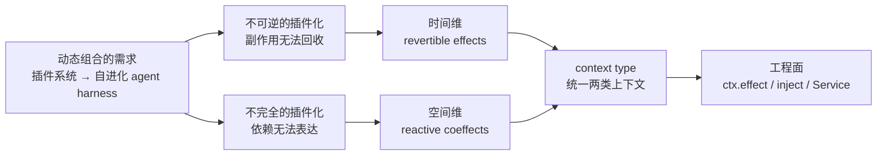
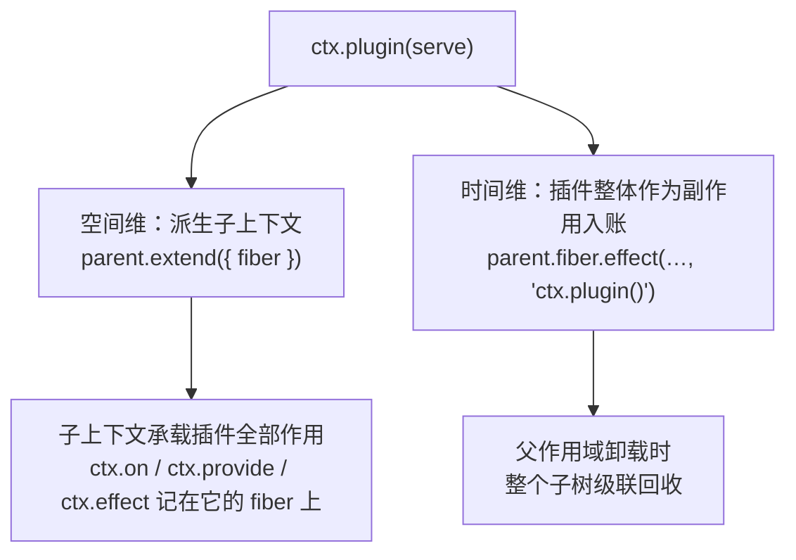

import { Meta } from '@storybook/addon-docs/blocks';

<Meta id="philosophy" title="Fiber 与设计理念/设计理念" name="Docs" />

# 设计理念

前面的课程从机制入手：[认识 cordis](?path=/docs/intro--docs) 用「时空可组合性」建立了两个维度的直觉，2.x 与 3.x 各课讲清了每个机制的工程用法。本课反方向行进——从问题出发重建这套设计：动态组合为什么需要两个新评价维度、每个维度上的既有做法分别卡在哪里、两个维度为什么能统一成**一个** context 模型。材料取自论文《A Programming Paradigm for Spatiotemporal Composability》的摘要级论述、官方哲学与设计文档，机制断言均按安装版本 cordis 4.0.0-rc.8 的源码核对。读完本课，手册里的任何机制都应该能放回同一条动机链上定位。



| 概念 | 一句话定位 | 展开 |
| --- | --- | --- |
| 动态组合 | 运行期的组装能力（插件、热更新），引入时间与空间两个评价维度 | 动态组合 |
| 时间维 | 移除组件时，其副作用能否被完全撤销 | 时间维 |
| 空间维 | 组件间依赖能否声明并被响应式管理 | 空间维 |
| revertible effects（可逆作用） | 每个作用携带逆操作，由运行时追踪——时间维的机制化 | 时间维 |
| reactive coeffects（响应式协作用） | 依赖以服务声明，上下文变更时按声明通知组件——空间维的机制化 | 空间维 |
| context（上下文） | 同时承载作用记账与依赖声明的运行时对象——两类上下文的统一 | context 模型 |
| 组件（component） | 作用全部可逆、依赖全部声明的代码单元——工程面就是「插件」 | 组件与框架哲学 |
| 资源安全 | 完整回收副作用的能力；内存安全是它的特例 | 组件与框架哲学 |

## 动态组合

「编程的本质就是组合」——官方设计文档以这句话开篇。组合分两种：**静态组合**发生在编译期，函数与模块是它的形态，考验的是逻辑可组合性；**动态组合**发生在运行期，插件系统与热更新是它的形态。一旦组合进入运行期，代码要面对编译期不存在的问题：这段功能可能在程序运行中途被装进来，也可能被拆走，还可能在依赖它的功能面前后变化——逻辑正确之外，多了**时序**（运行时的控制）与**依赖**（关系的表达）两个评价维度。

需求侧还在扩大。插件系统早已不限于浏览器扩展和 IDE 插件：操作系统、容器化集群是广义的插件系统；论文把动机推到最前沿——现代软件「从插件系统到自进化 agent harness（self-evolving agent harnesses）」都依赖动态组合，而这种能力此前缺乏形式化的理论基础。这也是 cordis 与论文共享的出发点：把两个经典概念——effect（作用）与 coeffect（协作用）——从静态的、语言层的理论（单子、代数作用）**提升为运行时机制**。

「提升为机制」是因为现成方案在这两个维度上各有著名的失败模式。

### 不可逆的插件化

VSCode 的扩展有 `deactivate` 卸载钩子，但实际使用中，卸载或更新扩展常常仍要重启整个编辑器——官方扩展也不例外。问题不在没有钩子，而在钩子是**契约**：开发者要把每个 `Disposable` 手动存进 `context.subscriptions`，忘存一个就泄漏；框架无法验证你交全了。副作用在运行时没有被追踪，资源占用无法回收，最终只能以重启兜底。这是时间维的失败：无法灵活、安全地控制组合的运行时时序。

### 不完全的插件化

Webpack 通过 Tapable 实现了高度插件化的构建系统，但插件的启动顺序与依赖关系成了复杂度瓶颈——插件启动与通信的时间成为性能负担，一些「插件化」只是把代码移动到新文件里，依赖关系反而更复杂。只有外围功能下放给插件、核心功能硬编码，插件之间又无法表达依赖，扩展性天花板由核心开发者而不是插件生态决定。这是空间维的失败：无法灵活、安全地管理组合的依赖关系。

两个失败模式指向两组机制。下面两节分别论证：为什么每个维度值得把它做成一等公民，而不是继续靠纪律。

## 时间维：可逆的副作用

### 副作用就是资源占用

把有副作用的操作和它的逆放在一起看，规律就出现了：

| 作用 | 占用的资源 | 逆操作 |
| --- | --- | --- |
| 打开文件 | 文件描述符 | 关闭文件 |
| 创建子进程 | 进程号 | 杀死进程 |
| 监听端口 | 端口 | 取消监听 |
| 添加回调 | 特定场景的一个槽位 | 删除回调 |
| 分配内存 | 内存 | 回收内存 |

**副作用就是对资源的占用**，而计算机资源在设计上就是可重复使用的——所以副作用原则上都有逆。官方哲学文档用这组对照反驳「现代软件文明在退步吗」的疑问：C 时代 `open`/`close`、`malloc`/`free`、`fork`/`kill` 成对出现，回收 API 是标配；现代框架里 Koa 的 `app.use()` 没有取消中间件的方法，Vue 的 `app.component()` 没有卸载组件的方法，Node.js 加载 `.node` 文件后永久占用。想回收却找不到 API，唯一的办法是重启。

「封装好了所以不用关心」并不成立：封装后的资源仍然是资源。对指针的封装——C++ 智能指针、Java 垃圾回收、Rust 所有权系统——不但没有导致泄漏，反而降低了心智负担。差别在于它们提供了**机制**而不是约定；重启太方便，让一部分框架开发者干脆不再考虑回收。

### 手动清理为什么不够

把撤销留给开发者，有两条现成路，各有天花板：

- **try/finally 绑定控制流作用域。** `finally` 在函数返回或抛错时执行，适合「本次调用获取的资源」。但插件注册的监听器、提供的服务、装载的子插件，生存期不是一次调用的生存期，而是**组件的生命周期**——「正常卸载」既不是返回也不是异常，是外部事件，没有任何 `finally` 的位置可以安放它的清理。
- **Disposable 契约靠纪律执行。** VSCode 的 `subscriptions`、各类 `dispose()` 回调都是这个形态：机制存在，但「把每个清理都交出来」没有强制力。忘了就泄漏，错误不缺席，只是迟到——迟到到下一次重启。

GC 也救不了这件事：五组资源里只有「内存」在垃圾回收的管辖区，文件描述符、端口、监听器、子进程与外部系统状态都不在。要跨过纪律这道坎，需要**框架持有账本**——这正是 effect 的角色。

### effect 与 restore：一本账的算例

设计文档给出的直觉：把副作用看作环境 `C` 到自身的变换 `f : C → C`，这些变换在复合下构成幺半群；若每个 `f` 都有逆元 `f⁻¹`，就构成群——「副作用可回收」的数学表达。机制上只需要一对函数：**effect** 执行作用、把逆元累积进回滚句柄 `h`；**restore** 执行累积的逆、重置句柄。用工程形态写出来只要一本账：

```ts
// 最小记账作用域：effect 执行动作并让逆函数入账，restore 执行全部逆操作
type Producer = () => () => void;

function createScope() {
  const disposers: Array<() => void> = [];
  return {
    effect(producer: Producer) {
      disposers.push(producer());               // 执行作用，f⁻¹ 入账
    },
    restore() {
      for (const dispose of disposers.splice(0).reverse()) {
        dispose();                               // 逆序执行累积的逆
      }
    },
  };
}

const scope = createScope();
scope.effect(() => {
  console.log('监听 80 端口');
  return () => console.log('关闭 80 端口');      // 这个作用 f 的逆 f⁻¹
});
scope.effect(() => {
  console.log('监听 443 端口');
  return () => console.log('关闭 443 端口');
});
scope.restore();
```

输出：

```text
监听 80 端口
监听 443 端口
关闭 443 端口
关闭 80 端口
```

输出的顺序就是全部数学：复合的逆是逆序复合 `(f∘g)⁻¹ = g⁻¹∘f⁻¹`，所以撤销按 **LIFO** 执行——后建立的先拆，正好是资源依赖的正确方向。回滚句柄 `h` 的工程化身就是记账列表；rc.8 源码里 `Fiber.effect` 的撤销实现就是 `disposables.splice(0).reverse()` 后逐个执行（见[Fiber](?path=/docs/fiber--docs)）。

这个玩具缺的东西——异步、依赖、嵌套作用域、按标签审查——就是 cordis 补上的部分。工程入口是 `ctx.effect(生产者, label?)`：交出生产者，拿回可调用又可等待的 disposer，作用域卸载时自动回收。**注册即托管，撤销即回收**——五种注册形态、撤销顺序与错误行为在[可逆副作用](?path=/docs/effects--docs)一课全部展开，那节课的注册-销毁往返实例就是本节论断的运行证据。cordis 自身的可逆注册——事件监听、服务提供、子插件装载——也全部经由这一个入口，这件事的分量在[context 模型](#context-模型)一节才完全显出来。

## 空间维：依赖与生命周期

「依赖关系的本质其实在于生命周期」——官方设计文档的这句话是空间维的钥匙。说「A 依赖 B」，实际语义是三件事：

1. B 未就绪时，A 不能启动；
1. B 消失时，A 必须被先行回收；
1. B 被替换实现时，A 要跟着刷新。

手工编排启动顺序的做法，等于把这三件事压扁成一件（「先启动 B」），而且把答案写死在组装代码里：顺序是全局共享的隐式契约，新插件加入可能要改所有人的代码；哪些步骤其实可以并行也无从判断，只能整体串行。Webpack 的瓶颈正是这个形态——不是插件不够多，而是插件之间的关系没有表达之处。

cordis 的答案是**声明式依赖 + 响应式管理**：消费者不编排任何人，只声明「我需要哪些服务」（`inject`）；运行时持有全图，在服务注册与注销时逐个通知声明了该名字的组件，重新计算依赖并决定 reload 还是 unload——上面三件事由机制自动完成，生命周期由依赖图决定，而不是由启动顺序决定。没有顺序依赖的组件可以并行解析，这就是官方所说「生命周期仅由依赖关系决定，大幅提升启动速度」的来源。

空间的另一半是**服务抽象**：每个能力是一个具名服务，名字是运行时的接口，实现可以整体替换——「不完全插件化」的另一半答案，核心能力与外围功能一样可替换，扩展性天花板交给生态。`Service` 基类与声明合并、`inject` 的等待与级联回滚的完整机制见[服务](?path=/docs/services--docs)与[依赖注入](?path=/docs/dependency-injection--docs)；[认识 cordis](?path=/docs/intro--docs) 里「销毁服务 → 消费者自动撤销 → 服务名从上下文消失」的三行输出算例，就是三件事中第 2 件的运行证据。

## context 模型

两个维度各自机制化之后，论文的关键一步是**统一**：effect context（带逆元追踪的上下文）与 coeffect context（带依赖规格的上下文）不是两个并行的系统，而是同一个 **context type**。统一不是省掉一个类型的语法糖——它有一个机关。

### 一切注册皆 effect

机关在于：「**余作用由作用产生**」。提供服务本身就是一种作用——它占用了服务命名空间的一个槽位，因此同样被记录在作用上下文中。空间维不需要第二套记账系统，它登记进同一本账。工程面可以从源码直接验证：凡是占用资源的注册类方法，全部经由 `ctx.fiber.effect()` 这一个入口入账（rc.8 源码核实）：

| 调用 | 记账标签 | 维度 |
| --- | --- | --- |
| `ctx.effect(生产者, label)` | 用户 `label`（默认 `'anonymous'`） | 时间 |
| `ctx.on('x', fn)` | `ctx.on("x")` | 时间（监听器占用事件槽位） |
| `new Service(ctx, 'name')` → `ctx.provide` | `ctx.provide("name")` | 空间落在时间上 |
| `ctx.plugin(插件)` | `ctx.plugin()` | 嵌套（子插件整体是父的一个作用） |
| `ctx.mixin` / `ctx.accessor` 等内部组装 | `ctx.mixin("...")` 等 | 框架自身的组装 |

官方设计文档把这总结为：上下文对象上的许多 API **本质上是某个函数的 effect 版本**——`ctx.on` 是「注册监听器」的 effect 版本，`ctx.provide` 是「注册服务」的 effect 版本。判断一个 API 是否属于这类，标准就是本课的出发点：它是否占用资源；读取与触发（`ctx.get`、`ctx.emit`）不占用资源，所以不记账。

消费者那一侧，`inject` 声明就是协作用规格：服务注册或注销时，运行时遍历注册表，对声明了该名字的上下文重新计算依赖、刷新状态（源码 `notify` → `_checkImpl` → `_refresh` 的链条）——「每当上下文发生变更，就依据各组件的协效应规格对其发出通知」。机制细节归[依赖注入](?path=/docs/dependency-injection--docs)与[Fiber](?path=/docs/fiber--docs)。

### 插座与插头

统一之后，上下文的结构可以一句说清：**状态 + 账本**。设计文档把这个构造写成递归——「环境 C 与回滚句柄 C→C 一起构成更大的 C」；工程面就是每个 `ctx` 挂一个 fiber，账本是 fiber 的 disposables 列表，插件的全部副作用都记在自己派生出的上下文上。



`ctx.plugin()` 同时在两个维度落子（源码：fiber 构造时以 `parent.extend({ fiber })` 派生子上下文，`fiber.dispose` 就是挂在父账上的一个 effect）。官方哲学文档的比喻由此而来：**上下文像一个副作用的插座，副作用是插头；插件则是接到另一个插座的插头**——它管理自己子上下文的全部副作用，而它自己作为一个插头插在父插座上。拔掉外层，里面的东西随之全部回收。上下文树的原型链实现见[上下文](?path=/docs/context--docs)，销毁的完整时序见[生命周期](?path=/docs/lifecycle--docs)。

## 组件与框架哲学

**组件（component）**是论文对两机制合一的命名：一段代码，其全部作用可逆（时间维）、其依赖以协效应规格声明（空间维）——工程面的名字就是「插件」。论文在组件之上给出动态组合演算，元理论证明时空可组合性可以从单个组件推广到多个交错运行的组件构成的完整系统；形式化细节归[论文导读](?path=/docs/paper--docs)。声明式组件加载器（配置调和与 HMR）是把「组件如何组装」也声明化的工程延伸，见[加载器](?path=/docs/loader--docs)。

官方哲学文档用副作用重新划了三个词的边界：**不产生副作用的是库，会产生副作用的是插件，能管理副作用的是框架**。这个三分给了一个评估任何「插件系统」的试金石：它的插件产生的副作用，谁记账？答案如果是「插件作者自己」，那么它的时间维仍然建立在纪律上。

由此定义**资源安全**：插件或框架具备完整回收副作用的能力。内存安全是它的特例——对照来看，Rust 以所有权机制在**语言层强制**保证内存安全，cordis 以上下文机制在**应用层提供**资源安全。注意「提供」不是「强制」：绕过 ctx 直接 `setInterval` 没有任何东西拦你，机制存在，用不用仍是选择。

这套范式对框架作者的推广策略是官方明说的两条：**无感性**——框架把领域内的方法妥善封装成 effect 版本后，开发者不认识 effect 也能自然写出时间、空间可组合的插件；**渐进性**——现有框架的 API 可以逐步替换成可组合的版本，不必一次性改造完。这两条解释了 cordis 的「元框架」定位：它不与应用框架争位置，而是成为应用框架组织插件、副作用与依赖的底座。

## 与既有方案

官方文档没有提供与下述框架的系统对比（reactive-coeffects 一篇对比的是学术上的协作用方案），下表是本手册以两个维度为尺的定位，判断依据均出自上文：

| 方案 | 时间维 | 空间维 | 一句话定位 |
| --- | --- | --- | --- |
| try/finally + 手写账本 | 控制流作用域内 | 无 | 纪律 |
| VSCode Disposable / `subscriptions` | 契约靠自觉 | 无 | 纪律的工业化 |
| IoC 容器（Spring 等） | 无（销毁靠回调约定） | 大半（声明式注入） | 空间维的先行者 |
| React hooks（useEffect 清理） | 部分（挂载粒度、契约靠自觉） | 无命名依赖（props 传递、立即执行） | UI 树内的 effect 作用域 |
| Vue 3 effectScope | 响应式子系统内的批量停止 | 无 | 思想同源的局部实现 |
| cordis | 完整（记账 + 自动回滚） | 完整（声明 + 响应式 + 级联） | 两维统一于 context |

两处展开，点到为止。React 的 `useEffect` 返回清理函数，与 `ctx.effect` 交出 disposer 是同族形状——差别在作用域模型（组件挂载树 vs 依赖图）与契约（忘写 cleanup 与忘 push `Disposable` 同病，而 cordis 把「交出撤销」内建为注册的语义本身），且 hooks 立即执行、没有「等依赖就绪」。IoC 容器解决了「谁注入谁」，但不追踪 bean 产生的外部副作用，销毁仍是生命周期回调约定——时间维缺席。

## 最佳实践

- **副作用一律交给 ctx 记账。** 判断标准不是「我写没写清理代码」，而是「清理函数入了谁的账」。能在 ctx 上找到注册类方法的（监听、服务、定时器、子插件）都用方法注册；ctx 上没有的就 `ctx.effect()` 包一层。
- **依赖用 `inject` 声明，不用启动顺序表达。** 任何「先加载 A 再加载 B」的组装代码都是空间维的欠账——顺序是全局共享的隐式契约，声明是组件私有的规格；能并行解析的部分也会随声明自然浮现。
- **组件按「可独立卸载的单元」划分粒度。** 放进同一个插件的东西会一起被撤销、一起等待依赖；拆分边界以「要不要一起消失」为准，而不是以文件大小或代码归属为准。
- **框架/库作者优先把领域 API 做成 effect 版本。** 无感性与渐进性是一对取舍：高频、易错的资源操作值得封装成 ctx 方法让使用者无感；改造成本高的存量 API 先用 `ctx.effect()` 兜底，逐步替换。

## 常见问题

- 垃圾回收不是已经自动管理资源了吗，为什么还要框架管副作用？
  GC 只覆盖堆内存——五组典型资源里的一组。文件描述符、端口、监听器、子进程和外部系统状态都不在它的管辖区；长时运行程序的泄漏主体恰恰是后者。副作用就是对资源的占用，其中只有一小部分叫内存。
- 用 try/finally、自己维护一个清理数组，不就够了吗？
  finally 属于控制流作用域，管不了「正常卸载」这种外部事件；自维护账本则把正确性交给纪律——VSCode 的 `subscriptions` 就是成熟框架上的现实教训：契约可以写进文档，框架却无法验证开发者交全了。把账本交给框架、让注册与撤销成为同一个 API 的两面，才把纪律变成机制。
- TC39 的 `using` 声明（Explicit Resource Management）不是正在解决资源回收吗？
  它解决的是块级词法作用域的资源：进入块获取、离开块释放。cordis 的作用域是运行时组件树——加载、卸载、重载、依赖变化都发生在任意时刻，且空间维需要「等依赖就绪」的配合。两者互补而不互替。
- 第三方库的 API 不接受 ctx，怎么做到可逆？
  用 `ctx.effect()` 把「启动 / 撤销」对包成记账项——`const dispose = ctx.effect(() => { const handle = 库的注册(); return () => handle.close(); })`。这正是「把函数改造成 effect 版本」的最小工程动作：框架作者做大封装（无感性），插件作者做小包裹（渐进性）。

## 总结回顾

摘要：

动态组合在运行期引入时间与空间两个评价维度，现成方案各有失败模式：VSCode 式的不可逆插件化（回收靠纪律）与 Webpack 式的不完全插件化（依赖无表达处）。时间维的论证链是：副作用就是对资源的占用，资源原则上都有逆，所以撤销应该由机制保证——effect 执行作用并让逆函数入账，restore 按复合之逆的逆序（LIFO）执行。空间维的论证链是：依赖的本质是生命周期（等待、先行回收、随实现刷新三件事），声明式依赖加响应式管理取代手工编排的启动顺序。统一的机关是「余作用由作用产生」——提供服务本身就是一种作用，于是空间维登记进时间维的同一本账，ctx 上的注册类方法都是某个函数的 effect 版本，插件整体又是父上下文里的一个作用，插座与插头层层嵌套。组件是两机制合一的单元（工程面即插件）；库、插件、框架按副作用三分；资源安全以完整回收副作用为义，内存安全是它的特例；无感性与渐进性是这套范式的推广策略。

一句话：

> 副作用记账是底座，依赖声明搭在它上面——「提供服务本身就是一种作用」，这就是时空可组合性统一为一类上下文的机关。

知识要点：

- 动态组合引入哪两个评价维度？各自的著名反例和失败模式叫什么？
- 为什么说「副作用就是对资源的占用」？五组典型对应是什么？
- try/finally 与 Disposable 契约分别卡在哪里？GC 的管辖区有多大？
- effect/restore 的最小账本里，撤销为什么是 LIFO？它的数学对应是什么？
- 「依赖关系的本质是生命周期」指哪三件事？声明式依赖取代了什么？
- 统一 context 的机关是什么？为什么空间维不需要第二套记账系统？
- `ctx.on`、`ctx.provide`、`ctx.plugin` 各以什么标签进入记账？判断一个 API 要不要 effect 化的标准是什么？
- 库、插件、框架按什么判据三分？资源安全与内存安全是什么关系？
- 无感性与渐进性分别解决什么问题？

## 参考资料

- [官方哲学文档：引言](https://github.com/cordiverse/docs/blob/main/zh-CN/guide/philosophy/index.md)——资源回收的退化论证、不完全/不可逆插件化与 VSCode、Webpack 案例
- [官方哲学文档：可逆的插件系统](https://github.com/cordiverse/docs/blob/main/zh-CN/guide/philosophy/disposable.md)——副作用的封装（幺半群与群）、effect/restore、上下文与插座比喻、库/插件/框架三分与资源安全
- [官方设计文档：可组合性与插件系统](https://github.com/cordiverse/docs/blob/main/zh-CN/design/composibility.md)——静态/动态组合的划分与两个可组合性维度
- [官方设计文档：上下文模型](https://github.com/cordiverse/docs/blob/main/zh-CN/design/context-model.md)——「ctx 上的方法都是某个函数的 effect 版本」与统一论述
- [官方设计文档：作用与余作用](https://github.com/cordiverse/docs/blob/main/zh-CN/design/effects-coeffects.md)——单子/代数作用与协作用的学术脉络、「现有理论停留在静态与语言层」的不足
- [官方设计文档：可逆作用](https://github.com/cordiverse/docs/blob/main/zh-CN/design/revertible-effects.md)——时间可组合性的形式化表述与 effect/restore 定义
- [官方设计文档：响应式余作用](https://github.com/cordiverse/docs/blob/main/zh-CN/design/reactive-coeffects.md)——「依赖关系的本质是生命周期」与服务化协作用
- [cordiverse/paper 论文仓库](https://github.com/cordiverse/paper)——《A Programming Paradigm for Spatiotemporal Composability》摘要：两维度定义、context type、组件与演算、自进化 agent harness 动机
- [cordis 源码：packages/core](https://github.com/cordiverse/cordis/tree/master/packages/core)——`fiber.ts` 的记账与 LIFO 实现、`reflect.ts` 的 provide/notify、`events.ts` 的注册路径（本文按本地安装的 4.0.0-rc.8 逐项核对）
