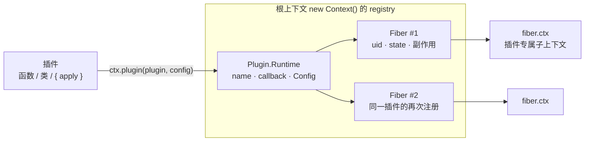

import { Canvas, Controls, Meta } from '@storybook/addon-docs/blocks';
import * as PluginsStories from './plugins.stories';

<Meta of={PluginsStories} name="Docs" />

# 插件

cordis 的一切功能都以插件装载。本课把「插件」拆成四个问题：插件长什么样（三种等价形态与静态元数据）、怎么注册（`ctx.plugin()` 与它创建的 Fiber）、重复注册会发生什么（运行时 `Plugin.Runtime` 与多实例）、销毁时发生什么（`fiber.dispose()` 与注册表的变化）。先给出贯穿全课的心智模型：**注册表以插件函数为键维护运行时，`ctx.plugin()` 每次调用都创建一个新实例（Fiber），销毁按实例进行，最后一个实例销毁时运行时才离开注册表。**

本课所有 API 与行为均按安装版本 cordis 4.0.0-rc.8 的源码逐一核对；4.0 尚未稳定，官方文档仅作交叉参考。相邻主题各有独立课程：Context 与上下文树见 2.2，服务与 `inject` 见 2.3 / 2.4，状态机与生命周期时序见 2.5，配置 schema 见 2.6，disposer 的形态细节见 3.1。



| 条目 | 签名 / 取值 | 回查要点 |
| --- | --- | --- |
| `ctx.plugin(plugin, config?)` | 返回 `Fiber & PromiseLike<Fiber>` | 每次调用创建一个新 Fiber；`await` 等待启用完成，插件抛错时以原错误拒绝 |
| 插件形态 | 函数 / 类 / `{ apply }` 对象 | 三选一；注册表以解析出的 callback 为键 |
| `fiber.state` | `FiberState` 0–5 | 0 PENDING、1 LOADING、2 ACTIVE、3 FAILED、4 DISPOSED、5 UNLOADING；完整状态机见 2.5 |
| `fiber.dispose()` | 返回 `Promise<void>` | 撤销该实例全部副作用（LIFO）；最后一个实例销毁时移除 Runtime |
| `ctx.registry.delete(plugin)` | 返回 `Runtime`，不是 Promise | 移除 Runtime 并销毁全部实例，但不等待销毁完成 |

## 快速上手

定义一个函数插件、注册它、再销毁它，最小闭环只要三步（Node.js ≥ 20 的 ESM 或浏览器控制台均可运行，输出按 4.0.0-rc.8 核对）：

```ts
import { Context } from 'cordis';

// 1. 定义插件：一个接受 (ctx, config) 的函数
function greet(ctx: Context, config: { name: string }) {
  ctx.effect(() => {
    console.log(`hello, ${config.name}`);
    return () => console.log(`bye, ${config.name}`);
  });
}

// 2. 创建根上下文并注册插件；await 等待启用完成
const root = new Context();
const fiber = await root.plugin(greet, { name: 'cordis' });
// 输出：hello, cordis

// 3. 销毁插件：撤销函数自动执行，副作用随之消失
await fiber.dispose();
// 输出：bye, cordis
```

插件的清理不靠手写 try/finally：副作用通过 `ctx.effect()` 注册即托管，销毁插件时框架自动逆序执行撤销函数（`ctx.effect` 的完整语义见 3.1）。

## 插件形态

官方文档定义了三种基本形态，走同一个注册入口，行为等价：

1. 一个接受 `(ctx, config)` 的**函数**；
2. 一个构造函数接受 `(ctx, config)` 的**类**；
3. 一个带 `apply` 方法的**对象**，`apply` 就是第一种形态所说的函数。

下面把「往上下文打一条日志」分别写成三种形态（插件真正执行的那段逻辑下称「插件体」）：

```ts
import { Context, type Plugin } from 'cordis';

const root = new Context();

// 形态一：函数（箭头函数，原因见下节）
const asFunction: Plugin.Function = (ctx) => {
  console.log('插件已启用');
};

// 形态二：类
class AsClass {
  constructor(ctx: Context) {
    console.log('插件已启用');
  }
}

// 形态三：对象，apply 属性即插件体
const asObject: Plugin.Object = {
  name: 'as-object',
  apply(ctx: Context) {
    console.log('插件已启用');
  },
};

// 三种形态用同一个 API 注册
root.plugin(asFunction);
root.plugin(AsClass);
root.plugin(asObject);
```

注册表靠 `registry.resolve()` 识别插件：函数和类返回自身，对象返回它的 `apply` 方法。这个解析结果（callback）就是注册表的键——所以「两个对象共享同一个 `apply` 函数」与「同一个函数注册两次」在注册表看来是同一件事（见「运行时与注册表」）。传入不合法的插件会直接抛错：`invalid plugin, expect function or object with an "apply" method, received number`。

作为模块发布时，插件可以整体导出（`export function apply` 加 `export const name`），也可以默认导出；只要模块提供了默认导出，加载器就只会加载默认导出——这是 loader 的行为，见 5.1。

### 函数形态的调用方式

rc.8 的实现按插件函数有没有 `prototype` 区分调用方式（源码中的 `isConstructor` 分支），这带来一个不显眼但关键的差别：

```ts
import { Context } from 'cordis';

const root = new Context();
const ran: string[] = [];

// function 声明：有 prototype → 被当作类，以 new 调用
function declared(ctx: Context) {
  return () => ran.push('declared 的 disposer');
}

// 箭头函数：无 prototype → 直接调用，返回值作为 disposer 收集
const arrow = (ctx: Context) => {
  return () => ran.push('arrow 的 disposer');
};

const f1 = await root.plugin(declared);
const f2 = await root.plugin(arrow);
await f1.dispose();   // ran：[]——declared 返回的函数被丢弃了
await f2.dispose();   // ran：['arrow 的 disposer']
```

三条影响（均按 4.0.0-rc.8 源码与运行结果核对）：

- **返回值：** `new` 分支只认实例上的 `[Service.init]` 异步初始化钩子，插件体 return 的函数会被丢弃；直接调用分支会把返回的函数收集为该实例的 disposer。
- **`this`：** function 声明的插件里 `this` 是一个一次性空对象；对象形态的 `apply` 以普通函数调用，`this` 不指向插件对象；只有类形态的 `this` 是实例。插件体不应依赖 `this`。
- **`ctx.effect()` 不受影响：** 官方文档示例用 function 声明加 `ctx.effect()` 注册副作用，这条路径在两种调用方式下行为一致。

结论：函数形态插件要么写成箭头函数（或 `bind` 过的函数，同样没有 `prototype`），要么保持 function 声明但用 `ctx.effect()` 注册清理。这是 4.0.0-rc.8 的实现细节，4.0 未稳定，升级时应复核。

### 静态元数据

三种形态共享一组可选的静态字段（`Plugin.Base`），注册表在**第一次**为该插件创建运行时时读取：

| 字段 | 类型 | 作用 |
| --- | --- | --- |
| `name` | `string` | 插件名。函数 / 类取函数名 / 类名，对象取 `name` 属性；用于 `fiber.name`、日志与插件可视化，官方说明它不影响任何运行时行为 |
| `Config` | Standard Schema | 配置 schema；注册与更新时校验并规范化 config，详见 2.6 |
| `inject` | 数组或对象 | 声明服务依赖；实例等待依赖就绪才启用，详见 2.4 |
| `provide` / `intercept` | 类型中声明的其他字段 | rc.8 的核心注册流程不读取它们；服务声明走 `Service` 基类（2.3） |

运行时一旦创建，后续注册不再更新这些字段：先用 `{ name: 'A', apply }` 再用 `{ name: 'B', apply }`（同一 `apply`）注册，运行时名一直是 `A`。

## 注册插件

`ctx.plugin(plugin, config?)` 每次调用做四件事：

- 在调用它的那个上下文的**父 fiber** 上挂一个销毁钩子，然后创建一个新 Fiber——这就是「父插件销毁会级联子插件」的来源（见下节）；
- 给实例分配单调递增的 `uid`（来自 `registry.counter`，销毁后编号不复用）；
- 为插件派生一个专属子上下文 `fiber.ctx`，插件体在其中执行（Context 的继承细节见 2.2）；
- 把 `config` 作为第二个参数传入插件体；没有 `Config` schema 时原样透传，未提供时为 `undefined`。

返回值同时是 Fiber 和 PromiseLike：`await ctx.plugin(fn)` 等待启用完成并得到 fiber 本体；插件抛错时这个 await 以原错误拒绝、实例进入 FAILED（见「销毁插件」）。

Fiber 上最常回查的字段：

| 字段 | 含义 |
| --- | --- |
| `fiber.ctx` | 插件专属子上下文 |
| `fiber.parent` | 注册时的父上下文 |
| `fiber.runtime` | 所属 `Plugin.Runtime`；根 fiber 为 `null` |
| `fiber.uid` | 实例编号；根 fiber 为 `0` |
| `fiber.config` | 传给插件体的配置 |
| `fiber.state` | `FiberState` 运行状态 |
| `fiber.name` | 就近向上取到的 `runtime.name`，到根为 `'root'` |

### 在插件里注册插件

插件体里也可以调用 `ctx.plugin()` 装载其他插件——入口插件 + 子插件是官方推荐的解耦方式，loader 与热重载也建立在这之上（5.1 / 5.2）。子实例的销毁钩子挂在父 fiber 上，所以父实例销毁时会级联销毁子实例（输出按 4.0.0-rc.8 核对）：

```ts
import { Context } from 'cordis';

const root = new Context();
const order: string[] = [];

function child(ctx: Context) {
  ctx.effect(() => {
    order.push('child-on');
    return () => order.push('child-off');
  });
}

function parent(ctx: Context) {
  ctx.plugin(child);              // 子插件注册在父插件的 ctx 上
  ctx.effect(() => {
    order.push('parent-on');
    return () => order.push('parent-off');
  });
}

const entry = await root.plugin(parent);
console.log(root.registry.size, root.registry.has(child));
// 2 true——父、子各占一个运行时

await entry.dispose();
console.log(root.registry.size, root.registry.has(child));
// 0 false——子插件被级联销毁，运行时一并移除

console.log(order.join(' -> '));
// parent-on -> child-on -> parent-off -> child-off
```

注意销毁顺序：副作用按注册的逆序（LIFO）撤销，父插件自己的 disposer 先于子插件销毁执行。重新注册 `parent` 时，`child` 会随之回到注册表。

## 运行时与注册表

注册表为**每个不同的 callback** 维护一个运行时（`Plugin.Runtime`），结构如下（源自 4.0.0-rc.8 的 registry 源码）：

```ts
{
  name: 'observer',        // 插件名（首次注册时确定）
  callback,                // 解析出的插件函数：函数 / 类本身，或对象的 apply
  Config,                  // 配置 schema（来自插件的静态 Config 字段）
  fibers: DisposableList,  // 该插件的全部实例
}
```

因此重复注册不是「覆盖」也不是「忽略」，而是**同一运行时下的多实例**：

```ts
const root = new Context();
function observer(ctx: Context) {
  ctx.effect(() => () => {});
}

const a = await root.plugin(observer);
const b = await root.plugin(observer);
console.log(root.registry.size);                        // 1——一个运行时
console.log(a.uid, b.uid);                              // 1 2——两个实例
console.log(root.registry.get(observer).fibers.length); // 2

await a.dispose();
console.log(root.registry.has(observer));               // true——b 还在

await b.dispose();
console.log(root.registry.has(observer));               // false——最后一个实例离开，运行时移除
```

下面的实例把这套语义放进了浏览器：插件体注册一个每秒心跳的 effect 和一个 `knock` 监听器，读数全部来自真实注册表。

<Canvas of={PluginsStories.Registry} />
<Controls of={PluginsStories.Registry} />

| 读者操作 | 可观察证据 |
| --- | --- |
| 切换「插件形态」 | 函数 / 类 / 对象都出现 ACTIVE 实例、心跳开始；registry.size 保持 1；运行时名称分别为 `heartbeat`（函数名）/ `Heartbeat`（类名）/ `heartbeat-object`（对象 `name` 属性）；「registry 键」在对象形态下变为 `plugin.apply` |
| 调大「实例数量」 | 新实例行出现，uid 递增不复用；registry.size 仍是 1，「活动实例」同步增加 |
| 调小「实例数量」 | 最后注册的实例先消失，其余实例的心跳继续；减到 0 后 registry.size 归 0 |
| 已无实例时点击画布 | 「已响应 knock」不再增长——监听器随实例销毁被自动撤销 |
| 点击画布 | 每个实例的「敲门」计数各自 +1——多个实例互不共享监听器 |
| 打开 Show code | 看到该 Canvas 实际执行的 `plugin-registry.ts` |

`ctx.registry` 是 Map 语义的内置服务，全部成员如下：

| 成员 | 行为 |
| --- | --- |
| `get(plugin)` | 取该插件（任意形态）的运行时；未注册时为 `undefined` |
| `has(plugin)` | 是否存在至少一个实例 |
| `size` | 当前运行时数量 |
| `delete(plugin)` | 移除运行时并销毁其全部实例（异步，见下节） |
| `keys()` / `values()` / `entries()` / `forEach()` | 以 callback 为键遍历 |
| `resolve(plugin)` | 返回注册表实际使用的键：函数 / 类返回自身，对象返回 `apply` |

两个相邻入口在这里只点名：`ctx.inject(deps, callback)` 是 `ctx.plugin({ inject: deps, apply: callback, name: callback.name })` 的语法糖（2.4 展开）；注册与销毁各会触发一次 `internal/plugin` 事件并携带 fiber，插件可视化建立在它之上（时序细节见 2.5）。

## 销毁插件

`await fiber.dispose()` 按源码顺序做四件事：

1. 置空 `uid` 并触发 `internal/plugin`（此时实例尚为 ACTIVE）；
2. 从运行时的 `fibers` 中移除自己；若自己是最后一个实例，连同运行时一起从注册表移除；
3. 逆序（LIFO）执行该实例收集的全部 disposer，撤销副作用与监听器；disposer 抛错只记日志、不上抛；
4. 状态进入 DISPOSED（`fiber.state === 4`）。

要一次销毁某插件的全部实例，用 `ctx.registry.delete(plugin)`——注意它**不等待销毁完成**：

```ts
const a = await root.plugin(observer);
const b = await root.plugin(observer);

root.registry.delete(observer);   // 移除运行时，并对两个实例调用 dispose
root.registry.has(observer);      // false——注册表立即清空
// 但两个实例的销毁是异步进行的；delete 返回的是运行时，不是 Promise
```

三处边界行为：

- **根 fiber** 的 `dispose` 不进入 DISPOSED，而是回收根上全部副作用、清空注册表，相当于回到 `new Context()` 的初始状态。
- **插件抛错**的实例进入 FAILED（`fiber.state === 3`），`await fiber` 以原错误拒绝；实例仍留在注册表中，依旧可以 `dispose()`：

```ts
function bad(ctx: Context) {
  throw new Error('boom');
}

const fiber = root.plugin(bad);
try {
  await fiber;             // 抛出 Error: boom
} catch (error) {
  console.error(error);
}
fiber.state;               // 3（FAILED）
await fiber.dispose();     // 失败的实例仍然可以销毁
```

- **在已销毁实例的上下文上继续注册**会抛 `CordisError: cannot create effect on inactive context`——销毁后的 `fiber.ctx` 不能再装载插件。

## 最佳实践

- **选形态：** 函数（箭头）是默认选择，最小且直接；需要实例状态、要继承 `Service` 或使用 `[Service.init]` 异步初始化时用类；需要把 `name` / `Config` / `inject` 当数据携带、或在多处引用同一插件对象时用对象。
- **选清理方式：** 优先 `ctx.effect()`——它与调用方式无关，function 声明也安全；「插件体直接 return disposer」只在没有 `prototype` 的函数（箭头、bind）下生效。
- **选销毁粒度：** 销毁单个实例用 `await fiber.dispose()`；销毁全部实例用 `registry.delete()`，需要确认完成时逐个 await 或监听 `internal/plugin`（2.5）。

## 常见问题

- 同一个插件注册了两次，副作用出现两份，或监听器触发两次。
  这是多实例语义而非重复注册被忽略：第二次 `ctx.plugin()` 创建了新的 Fiber 与前者并存。判断依据是 `registry.size` 不变而 `runtime.fibers.length` 增加。只想保留一份时，先 `await` 旧实例的 `dispose()`（或 `registry.delete`）再注册。
- 调用 `ctx.registry.delete(plugin)` 后 `has()` 立即为 false，但插件的副作用好像还在跑。
  `delete` 同步移除运行表项，但对各实例的 `dispose` 是异步进行的，且返回值是运行时而不是 Promise，无法直接 await。需要确认销毁完成时，改为逐个 `await fiber.dispose()`，或监听 `internal/plugin` 事件（2.5）。
- 函数插件 return 了清理函数，插件销毁时却没有执行。
  rc.8 按插件函数有没有 `prototype` 决定调用方式：function 声明以 `new` 调用、返回值被丢弃；箭头函数（或 bind 过的函数）直接调用、返回值才被收集为 disposer。把插件写成箭头函数，或改用 `ctx.effect(() => () => 清理())`——后者与声明方式无关。

## 总结回顾

摘要：

插件是 cordis 装载功能的统一单元，有函数、类、对象三种等价形态，注册表用 `registry.resolve()` 解析出的 callback 作键，为每个不同 callback 维护一个含名称、配置 schema 与实例列表的运行时。`ctx.plugin(plugin, config)` 每次调用都创建一个新 Fiber 实例：分配不复用的 uid、派生专属子上下文、把销毁钩子挂在父 fiber 上，因此重复注册得到多实例、父插件销毁会级联子插件。销毁按实例进行：dispose 逆序撤销全部副作用，最后一个实例离开时运行时才从注册表移除；`registry.delete()` 批量销毁但不等待完成。函数形态的调用方式由 `prototype` 决定，清理统一交给 `ctx.effect()` 最稳妥。

一句话：

> 插件是挂在一个 callback 上的可重复实例：`ctx.plugin()` 每次创建新 Fiber，销毁按实例进行，最后一个实例离开时运行时才从注册表消失。

知识要点：

- 一个插件可以是哪三种形态？注册表用什么作键？
- function 声明与箭头函数的插件在调用方式上有什么差别？清理函数分别该怎么写？
- `ctx.plugin()` 的返回值是什么？`await` 它会得到什么、什么时候会拒绝？
- 同一插件注册两次会发生什么？`registry.size` 与 `runtime.fibers` 各怎么变？
- `fiber.dispose()` 依次做哪些事？最后一个实例销毁时注册表发生什么？
- 在插件里再注册插件，父实例销毁时会发生什么？销毁顺序是怎样的？
- `registry.delete()` 与逐个 `fiber.dispose()` 有什么差别？

## 参考资料

- [官方文档：认识插件](https://github.com/cordiverse/docs/blob/main/zh-CN/guide/essential/index.md)——三种基本形态、模块化与嵌套插件
- [官方 API 参考：Registry](https://github.com/cordiverse/docs/blob/main/zh-CN/api/core/registry.md)——`ctx.plugin()` 与 `ctx.inject()` 的签名
- [官方 API 参考：Fiber](https://github.com/cordiverse/docs/blob/main/zh-CN/api/core/fiber.md)——状态机、`fiber.dispose()` 与 `fiber.then()` 语义
- [cordis 源码：packages/core](https://github.com/cordiverse/cordis/tree/master/packages/core)——`registry.ts` / `fiber.ts`（本课按本地安装的 4.0.0-rc.8 逐项核对）
