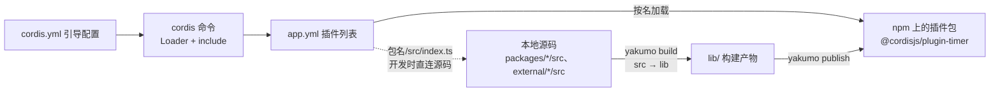

import { Meta } from '@storybook/addon-docs/blocks';

<Meta id="project-structure" title="上手/工程组织" name="Docs" />

# 工程组织

一个 cordis 工程只有两种角色：**应用**是配置驱动的运行壳，`app.yml` 里写什么就跑什么，可以一行代码不写；**插件包**是被应用按名加载的 npm 包，从 `src/index.ts` 构建出 `lib/` 再发布。连接两端的是 yakumo——它用和 cordis 应用完全相同的配置形态，管住从源码到 npm 的构建与发布。本课解剖官方模板（boilerplate）和官方插件包（如 `@cordisjs/plugin-timer`）的真实文件，讲清关键文件、每条脚本和发布字段是干什么的。

| 文件 / 字段 | 属于 | 职责 |
| --- | --- | --- |
| `cordis.yml` | 应用 | 引导配置：CLI、守护进程、prelude 插件 |
| `app.yml` | 应用 | 应用插件列表，真正决定“跑哪些插件” |
| `scripts.dev` / `scripts.start` | 应用 | 启动脚本；`tsx`、`@cordisjs/unyaml` 仅 dev 需要 |
| `workspaces` | 应用 | 本地插件纳入工作区（`packages/*`、`external/*` 及嵌套） |
| `yakumo.yml` | 应用与插件包 | yakumo 管线；`build` 默认是 `tsc` 加 `esbuild` |
| `src/index.ts` → `lib/` | 插件包 | 源码入口与构建产物；npm 只发布 `lib` |
| `exports` / `files` | 插件包 | 发布后的可导入面 |
| `peerDependencies.cordis` | 插件包 | cordis 由宿主应用提供，插件包不重复安装 |

## 快速上手

最小闭环：创建模板工程、以开发模式启动、改一行配置看到热生效。命令在应用目录（顶层 `package.json` 所在目录）下运行。

```sh
yarn create cordis my-app   # 也可 npm init cordis@latest my-app 或 pnpm init cordis my-app
cd my-app
yarn dev
```

`yarn dev` 启动后，控制台会输出插件加载日志，`@cordisjs/plugin-server` 默认监听 3140 端口（见 `app.yml` 的 `port: 3140`），运行数据写入 `data/` 目录（如 SQLite 数据库 `data/cordis.db`）。

保持进程运行，编辑 `app.yml`，给任意插件加一行 `disabled: true` 并保存：

```yaml title=app.yml
- id: 312edd83
  name: '@cordisjs/plugin-timer'
  disabled: true   # 新增这一行后保存
```

控制台随即输出该插件被卸载的日志——`app.yml` 本身在 HMR 监听范围内，配置改动即时生效，无需重启。到此你已经用过本课的主要角色：模板工程、插件列表 `app.yml` 和启动脚本。

## 工程角色

先建立模型，再看文件。三种工程形态由“谁加载谁”决定：

- **应用工程**：跑起来的那个进程。由 `package.json` 加两份 YAML 配置构成，本身通常不发布，是插件的组装现场。
- **插件包工程**：发布到 npm 的包。入口是 `apply(ctx, config)`（见[插件](?path=/docs/plugins--docs)一课），应用通过配置里的 `name` 按名加载它。
- **工作区**：两者的容器。一个应用工程通过 `workspaces` 把本地插件包和克隆的第三方仓库纳入同一份依赖关系，配合 HMR 形成开发回路。



判断建哪种工程：要跑一个服务或机器人，建应用工程；要让别人（或自己的其他应用）按包装载你的能力，建插件包工程；两者都涉及时，用一个工作区装下应用加本地插件包。

## 应用工程

官方模板 [boilerplate](https://github.com/cordiverse/boilerplate) 就是标准应用工程，`create-cordis` 脚手架直接以它为模板生成项目。与工程相关的文件如下（省略 `.github/`、`.vscode/` 等）：

```text
my-app/
├── package.json          # 应用目录的标志；scripts、workspaces 在这里
├── cordis.yml            # 引导配置：CLI、守护进程、prelude 插件
├── app.yml               # 应用插件列表
├── tsconfig.json         # 本地源码的路径映射（只影响类型检查与 IDE）
├── tsconfig.base.json    # 共享编译选项（declaration、composite）
├── yakumo.yml            # yakumo 管线（build = tsc + esbuild）
├── external/             # 克隆的第三方插件仓库，原样参与工作区
├── packages/             # 自己编写的本地插件包
├── data/                 # 运行时数据，随运行生成（git 忽略）
└── docker/               # 容器部署脚本（可选）
```

`external/`、`packages/`、`data/` 初始为空或不存在，按需出现。`package.json` 里与之相关的部分：

```json title=package.json
{
  "name": "@cordisjs/boilerplate",
  "private": true,
  "packageManager": "yarn@4.14.1",
  "files": [".env", "app.yml", "cordis.yml"],
  "workspaces": [
    "external/*",
    "external/*/external/*",
    "external/*/external/*/packages/*",
    "external/*/packages/*",
    "packages/*"
  ],
  "scripts": {
    "build": "yakumo build",
    "dev": "cross-env NODE_ENV=development NODE_OPTIONS=\"--import tsx --import @cordisjs/unyaml\" cordis run",
    "start": "cordis run"
  }
}
```

三个要点：`private: true` 表示应用默认不发布；`workspaces` 的嵌套通配让克隆进 `external/` 的仓库自带的子工作区也能被识别（这正是 yakumo 的看家能力）；`files` 列出的是“整合包发布”时要带上的应用数据（见[发布](#发布)一节）。

### cordis.yml 与 app.yml

两份配置分工明确，都在[加载器](?path=/docs/loader--docs)一课的管辖内，这里只讲工程侧的职责边界：

| | `cordis.yml` | `app.yml` |
| --- | --- | --- |
| 角色 | 引导配置 | 应用插件列表 |
| 内容 | CLI 插件、守护进程、prelude（env、logger） | 配置单元数组：要跑的插件及其配置 |
| 谁读它 | `cordis` 命令启动时最先加载 | `@cordisjs/plugin-cli-cordis` 通过 include 读入 |
| 改动频率 | 几乎不改 | 经常改（加减插件、调配置） |

`cordis.yml` 的实际内容：

```yaml title=cordis.yml
- name: '@cordisjs/plugin-cli'
  config:
    name: cordis
- name: '@cordisjs/plugin-cli-cordis'
  config:
    path: ./app.yml
    daemon:
      enabled: true
    prelude:
      - name: '@cordisjs/plugin-env'
      - name: '@cordisjs/plugin-logger-console'
```

它先装上命令行框架（`plugin-cli`），再由 `plugin-cli-cordis` 指定真正的插件列表文件 `app.yml`，并启用守护进程模式。`app.yml` 顶层数组，每项是一个配置单元（`name` 必需，`config`、`disabled`、`label` 按需），可用 `@cordisjs/plugin-group` 插件分组——字段语义详见官方配置文档与加载器课程。

## 插件包工程

以官方插件 `@cordisjs/plugin-timer`（源码位于 cordis 仓库 `packages/timer/`）为样本，一个插件包工程只需四样东西：

```text
my-plugin/
├── package.json          # name、exports、files、peerDependencies
├── tsconfig.json         # rootDir: src、outDir: lib
├── src/
│   └── index.ts          # 插件入口：apply(ctx, config)
└── lib/                  # yakumo build 的产物（git 忽略、npm 发布）
```

`tsconfig.json` 只有三行有效配置：

```json title=tsconfig.json
{
  "extends": "../../tsconfig.base",
  "compilerOptions": {
    "rootDir": "src",
    "outDir": "lib"
  },
  "include": ["src"]
}
```

入口 `src/index.ts` 写插件本身，是[插件](?path=/docs/plugins--docs)一课的主题。工程侧要记住的是：**`src/` 是给人改的，`lib/` 是给机器读的**，发布与生产运行都只消费 `lib/`。

## 运行脚本

### cordis 命令链路

`cordis` 命令来自 cordis 核心包自带的 `bin.js`（`package.json` 的 `bin` 字段）。它不做参数解析，只做一件事——按引导链把应用拉起来：

```text
cordis run
  └─ bin.js：new Context()，baseUrl 设为当前目录
      └─ 加载 Loader，读取 ./cordis.yml（include 插件）
          └─ cordis.yml 装上 plugin-cli 与 plugin-cli-cordis
              └─ plugin-cli 解析 process.argv，执行 run 命令
                  └─ run：fork 守护 worker（自动附加 --expose-internals）
                      └─ worker：加载 prelude 插件，读入 ./app.yml
```

所以 `package.json` 里那个看似简单的 `"start": "cordis run"` 背后是：核心 bin 引导 → `cordis.yml` → `plugin-cli-cordis` 的 `run` 子命令 → `app.yml`。子命令由 `cordis.yml` 装载的插件决定，当前模板注册的是 `run [url]`（`-d` / `--daemon` 控制守护模式）；官方文档部分页面仍写着旧命令 `cordis start`，以模板脚本为准。

### dev 与 start

| | `yarn dev` | `yarn start` |
| --- | --- | --- |
| NODE_ENV | development | 未设置 |
| `--import tsx` | 有：Node 可直接加载 `.ts` 源码 | 无：只能加载构建产物 |
| `--import @cordisjs/unyaml` | 有：Node 可直接 `import` `.yml` 文件 | 无 |
| HMR | 随 Development 分组加载 | 通常不加载 |

两个 `--import` 是 dev 的全部秘密：`tsx` 让应用能直连本地插件的 TypeScript 源码（见下一节），`@cordisjs/unyaml` 让从源码运行的插件能导入自己的 YAML 语言包等资源。生产运行走 `lib/` 产物，两者都不需要。HMR 由 `app.yml` 的 Development 分组里的 `@cordisjs/plugin-hmr` 提供，`root` 配置决定监听哪些路径，模板默认是：

```yaml title=app.yml（节选）
- id: e1e36558
  name: '@cordisjs/plugin-hmr'
  config:
    root:
      - external
      - packages
      - app.yml
```

改动落到三类文件上的行为不同：插件模块变更触发插件级热重载（不是整进程重启）；`app.yml` 变更触发配置重读；被判定为框架自身的文件变更则整个进程退出重启。

## 本地插件开发

开发一个插件时，把它放进工作区，让应用直连其源码。三步配合：

**第一步，放进工作区。** `workspaces` 通配已经预留了位置：自己写的包放 `packages/*`；克隆的第三方插件仓库原样放 `external/*`，它自带的嵌套工作区（`external/*/packages/*` 等）也能被识别，不需要改动上游结构。

**第二步，接进类型系统。** 模板的 `tsconfig.json` 用 `paths` 把包名映射到本地源码，IDE 与类型检查跟的是 `src/` 而不是 `node_modules` 里的产物：

```json title=tsconfig.json（节选）
{
  "compilerOptions": {
    "paths": {
      "@cordisjs/plugin-*": ["./external/*/packages/core/src"],
      "cordis-plugin-*": ["./external/*/src", "./packages/*/src"],
      "cordis": ["./packages/core/src"]
    }
  }
}
```

**第三步，接进运行时。** 在 `app.yml` 里用**包名的 `src` 子路径**引用插件，开发时改源码即时热重载：

```yaml title=app.yml
- id: a1b2c3d4
  name: 'my-plugin/src/index.ts'   # 直连 TS 源码，需 dev 模式（tsx）
```

这条路能走通，靠的是插件包 `exports` 里的 `"./src/*": "./src/*"` 子路径导出——它是官方包的标准配置，专门服务源码级引用。发布形态的引用则写裸包名 `my-plugin`，走 `lib/index.js`。

`tsconfig.json` 的 `paths` 只影响类型检查与 IDE，不影响 Node 的运行时解析；运行时能找到本地包，靠的是包管理器把工作区成员软链进 `node_modules`。

## 构建

### yakumo 管线

[yakumo](https://github.com/cordiverse/yakumo) 是 cordiverse 的工作区工具链。它本身就是一个 cordis 应用——同样的 Context 加 Loader 加 include 结构，只是配置文件换成 `yakumo.yml`，命令由 `@cordisjs/plugin-cli` 解析。管线在配置里声明：

```yaml title=yakumo.yml
- name: yakumo
  config:
    pipeline:
      build:
        - tsc
        - esbuild
        - client
      clean:
        - tsc --clean
- name: yakumo-esbuild
- name: yakumo-tsc
- name: '@cordisjs/client/yakumo'
```

`yarn build` 即 `yakumo build`：对工作区内的包跑管线——`tsc` 阶段产出 `.d.ts` 类型声明，`esbuild` 阶段产出 `.js` 代码，都落到各包的 `lib/`。cordis 仓库自己也是这么构建的（脚本 `yarn yakumo esbuild && yarn yakumo tsc`，效果等价）。yakumo 还内建 `version`、`publish`、`run`、`list`、`upgrade` 等命令，发布一节只展开前两个。

### 构建产物

一次 `yarn build` 后，`src/index.ts` 变成两个文件：

```text
lib/
├── index.js     # esbuild 产物：运行时代码
└── index.d.ts   # tsc 产物：类型声明
```

`package.json` 的 `main` 与 `types` 分别指向它们。发布前用 `yarn build` 验证一遍“用户拿到的形态”，是插件包开发的标准动作；`yarn clean`（管线的 `tsc --clean`）负责清掉产物。

## package.json

发布形态由插件包的 `package.json` 决定。对照核心包 `cordis` 与插件包 `@cordisjs/plugin-timer` 的实际字段：

| 字段 | cordis（核心） | @cordisjs/plugin-timer（插件） | 说明 |
| --- | --- | --- | --- |
| `type` | `module` | `module` | ESM 包 |
| `main` / `types` | `lib/index.js` / `lib/index.d.ts` | 同左 | 指向构建产物 |
| `exports` | 见下 | 同构 | 可导入面 |
| `files` | `["lib", "bin.js"]` | `["lib"]` | npm 只打包这些 |
| `peerDependencies` | loader、include（均 optional） | `cordis` | 宿主要提供的东西 |
| `devDependencies` | — | `cordis` | 类型与本地开发 |
| `sideEffects` | `false` | 未设置 | 帮打包器做静态优化 |

`exports` 三段是官方包的标准写法：

```json title=package.json（节选）
{
  "exports": {
    ".": {
      "types": "./lib/index.d.ts",
      "default": "./lib/index.js"
    },
    "./src/*": "./src/*",
    "./package.json": "./package.json"
  }
}
```

- `"."`：裸包名入口，类型优先指向 `lib` 的声明文件。
- `"./src/*"`：源码子路径，供工作区内开发直连（上一节的用法）与源码级排错。
- `"./package.json"`：让工具能读到包元信息，yakumo 等依赖它。

插件包把 `cordis` 写在 `peerDependencies` 而不是 `dependencies`：宿主应用统一提供并只装一份 cordis，插件包不私自带入第二个实例（`Context`、`Service` 等运行时单例依赖此约定）；`devDependencies` 里再放一份 `cordis` 供类型检查与独立开发。核心包是特例——它没有宿主，peer 里放的是 `@cordisjs/plugin-loader` 和 `@cordisjs/plugin-include`（都标 optional），因为只有 `bin.js` 启动应用时才需要它们，作为库被引入时不需要。

## 发布

### npm 命名

两个已成的约定：官方插件用 `@cordisjs` scope（`@cordisjs/plugin-timer`、`@cordisjs/plugin-http`）；社区插件的预留前缀是 `cordis-plugin-*`——boilerplate 的 `tsconfig.json` 专门为这个前缀留了本地映射。应用（整合包）命名没有约定，模板自己用的是 `@cordisjs/boilerplate`。

### 版本推进与发布

`yakumo version` 推进工作区内的版本号，预发布阶梯是 `alpha` → `beta` → `rc`。推进类型用选项指定，包名是可选的位置参数（省略时会询问是否作用于全部包）：

```sh
yarn yakumo version --patch --prerelease   # 1.0.0 → 1.0.1-alpha.0；重复执行 → beta.0 → rc.0
yarn yakumo version --minor --prerelease   # 1.0.0 → 1.1.0-alpha.0
yarn yakumo version --stable               # 去掉预发布后缀：1.0.1-rc.0 → 1.0.1
yarn yakumo version --reset                # 回退一步：预发布号减一（rc.1 → rc.0），稳定版则 patch 减一
```

`yakumo publish` 把工作区里变了的包发到 npm，行为都为 monorepo 设计：

- 默认跳过 `private: true` 的包（显式点名发布时会询问是否转为公开）。
- 先对照 npm registry：版本已存在的直接 skip，所以重复执行是安全的。
- 发布前做依赖版本约束检查：工作区内任何包的 `dependencies` / `peerDependencies` 范围在“待发版本集合 + registry 现有版本”里无可满足版本时，整次发布失败。
- dist-tag 自动选择：版本带 `alpha` / `beta` 预发布后缀的发 `next` tag，`rc` 与稳定版发 `latest`。
- `--access public`（默认）、`--tag`、`--registry`、`--otp` 可覆盖行为；发布后自动同步 npmmirror。

cordis 仓库的发布就是在 CI 里完成的——push 到 main 分支时跑 `yarn yakumo publish`，并开启 npm provenance：

```yaml title=.github/workflows/build.yml（节选）
- name: Publish
  if: github.event_name == 'push' && github.ref == 'refs/heads/main'
  run: |
    yarn config set npmPublishProvenance true
    yarn yakumo publish
```

### 应用整合包

应用本身也能发布，形态叫“整合包”（bundle）。boilerplate 的 CI 有两条发布线：npm workflow 在 push 到 main 时把整个应用目录（去掉 `node_modules`，`private` 改为 `false`）打成 npm 包，dist-tag 用 `nightly`、版本号追加提交哈希；版本号变化时 tag workflow 自动创建 `v*` release 并触发同一路径发正式版。`files` 里声明的 `.env`、`app.yml`、`cordis.yml` 保证应用数据随包带上。Docker 镜像走另一条 build workflow：`files` 与 git 跟踪的文件打成 zip 塞进基于 `node:lts-alpine` 的镜像，入口是 `yarn start`，首次启动解压到卷目录。官方的“整合包”文档页尚未完成，以上以模板仓库脚本为准。

## 最佳实践

- **cordis 永远放 `peerDependencies`。** 插件包私自带一份 cordis 会造成双实例，`Context` 与服务容器会失配；`devDependencies` 再放一份仅供类型。这是官方插件的统一形态。
- **`external/` 与 `packages/` 各司其职。** 克隆的第三方仓库放 `external/`，保留上游原样结构（嵌套工作区照样工作）；自己维护的包放 `packages/`。不要把上游仓库拷散了塞进 `packages/`，否则无法跟随上游更新。
- **`files` 只带 `lib`，`exports` 保留 `./src/*`。** 发布体积最小，同时给工作区开发和源码级排错留入口。
- **日常 dev 直连 `src` 子路径，发布验证走裸包名。** 改源码立即生效只发生在 dev；合入前用 `yarn build` 加裸包名引用跑一遍，验证的才是用户实际拿到的 `lib/` 形态。
- **rc 期的版本范围跟随当前 rc。** cordis 4.0 尚未稳定，插件包的 peer 范围写当前安装的 rc（如 `^4.0.0-rc.8`），进入稳定线后再放宽。

## 常见问题

- 按官方文档执行 `cordis start` 报错退出。
  文档部分页面对应早于 `plugin-cli` 的命令行形态。当前模板注册的子命令是 `cordis run`，模板 `package.json` 的 `dev` / `start` 脚本已经写好，直接用 `yarn dev` / `yarn start`，不要手拼旧命令。
- HMR 报错 `--expose-internals is required for HMR service`。
  HMR 服务需要 Node 内部模块接口。经 `@cordisjs/plugin-cli-cordis` 启动时，守护 worker 会自动附加该参数；如果你绕过模板脚本、自己直接 `node node_modules/cordis/bin.js` 启动，就需要手动加上 `--expose-internals`。
- Linux 上 dev 模式报 `NOSPC: System limit for number of file watchers reached`。
  系统监听文件数到上限（常见 8192）。提高上限：`echo fs.inotify.max_user_watches=524288 | sudo tee -a /etc/sysctl.conf && sudo sysctl -p`；或收窄 HMR 的 `root` 到正在开发的子目录（如 `external/foo`），它也接受数组。
- 版本检查失败，提示类似 `xxx > cordis@^4.0.0-rc.5 cannot be satisfied`。
  semver 的预发布范围只匹配同一 `major.minor.patch` 位的更高预发布与正式版：`^4.0.0-rc.5` 接受 `4.0.0-rc.8`、`4.0.0`、`4.5.0`，但不接受 `4.1.0-beta.1`。确认宿主与应用里的 cordis 版本在同一预发布线上，或把范围改宽到能覆盖实际版本。
- `yarn dev` 一切正常，`yarn start` 报 “Unknown file extension ".ts"” 或改动不生效。
  `start` 没有 `--import tsx`，加载不了 TypeScript 源码；且它消费的是 `lib/` 产物。`app.yml` 里开发期的 `包名/src/index.ts` 引用要改回裸包名，并先 `yarn build`。

## 总结回顾

摘要：

应用工程由 `package.json` 加 `cordis.yml`（引导）加 `app.yml`（插件列表）构成，`cordis` 命令沿着 bin → `cordis.yml` → `plugin-cli-cordis` 的 `run` → `app.yml` 链路把它拉起来；dev 脚本用 `tsx` 与 `@cordisjs/unyaml` 换来源码级运行和 HMR。本地插件经 `workspaces` 纳入应用，`tsconfig.json` 的 `paths` 接类型，`app.yml` 的 `src` 子路径接运行时。插件包以 `@cordisjs/plugin-timer` 为样板：`src/index.ts` 是唯一源码入口，`yakumo build`（tsc 出声明、esbuild 出代码）产出 `lib/`，`package.json` 用 `exports`、`files`、`peerDependencies` 定义发布形态。发布走 `yakumo version` 推版本（alpha → beta → rc → stable）、`yakumo publish` 发包（自动跳过已发版本、检查依赖约束、按预发布后缀分 `next` / `latest` tag），应用则可以打成整合包随 CI 发布。

一句话：

> 应用是配置驱动的运行壳，插件包是按名加载的 npm 包，yakumo 用同一套配置形态管住从 `src` 到 `lib` 再到 npm 的整条链路。

知识要点：

- 应用工程与插件包工程分别由哪些文件构成？
- `cordis run` 按下之后依次发生什么？`cordis.yml` 与 `app.yml` 各负责什么？
- `yarn dev` 与 `yarn start` 差在哪两个 `--import`？
- 本地插件怎么接进应用的工作区、类型系统和运行时？
- `yakumo build` 的管线做什么？产物在哪个目录、包含哪些文件？
- 插件包 `package.json` 的 `exports`、`files`、`peerDependencies` 怎么写，为什么 cordis 放 peer？
- `yakumo version` 与 `yakumo publish` 分别做什么？`next` 与 `latest` tag 怎么分？
- 官方与社区的 npm 包命名分别用什么？

## 参考资料

- [Cordis 文档：启动脚本（starter/scripts）](https://github.com/cordiverse/docs/blob/main/zh-CN/guide/starter/scripts.md)
- [Cordis 文档：配置文件（starter/config）](https://github.com/cordiverse/docs/blob/main/zh-CN/guide/starter/config.md)
- [Cordis 文档：环境搭建（starter/setup）](https://github.com/cordiverse/docs/blob/main/zh-CN/guide/starter/setup.md)
- [cordiverse/boilerplate 官方应用模板](https://github.com/cordiverse/boilerplate)
- [cordiverse/cordis 仓库（`packages/timer`、`.github/workflows/build.yml`）](https://github.com/cordiverse/cordis)
- [cordiverse/yakumo 工作区工具链](https://github.com/cordiverse/yakumo)
- [npm：@cordisjs/plugin-timer 发布元信息](https://www.npmjs.com/package/@cordisjs/plugin-timer)
