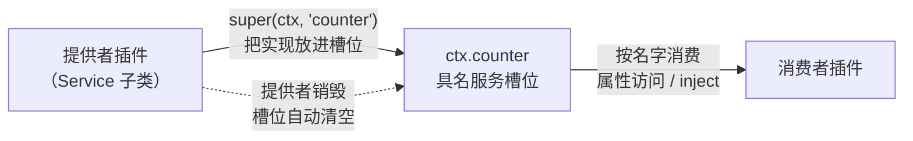
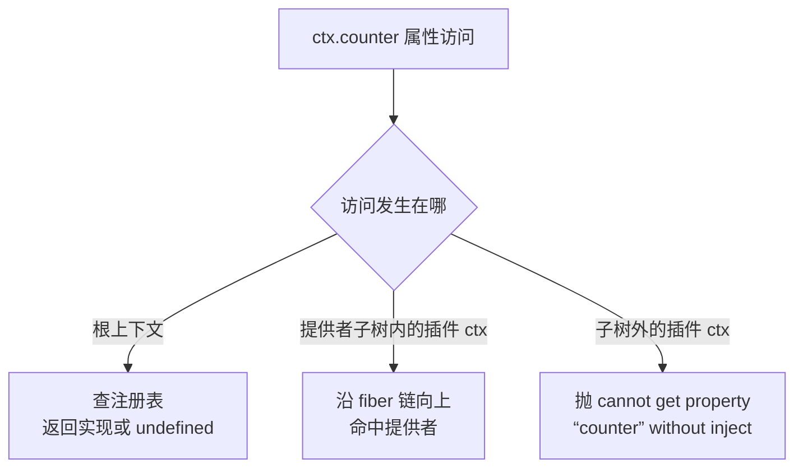

import { Canvas, Controls, Meta } from '@storybook/addon-docs/blocks';
import * as ServicesStories from './services.stories';

<Meta of={ServicesStories} name="Docs" />

# 服务

插件解决「功能怎么装上来、拆下去」，服务解决「装上来的功能怎么被找到」。cordis 里的服务就是挂在上下文上的一个**具名能力槽位**：一个名字（`database`、`logger`、本课实例里的 `counter`）对应 `ctx` 上的一个属性；提供者插件把实现放进槽位，消费者插件按名字取用——两边从头到尾不 import 对方，依赖的是名字这个契约。本课沿四个问题展开：服务怎么定义（`Service` 基类与声明合并）、怎么注册与替换（同名同时刻只有一个实现）、怎么消费（属性访问的可见性规则）、什么时候消失（随提供者失效）。下方实例在浏览器里注册了一个真实的 counter 服务，四个开关分别对应这四个问题。



| 关键对象 / 场景 | 形态 / 默认值 | 回查要点 |
| --- | --- | --- |
| `Service` 构造 | `new Service(ctx, name?)` | 4.0 两参；`name` 省略时读子类静态属性 `provide` |
| 注册通道 | 构造内部调 `ctx.reflect.provide(name, 实例)` | 也可绕开基类直接 `ctx.provide(name, value)`，返回清理函数 |
| 重复注册 | 抛 `service "x" has been registered at <提供者>` | 同名同时刻仅一个实现；先卸载旧的，或用 `ctx.isolate` 开平行槽位 |
| 根上下文访问 | `root.counter` → 实例或 `undefined` | 查不到不抛错，是应用侧判断服务存在的安全路径 |
| 子树外访问 | 抛 `cannot get property "x" without inject` | 普通插件 ctx 沿 fiber 链解析，走不出提供者子树；跨子树要 `inject`（2.4） |
| 存在性判断 | `ctx.get(name)` 或真值判断 | `'x' in ctx` 声明过即恒真，反映不了当前是否可用 |
| 注册 / 移除事件 | `ctx.on('internal/service', (name, value) => {})` | 注册时 `value` 为实例，移除时为 `undefined` |
| 类型入口 | `declare module 'cordis'` | 纯类型层；不写也能跑，只是没有补全与检查 |

## 定义服务

定义一个服务要交代两件事：名字叫什么、实例长什么样。`Service` 基类把名字的注册收进构造函数，把「实例长什么样」留给你的子类——最小形态只需要一个构造器和消费者要调的方法。

### Service 基类

```ts
import { Context, Service } from 'cordis';

// 契约：消费者只依赖这个名字下「有什么可用」
export interface CounterApi {
  readonly count: number;
  bump(step: number): number;
}

export class LinearCounter extends Service implements CounterApi {
  count = 0;

  constructor(ctx: Context) {
    super(ctx, 'counter'); // 注册动作本身：把 this 放进当前作用域的 counter 槽位
  }

  [Service.init]() {
    // 类插件路径专属：实例构造完成后由框架调用，适合异步初始化
  }

  bump(step: number) {
    this.count += step;
    return this.count;
  }
}
```

`super(ctx, 'counter')` 这一行就是注册：基类构造函数把 `this.ctx`、`this.name` 绑好，随即调用 `ctx.reflect.provide('counter', this)` 把实例放进槽位（源码 `packages/core/src/service.ts`）。基类的其余成员按需取用：

| 成员 | 形态 | 说明 |
| --- | --- | --- |
| `constructor(ctx, name?)` | 实例方法 | 两参。`name` 省略时读子类的 `static provide = 'counter'` 作默认服务名 |
| `service.ctx` / `service.name` | 实例属性 | 每个服务实例都记得自己挂在哪个 ctx、哪个名字上 |
| `[Service.init]` | 可选钩子 | 类插件路径构造完成后由框架调用；手动 `new` 不触发。可返回清理函数（异步结果同样支持），交框架托管 |
| `[Service.invoke]` | 可选钩子 | 把服务做成可调用对象——`ctx.logger('name')` 就是这种形态；官方 API 文档明确不建议滥用 |

三条边界：

- **构造签名以 4.0 源码为准。** 官方指南「服务与依赖」一章仍写着 3.x 的三参 `super(ctx, name, immediate)` 和 `start()` / `stop()` / `fork()` 生命周期方法，4.0（rc.8）里都不存在；异步初始化改用 `[Service.init]`。
- **Service 子类本身就是插件类。** `ctx.plugin(LinearCounter)` 装载、fiber 销毁时注销服务；插件类的 `static inject`、`static Config` 等静态属性对它同样适用（见[插件](?path=/docs/plugins--docs)与[配置](?path=/docs/config--docs)）。
- **基类不是必需的。** `ctx.provide('counter', { count: 0, bump(step) { ... } })` 能把任意对象直接放进槽位并返回清理函数；官方 API 文档的原话是「理论上你可以用任何可代理对象作为服务」。基类的价值在统一的 ctx/name 绑定、`init` 钩子和「插件即服务」的装载形态。

还有一个值得知道的机制：通过 ctx 拿到的服务是**带调用者追踪的代理**。在服务方法内部读 `this.ctx`，得到的是调用方的上下文（影子上下文）而非提供者的——在方法里注册的副作用会随调用者销毁被自动撤销。这是 `Service` 构造函数里那个 tracker 的职责，细节留给[源码导读](?path=/docs/source-code--docs)。

### 声明合并

上面代码里的 `declare module 'cordis'` 与接口是给 TypeScript 看的接口约定：

```ts
declare module 'cordis' {
  interface Context {
    counter: CounterApi;
  }
}
```

写上之后，`ctx.counter` 有类型补全，`ctx.provide('counter', x)`、`ctx.get('counter')` 命中泛型重载。注意两点：合并写的是**契约**（接口）而不是实现类——这正是「名字是接口、实现可替换」在类型层的表达；合并只影响类型层，漏写时运行时行为完全一致，代价是 `ctx.counter` 在类型检查里被当成 Context 上不存在的属性报错，只能断言绕过。多包对同一名字的合并写法与类型安全细节在 [TypeScript 模式](?path=/docs/ts-patterns--docs)展开。

## 实现与替换

同一个名字可以有任意多个实现类（都 `super(ctx, 'counter')`，满足同一契约），但**同一隔离域内同时刻只有一个能注册成功**——这是 `reflect.provide` 的硬规则：

- 第二个注册者直接抛错：`service "counter" has been registered at <LinearCounter>`（尖括号里是先到者的插件名）。后到者加载失败（fiber 进入 FAILED），**先到者不受任何影响**。
- 「替换」不是覆盖赋值，而是完整的卸旧上新：`await oldFiber.dispose()` 再 `await ctx.plugin(NewImpl)`。依赖这个服务的消费者会随旧实现移除被级联处理、新实现就绪后恢复——谁在什么时机被重启，是[依赖注入](?path=/docs/dependency-injection--docs)与[生命周期](?path=/docs/lifecycle--docs)的主线。
- 例外是 `ctx.set(name, value)`：提供者可以在自己的 fiber 内**原地**换掉实例值。它是实验性 API，不通知任何依赖者，只适合提供者内部微调；跨 fiber 调用会抛 `cannot set property "x" in multiple fibers`。
- 需要同一个名字的多份平行实例时，用 `ctx.isolate(name)` 派生的上下文——那是另一个隔离域里的独立槽位；配置驱动的隔离与拦截（loader 的 `isolate` / `intercept` 字段）在[加载器](?path=/docs/loader--docs)展开。

下面的实例里，「服务实现」开关演示卸旧上新，「重复注册」开关演示第二条硬规则。

## 消费服务

消费者拿服务的最直接方式是属性访问——但**属性访问不是全局字典**。`ctx.counter` 从哪能拿到、从哪拿不到，由访问发生的位置决定：



三条路径各有一次真实执行的对照——实例的画布每次点击同时走两条：

<Canvas of={ServicesStories.Interactive} />
<Controls of={ServicesStories.Interactive} />

| 读者操作 | 可观察证据 |
| --- | --- |
| 点击画布 | 「服务值」按当前实现计算（累加 +step、倍增 ×2+step）；日志出现两条消费路径——应用侧成功，兄弟作用域抛 `cannot get property "counter" without inject` |
| 切换「服务实现」 | 日志出现移除与注册两条记录，槽位名字始终是 counter；再点击后「服务值」按新实现计算——消费代码一行没改 |
| 打开「重复注册」 | 日志出现 `service "counter" has been registered at <LinearCounter>`；提供者框下方多出红色 FAILED 提示；原服务继续响应点击 |
| 关闭「提供者在线」 | 日志出现 `internal/service：counter ← undefined（已移除）`；槽位显示 `ctx.counter = undefined`；再点击画布，应用侧报「服务已随提供者一起消失」 |
| 调整「bump 步长」 | 下一次点击传入新步长，「服务值」的增量随之变化 |
| 打开 Show code | 看到实例实际执行的 counter-service.ts：契约接口、两个 Service 子类与注册 / 替换 / 消费分支 |

三条路径的依据（源码 `packages/core/src/reflect.ts` 的属性 get 处理器）：

- **根上下文**是唯一例外：它不沿链解析，直接查注册表，查不到安静地返回 `undefined`。应用侧入口用真值判断 `if (root.counter)` 即可，不会抛错。
- **提供者子树内**的普通插件 ctx 沿自己的 fiber 链向上找 provide，命中即返回实现；这也是服务「空间」属性的体现——作用域模型在[上下文](?path=/docs/context--docs)展开。
- **子树外**的插件 ctx 走到根仍未命中，抛 `cannot get property "counter" without inject`。这不是限制而是提示：跨子树、有时序的依赖本来就该用 `inject` 声明，让框架把消费者挂起等待、服务消失时自动回滚——那是 2.4 的主线，本课记住结论即可。

两个补充观察点：

- **事件**：`ctx.on('internal/service', (name, value) => {})` 在服务注册与移除时触发，注册时 `value` 是实例、移除时是 `undefined`；提供者开始卸载时还会以旧实例补发一次（状态机先转 UNLOADING 再清理注册表），监听方按 `value` 真假判断即可。
- **存在性**：`'counter' in ctx` 只要声明过就返回 `true`（声明记录不随注销删除）；判断「现在能不能用」要看 `ctx.get('counter')` 的返回值或直接真值判断。

## 最佳实践

- **名字当 API 设计。** 先写消费者要用的接口（如 `CounterApi`），声明合并也写接口，实现类 `implements` 它——「换实现零改动消费代码」不是口号，是类型与运行时共用同一契约的结果。
- **提供者形态按规模选。** 有状态、要异步初始化、要作为插件包分发 → `Service` 子类；一次性对象、快速补丁 → `ctx.provide()` 一行注册。
- **换实现走卸旧上新，不依赖 `ctx.set`。** 前者让依赖者自动跟随重载；后者是实验性原地换值，不通知任何人。

## 常见问题

- 按官方文档写 `Context.service('name')` 定义服务、或给 `super()` 传第三参 `immediate`，4.0 里直接报错？
  官方指南「服务与依赖」一章对应 3.x API：`Context.service()`、三参构造、`start()` / `stop()` / `fork()` 在 4.0（rc.8）均不存在。4.0 的定义方式是 `Service` 子类两参构造或 `ctx.provide()`；异步初始化用 `[Service.init]`。
- 在普通插件上声明了 `provide: 'x'`（或 `static provide`），`ctx.x` 却始终没有出现？
  `Plugin.Base` 类型上确实有 `provide` / `intercept` 字段，但核心注册流程只读取插件对象的 `name`、`Config`、`inject` 三项，这两个字段均不被消费（rc.8 源码核实，与[插件](?path=/docs/plugins--docs)的结论一致）。`static provide` 唯一生效的位置是 `Service` 子类构造函数里的默认服务名；普通插件要提供服务，走 `Service` 基类或 `ctx.provide()`。
- 加载第二个提供者时报 `service "x" has been registered at <...>`？
  正常保护，不是 bug：同一名字、同一隔离域同时刻只允许一个实现。确认旧提供者是否该卸载（`fiber.dispose()`）；确需并存时用 `ctx.isolate(name)` 开平行槽位。
- `'x' in ctx` 是 `true`，`ctx.x` 却是 `undefined` 或抛错？
  `in` 检查的是「这个名字是否被声明为服务 / 访问器」，声明记录不随注销删除；当前是否有实现要看 `ctx.get('x')` 的返回值。

## 总结回顾

摘要：

服务是挂在上下文上的具名能力槽位：定义时用 `Service` 子类（两参构造，`super(ctx, name)` 即注册）或 `ctx.provide()` 裸注册，用 `declare module 'cordis'` 把契约写给类型层；同名实现可以有任意多个，但同一隔离域内同时刻只能注册一个，第二个直接抛错，替换要走卸旧上新；消费按位置分三条路径——根上下文查注册表得实现或 `undefined`，提供者子树内沿 fiber 链命中，子树外抛 `without inject`，跨子树依赖交给 `inject` 声明；`internal/service` 事件与 `ctx.get` 是观察与判断服务存活的入口，而服务的生死完全跟随提供者插件。

一句话：

> 服务是挂在上下文上的具名槽位：提供者把实现放进去、消费者按名字取用；提供者在则服务在，同名同时刻只有一个实现。

知识要点：

- `Service` 基类的构造签名是什么？注册动作发生在哪一行？
- 声明合并写给谁看？漏写会怎样？
- 同名第二个实现注册时会发生什么？正确的替换姿势是什么？
- `ctx.counter` 的访问在根上下文、提供者子树、兄弟子树三种位置分别得到什么？
- 怎么观察一个服务的注册与移除？怎么判断它当前可用？
- 服务什么时候消失？清理由谁负责？

## 参考资料

- [官方 API 参考：Service](https://github.com/cordiverse/docs/blob/main/zh-CN/api/core/service.md)：4.0 线的构造签名与 symbol 方法（init / invoke）
- [官方 API 参考：Reflect](https://github.com/cordiverse/docs/blob/main/zh-CN/api/core/reflect.md)：ctx 属性访问的解析规则与 provide / get / set
- [官方指南：服务与依赖](https://github.com/cordiverse/docs/blob/main/zh-CN/guide/essential/service.md)：服务的概念框架参考；其 API 为 3.x 形态，以源码为准
- [cordis 源码：packages/core/src/service.ts](https://github.com/cordiverse/cordis/blob/master/packages/core/src/service.ts)：Service 基类实现（本文以安装的 4.0.0-rc.8 为准）
- [cordis-primer：Context 与服务](https://deepseek-harness.github.io/deepseek-harness/reference/cordis-primer)：服务容器与具名 key 的约定
