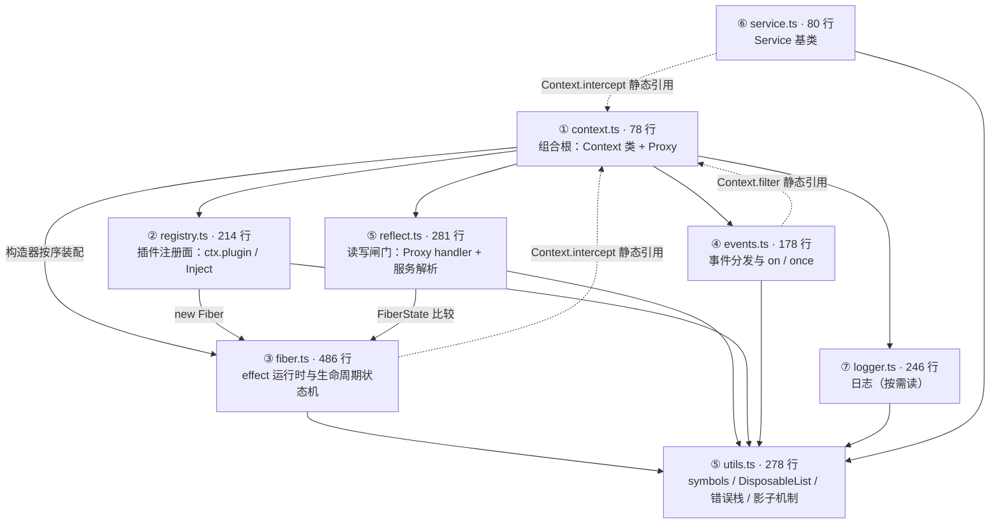

import { Meta } from '@storybook/addon-docs/blocks';

<Meta id="source-code" title="进阶/源码导读" name="Docs" />

# 源码导读

cordis 的 core 包很小——src 九个文件共约 1850 行 TypeScript，编译成单个 1530 行的 `lib/index.js`——但它的组织方式不直觉：类型声明与实现分成两套文件、模块之间靠 declaration merging 相互「注入」方法、运行时靠一个 Proxy 和一组 Symbol 约定缝合。本课不复述机制（那是 2.x–4.x 各课的事；概念与论文的映射归[论文导读](?path=/docs/paper--docs)），只回答四个阅读问题：**包里有什么、读哪个；九个模块各装什么、谁依赖谁；按什么顺序读、为什么；测试怎么当行为规范用**。目录与行号均按安装版 cordis 4.0.0-rc.8 核对，src 行数取仓库 master。

开场路由表（回查时从「想搞懂」进）：

| 想搞懂 | 去读 |
| --- | --- |
| `ctx` 到底是什么 | `context.ts` 的 `Context` 构造器（Proxy + 组合根） |
| `ctx.plugin()` 返回什么、插件怎么注册 | `registry.ts` 的 `RegistryService.plugin` |
| effect 怎么记账、怎么撤销 | `fiber.ts` 的 `effect` / `_execute` / `_unload` |
| 配置校验在哪发生 | `fiber.ts` 顶部的 `resolveConfig` / `ValidationError` |
| `ctx.foo` 的服务访问怎么解析 | `reflect.ts` 的 `ReflectService.handler.get` |
| 五种分发差在哪 | `events.ts` 的 `parallel` / `emit` / `serial` / `bail` / `waterfall` |
| `Service` 基类做了什么 | `service.ts` 的构造器 |
| 错误栈为什么指向我的代码 | `utils.ts` 的 `composeError` / `buildOuterStack` |
| 日志名称从哪来 | `logger.ts` 的 `[symbols.invoke]` |



实线是运行时真实发生的引用（装配、实例化、工具调用），虚线是三处反向的类静态引用——它们与「人人都 import Context」的类型循环一起，构成下图之外的主要迷惑项，见[运行时依赖与类型循环](#运行时依赖与类型循环)。外部依赖只有两个：cosmokit（`defineProperty` / `isNullable` / `hyphenate` 等工具）与 `@standard-schema/spec`（校验协议类型）；core 无 Node 专有依赖，浏览器可直跑。

## 快速上手：五分钟定位一段实现

读 cordis 源码的最小闭环是「本地定位 → 取 TS 原文 → 查公开面」三步：

1. **本地定位**：实现就在安装包里。先列模块区间（真实输出见[Bundle 的模块边界](#bundle-的模块边界)），再按函数名搜索：

   ```console
   $ grep -n '^// src/' node_modules/cordis/lib/index.js
   $ grep -n 'RegistryService' node_modules/cordis/lib/index.js
   ```

2. **取 TS 原文**：打开 `https://github.com/cordiverse/cordis/blob/master/packages/core/src/<模块>.ts`。src 与 lib 是同一逻辑的两种形态：src 保留类型与原始 import 结构，lib 是拼接后的单文件。
3. **查公开面**：读 `node_modules/cordis/lib/<模块>.d.ts`，先看顶部的 `declare module './context'` 块——它列出该服务往 `Context` 接口注入的全部方法。

版本以 `node_modules/cordis/package.json` 的 `version` 为准（本手册 rc.8）；master 与安装版结构相同，个别实现可能有差异，断言行为时以安装版为准。

## 包的形态：lib、src 与类型声明

### 安装包里有什么

`ls node_modules/cordis` 的真实内容只有四项：`README.md`、`bin.js`（命令行入口，链路见[工程组织](?path=/docs/project-structure--docs)）、`lib/`、`package.json`——**没有 `src/`**。`package.json` 的 exports 里虽有 `"./src/*": "./src/*"` 映射，但 `files` 只列了 `lib` 和 `bin.js`：那条映射服务于仓库内 monorepo 互引（packages 之间直接消费 TS 源码），对发布产物是空承诺。读源码去 GitHub。

`lib/` 装两类东西：

- **9 个 d.ts**（合计约 450 行声明）——按模块分文件的类型声明；
- **1 个 index.js**（rc.8 为 1530 行）——esbuild 把九个模块打包成的单文件产物：类型剥离、`const enum` 内联成数字、import 就地展开。

### bundle 的模块边界

bundle 用 `// src/<模块>.ts` 注释保留了模块边界，在 node_modules 里也能按模块导航：

```console
$ grep -n '^// src/' node_modules/cordis/lib/index.js
4:// src/events.ts        # 仅一条 import 语句，正文在 256 行
7:// src/utils.ts
256:// src/events.ts
372:// src/logger.ts
625:// src/reflect.ts     # 仅一条 import 语句，正文在 1025 行
628:// src/fiber.ts
1025:// src/reflect.ts
1242:// src/registry.ts
1375:// src/context.ts
1429:// src/service.ts
```

两个阅读注意：

- **一个模块可能出现两次**。esbuild 按依赖拓扑拼接，import 与正文会分离——events 与 reflect 都是这样，reflect 依赖 fiber 的 `FiberState`，正文被排到 fiber 之后。定位正文段时先 `grep` 列出全部标记。
- **bundle 行号与 src 行号是两套坐标系**。手册各课引用的「fiber.ts 878 行」指 `lib/index.js` 的行号；对照 GitHub src 时不要拿它当文件内行号用。

### 类型声明与实现的关系

`index.d.ts` 用 `export * from` 转出七个模块（context / events / fiber / logger / registry / service / utils）——**reflect 不在其列**：`ReflectService` 既不在 d.ts 的根导出里，也不在运行时导出表里（`lib/index.js` 末尾的 export 列表没有它）。它的类型经 `context.d.ts` 的 `reflect: ReflectService` 字段可达。这是读导出表能发现的口径差：reflect 被当作纯内部基础设施，而 `EventsService` / `LoggerService` / `RegistryService` 都是根导出。

读 d.ts 的两个技巧：

- 每个服务模块 d.ts 顶部的 `declare module './context'` 块，就是该服务往 `Context` 接口注入的方法清单——比读实现快得多地回答「ctx 上会长出什么」。
- 下划线成员（`_hooks` / `_disposables` / `_store` / `_runner`）类型上可见、约定上内部；`FiberState` 是 `const enum`，d.ts 保留枚举名与数字（`PENDING = 0` … `UNLOADING = 5`）。

declaration merging 的写法细节、`InjectKey` 这类条件类型归 6.3 TypeScript 模式；本课只负责「去哪读」。

## 九模块地图

| 模块 | src 行数 | lib/index.js 区间（rc.8） | 职责 | 关键导出 | 机制正文 |
| --- | --- | --- | --- | --- | --- |
| index.ts | 7 | 导出表（末尾） | 纯 re-export，公开面唯一入口 | 全部公开符号 | — |
| utils.ts | 278 | 7–254 | 地基：符号表、DisposableList、构造判定、错误栈拼接、影子机制 | `symbols` `DisposableList` `isConstructor` `composeError` `buildOuterStack` `getTraceable` `joinPrototype` `createCallable` | 2.3 / 本课 |
| events.ts | 178 | 256–370 | 事件服务：五种分发 + on / once（经 effect 记账） | `EventsService` `isBailed` | 3.2 / 3.3 |
| logger.ts | 246 | 372–623 | 日志：格式化、颜色、缓冲、导出器；手写可调用服务 | `Logger` `LoggerService` `LoggerLevel` | 5.3（消费面） |
| fiber.ts | 486 | 628–1023 | 心脏：配置校验、FiberState 状态机、effect 执行管线 | `Fiber` `FiberState` `CordisError` `ValidationError` `resolveConfig` | 2.5 / 2.6 / 3.1 / 4.1 |
| reflect.ts | 281 | 625–626 与 1025–1240 | 读写闸门：Context 的 Proxy 陷阱、provide / notify、mixin | `ReflectService`（不从根导出） | 2.2 / 2.3 |
| registry.ts | 214 | 1242–1373 | 注册面：Plugin 三形态、Inject 装饰器、runtime 缓存 | `RegistryService` `Inject` `Plugin`（类型） | 2.1 / 2.4 |
| context.ts | 78 | 1375–1427 | 组合根：Context 类、Proxy 包装、根 fiber、四大服务装配 | `Context` | 2.2 |
| service.ts | 80 | 1429–1500 | 服务基类：构造即 provide、隔离判定、拦截合并 | `Service` | 2.3 |

规模直觉：fiber + reflect + utils 三件占去 src 的 56%——**状态机、解析闸门、缝合工具**是复杂度所在；context 与 service 各只有约 80 行，是「小文件管大结构」的组合根与协议层。

### 运行时依赖与类型循环

看 import 会发现「人人都 import Context，Context 又 import 所有人」——这不是坏味道，是 declaration merging 的必然形态：每个服务模块用 `declare module './context'` 往 `Context` 接口上添方法（fiber 加 `effect`、events 加 `on` / `emit` 一族、reflect 加 `get` / `set` / `provide`、registry 加 `plugin` / `inject`），类型层的循环到处都是。运行时真实发生的引用少得多，就是上图实线：组合根 `context.ts` 的构造器按 fiber → reflect → registry → events → logger 的顺序装配；registry 持有 Fiber（`new Fiber`）；reflect 比较 `FiberState`。三处虚线（events 读 `Context.filter`、fiber 与 service 读 `Context.intercept`）在 ESM 下安全——类静态在模块定义时已初始化。

还有一段常被漏看的装配代码——`ReflectService` 构造器的四行 mixin：

```ts
this.mixin('reflect', ['get', 'set', 'provide', 'accessor', 'mixin'])
this.mixin('fiber', ['runtime', 'effect'])
this.mixin('registry', ['inject', 'plugin'])
this.mixin('events', ['on', 'once', 'parallel', 'emit', 'serial', 'bail', 'waterfall'])
```

`ctx.on` 不是 `Context` 类的方法，而是 mixin 建的访问器：读 `ctx.on` 时从 `ctx.events` 取值并绑好 this。找任何 ctx 方法的实现，先判断它属于哪个服务，再进对应文件——上面四行就是索引。

### 模块间的信令：internal/* 事件

模块之间不直接调用彼此的私有方法，靠一组 `internal/` 前缀事件通信（发出处均已按源码核对）：

| 事件 | 发出处 | 语义 |
| --- | --- | --- |
| internal/plugin | `Fiber` 构造器与 dispose 回调 | 插件 fiber 加载 / 移除通告 |
| internal/status | `Fiber._updateState` | 状态迁移通告（携带新旧态） |
| internal/listener | `EventsService.on` | 监听器注册的拦截点（bail 可改道） |
| internal/update | `Fiber.update` | 配置更新瀑布（构造器预挂一个 global 首钩） |
| internal/service | `ReflectService.notify` | 服务解析变化通告（带 isolate 过滤的接收方） |
| internal/get 与 internal/set | `ReflectService.handler` | 属性解析的瀑布兜底（扩展可接管） |
| internal/dispatch | `EventsService._resolve` | 一切非 internal 分发的统一拦截点 |

两条约定：`internal/` 前缀的事件**绕过** `internal/dispatch`（`_resolve` 里的 `startsWith('internal/')` 检查），不进入公共分发通道；`internal/update` 的非 global 监听被改道进 `fiber._hooks`（fiber 级配置钩子，5.2 的配置调和在此挂点）。读 loader / HMR / 调试工具等上层包时，先在这张表查语义再看消费侧。

## 推荐阅读路径

### 主线：从组合根下探

推荐的初读顺序：`index.ts`（1 分钟，7 行 re-export 确认公开面）→ **context → registry → fiber → events → reflect + utils → service**，logger 按需。每步写明读什么、带着什么问题、到哪停：

1. **context.ts（78 行，先读）**——组合根。构造器 15 行读完就建立了全书的对象模型：

   ```ts
   constructor() {
     this[symbols.isolate] = Object.create(null)
     this[symbols.intercept] = Object.create(null)
     const self = new Proxy<this>(this, ReflectService.handler)
     this.root = self
     this.baseUrl = undefined
     this.fiber = new Fiber(self, {}, Object.create(null), null, () => [])
     this.reflect = new ReflectService(self)
     this.registry = new RegistryService(self)
     this.events = new EventsService(self)
     this.logger = new LoggerService(self)
     this.fiber._disposables.clear()
     return self
   }
   ```

   读出三件事：ctx 是被 Proxy 包住的实例（陷阱在 reflect.ts）；应用启动时就有一根根 fiber（runtime 传 `null`）；四个内建服务在此装配。`extend` / `isolate` / `intercept` 三个派生方法对应[上下文](?path=/docs/context--docs)的派生机制。

2. **registry.ts（214 行）**——用户面。`RegistryService.plugin` 十余行是全书引用最密的代码路径：`resolve` 归一插件三形态 → 按 callback 查 runtime 缓存（`runtime = { name, callback, fibers: new DisposableList(), Config }`）→ `new Fiber(...)` → `Object.create(fiber)` 包装出带 `then` 的返回值（`await ctx.plugin()` 即 `fiber.await()`）。`isConstructor` 的调用点在 Fiber 的 `_runner.execute`——决定插件走 `new` 还是直接调用（[插件](?path=/docs/plugins--docs)已核实的 prototype 分支）。`Inject` 装饰器与 `Inject.resolve` 可留到 6.3。
3. **fiber.ts（486 行，心脏）**——按三段读。顶部是校验（`ValidationError` / `resolveConfig` 的十行，[配置](?path=/docs/config--docs)）；中部是构造器双分支（runtime 非空 = 插件 fiber：领 uid、派生 ctx、为 inject 配置建 intercept 原型链、把 `ctx.plugin()` 记成父 fiber 的 effect；runtime 空 = 根 fiber：直接 ACTIVE）；下部是状态机——`_getState` 四行是状态的唯一真相（`uid === null` DISPOSED、`_error` FAILED、`epoch !== INACTIVE` ACTIVE、否则 PENDING），`_refresh` 拼 epoch 依赖指纹，`_setEpoch` 二选一进 `_reload` / `_unload`，`inertia` 是进行中那个 Promise。effect 执行管线 `_execute` 的六分支（函数 / null / Promise / 迭代器 / 异步迭代器 / 其他报错）与 `lib/index.js` 878 行的 `task?.catch(dispose).catch(...)`（异步 effect 失败 = 撤销已收集副作用 + 只记日志）是[可逆副作用](?path=/docs/effects--docs)与[Fiber](?path=/docs/fiber--docs)的实现落点。
4. **events.ts（178 行）**——第一个「标准服务」样本：`on` 经 `ctx.fiber.effect` 记账（监听器随插件销毁自动撤销的物理来源）；五种分发是五个平铺小函数（[分发模式](?path=/docs/dispatch-modes--docs)）；构造器里对 `internal/update` 的改道把 fiber 级钩子与 global 钩子分开。
5. **reflect.ts（281 行）＋ utils.ts 的影子机制（最难段）**——`ReflectService.handler` 的 `get` / `set` / `has` 三陷阱逐分支读：直通属性先行，未声明的读取走 `waterfall('internal/get', ...)` 沿 fiber 链找 `store`——[服务](?path=/docs/services--docs)的解析规则的实现面。`getTraceable` / `createTraceable` 一族在 utils.ts（服务方法里的 `this.ctx` 重绑到调用者，2.3 讲过语义）；第一遍可只记入口 `getTraceable`，跳过 `createShadow` 细节。
6. **service.ts（80 行，收尾）**——`Service` 构造器把服务语义闭环：可调用包装（`createCallable` + `joinPrototype`）→ `ctx.reflect.provide`；`[symbols.filter]` 四行是隔离判定；`Symbol.hasInstance` 沿原型链走查，跨包 `instanceof` 不依赖 `extends`。
7. **logger.ts（246 行，按需）**——与核心状态机几乎解耦。值得一看的是它**不经 `Service` 基类**、手写可调用服务的全部步骤（`createCallable` + tracker + `[symbols.invoke]`），是影子机制之外的第二样本；调日志名称来源（`fiber.name` 的 hyphenate）时再读。

为什么是这个顺序：不自底向上（utils 先读），因为 utils 278 行里近半是影子机制，没有「服务为什么需要重绑 this」的问题意识时几乎不可读；不从 fiber 先读（它最重要），因为 Fiber 的字段全在回答「注册进来的服务怎么解析、什么时候重跑」，缺了 registry 与 reflect 的语境读不出意义。主线的选择标准是：**每读一个文件，它回答的问题来自上一层，它抛出的未读符号恰好落在下一层**。

### 替代入口：三条主题线

回查时不必走主线，沿问题直取：

- **时间维（一个 effect 的一生）**：`RegistryService.plugin` 里 label 为 `ctx.plugin()` 的 effect 记账 → `Fiber.effect` / `_execute` → `_unload` 逆序清账（`DisposableList.clear` 逆序返回）→ `composeError` 报栈。
- **空间维（一次属性访问）**：`ReflectService.handler.get` → `waterfall('internal/get')` → 沿 fiber 链查 `store` → `_getImpl` 的 `FiberState.ACTIVE` 检查。
- **用户面（一个插件的一生）**：`ctx.plugin()` → Fiber 构造（uid、派生 ctx、intercept 链）→ `_checkImpl` / `_refresh`（等依赖）→ `inertia` 加载 → `dispose` 级联（[生命周期](?path=/docs/lifecycle--docs)）。

## 符号与内部约定

**symbols 表**（`utils.ts` 开头）共 18 个符号分三组，全部用 `Symbol.for('cordis.*')` 注册进**全局符号表**——多副本安装（npm 重复依赖）也指向同一符号，这是跨包互操作的基础。

| 组 | 成员 | 用途 |
| --- | --- | --- |
| internal | shadow / caller / receiver / original / metadata / initHooks / checkProto | 影子机制与装饰器的内部信物 |
| context | effect / filter / isolate / intercept | Context 的四个静态符号（`Context.effect === symbols.effect`，同一符号的两个名字） |
| service | init / check / config / invoke / extend / tracker / resolveConfig | Service 基类的协议入口 |

**`Context.is` 的类型守卫技巧**（context.ts）：`value?.[Context.is]` 把静态方法强转为属性键，经 `Symbol.toPrimitive` 得到全局符号 `cordis.is`，原型上同名键标记实例——

```ts
static is(value: any): value is Context {
  return !!value?.[Context.is as any]
}
static {
  Context.is[Symbol.toPrimitive] = () => Symbol.for('cordis.is')
  Context.prototype[Context.is as any] = true
}
```

**kValidationError**（fiber.ts 顶部）：`Symbol.for('ValidationError')` 挂在 `ValidationError.prototype` 上，供跨 bundle / 跨副本做标记判定而不依赖原型链身份；它不在导出表里。

**下划线前缀 = 约定私有**：`_hooks` / `_disposables` / `_store` / `_internal` / `_runner` 等类型可见、语义内部。reflect.ts 的 `isSpecialProperty` 把符号键、`'prototype'`、`'then'`、纯数字、`_` 前缀属性判为「直通属性」（不走服务解析）——这也是服务名不能以下划线开头的原因；`'then'` 直通则保证对 ctx 做 thenable 探测（`await` 前的检查）不会落入解析路径。

**INACTIVE 哨兵与 epoch 指纹**：`const INACTIVE = '__INACTIVE__'`；`_runner.epoch` 用同一个字段承载两种值——`INACTIVE`（不该运行）或依赖指纹字符串（`''` 或 `':3:5'`，即各依赖提供者 fiber 的 uid 序列，[Fiber](?path=/docs/fiber--docs)已核实）。

**CordisError**：带 `code` 的错误类，目前唯一的 code 是 `INACTIVE_EFFECT`——`assertActive` 在 `uid === null` 时抛出，即 effect 注册门槛的物理来源（3.1）。

**effect label**：每个 effect 都带标签，`Fiber.getEffects()` 返回标签树，是「我的副作用都有谁」的官方出口。标签来源固定：

| label | 注册点 |
| --- | --- |
| anonymous | `ctx.effect(fn)` 未传 label 时 |
| ctx.plugin() | 插件注册（fiber.ts） |
| ctx.on("...") | 事件监听（events.ts） |
| ctx.provide("...") | 服务提供（reflect.ts） |
| ctx.accessor("...") 与 ctx.mixin("...") | 属性声明（reflect.ts） |
| ctx.logger.exporter() | 日志导出器（logger.ts） |

## utils 工具面

全书各课反复引用的工具在此集中回查（除 `isBailed` 在 events.ts，其余全在 utils.ts）：

- **DisposableList**——`WeakKey` 双索引容器（Map 按自增序号 + WeakMap 按值）。`push` 返回解绑函数；`delete` 按值删；`clear` **逆序**返回全部值——LIFO 撤销的物理来源之一。三个宿主：`fiber._disposables`（副作用账本）、`runtime.fibers`（同插件多实例）、`fiber._hooks`（fiber 级 internal/update 钩子）。
- **buildOuterStack(offset?)**——创建时捕获「外层」错误对象的栈帧，返回延迟取帧的函数；`Fiber` 与 `RegistryService.plugin` 在入口处各建一份，把调用方的现场带进异步回调。
- **composeError(callback, getOuterStack)**——callback 同步抛错或返回 rejected Promise 时，把内层栈与外层栈拼接后重抛：插件报错时栈指向用户代码而非 cordis 内部（`handleError` 做 splice 拼接，识别 `<anonymous>` 帧逐层回退）。「报错为什么准」的唯一答案。
- **isConstructor**——`prototype` 存在且非（异步）生成器构造函数；registry 据此决定 `new` 还是调用（2.1）。
- **getTraceable 一族**——`getTraceable`（入口）/ `createTraceable`（建 Proxy）/ `createShadow` / `createShadowMethod` / `withProps` / `applyTraceable`：影子机制，让服务方法里的 `this.ctx` 变成调用者的 ctx（语义在 2.3，这里是指路牌）。
- **joinPrototype 与 createCallable**——把服务原型接到函数原型上，造「可调用的服务实例」（`ctx.logger('name')` 形态的来源）。
- **isBailed**（events.ts）——`value !== null && value !== false && value !== undefined`，bail / serial 的短路判据（3.3）。
- **isObject 与 getPropertyDescriptor**——通用小工具，Proxy 陷阱与守卫内部使用。

## 测试当文档读

### 组织与跑法

测试不在 npm 包里，在仓库 `packages/core/tests/`：12 个 spec 加一个共享 harness `utils.ts`；vitest 4；跑法是仓库根 `yarn install && yarn test`（= `yakumo vitest --import tsx`，yarn 4 workspaces）。spec 与 src 模块的对应关系：

| spec | 行为面 | 主要对应 src | 机制正文 |
| --- | --- | --- | --- |
| plugin.spec.ts | 注册、嵌套、快照对比、Service.init | registry.ts | 2.1 / 2.5 |
| fiber.spec.ts | inertia 锁 ×3、epoch 重算 | fiber.ts | 4.1 |
| dispose.spec.ts | 同步 / 异步撤销、yield 中止、报错路径 | fiber.ts | 3.1 |
| events.spec.ts | on / once 与五种分发 | events.ts | 3.2 / 3.3 |
| service.spec.ts | pending inject、traceable、多注入 | service.ts / reflect.ts | 2.3 |
| reflect.spec.ts | Context.is、访问检查、注入泄漏 | reflect.ts | 2.2 / 2.3 |
| shadow.spec.ts | caller 元数据、影子剥离 | utils.ts | 2.3 |
| isolate.spec.ts | 隔离域、共享 label、隔离事件 | context.ts / reflect.ts | 2.2 |
| associate.spec.ts | 关联属性注入 | reflect.ts | 6.3（类型面） |
| decorator.spec.ts | `@Inject` 方法装饰器 | registry.ts | 2.4 / 6.3 |
| invoke.spec.ts | 函数式服务 | utils.ts / service.ts | 2.3 |
| logger.spec.ts | 缓冲、导出器生命周期、名称来源 | logger.ts | 5.3（消费面） |

共享 harness（`tests/utils.ts`）值得先读：`withTimers`（把每个用例包进 `vi.useFakeTimers`，finally 恢复）、`sleep`、`Session` / `Filter`（`Context.filter` 的最小样本）、`Counter`（带 `[Service.tracker]` 的示例服务）、`getHookSnapshot`（遍历 `ctx.events._hooks` 计数——「销毁后无残留」的可观测断言）。

### 当行为规范读的三类用例

**状态机规范——fiber.spec 的 `inertia lock` 系列**。fake timers 逐段推进并在每个时间点断言 `FiberState`，等于把 epoch / inertia 的竞态语义写成推演表（节选）：

```ts
it('inertia lock 1', withTimers(async (root) => {
  const dispose = root.provide('foo', 1)
  const fiber = root.inject(['foo'], async () => {
    await sleep(1000)
    return () => sleep(1000)
  })
  await vi.advanceTimersByTimeAsync(400) // 400
  expect(fiber.state).to.equal(FiberState.LOADING)
  dispose()
  await vi.advanceTimersByTimeAsync(400) // 800
  expect(fiber.state).to.equal(FiberState.LOADING)
  await vi.advanceTimersByTimeAsync(400) // 1200
  expect(fiber.state).to.equal(FiberState.UNLOADING)
```

「卸载中依赖回来了会怎样」「加载中依赖没了会怎样」这类问题的权威答案，都在这三个用例的断言序列里——注释里的时间轴数字读作状态推演。

**撤销语义规范——dispose.spec 的 async yield 系列**。`async yield 2 (aborted)` 与 `3 (aborted)` 钉死异步迭代器在 dispose 后停止拉取；`async yield 4 (await dispose)` 钉死「await 一个 effect 即撤销它」的边界；四个 `with error` 用例划清报错时的清账责任。

**可组合性规范——plugin / service 的 `compare snapshot`**。两棵插件树经不同装卸序列后的等价断言——[论文导读](?path=/docs/paper--docs)里 Confluence 定理（动态历史不留痕迹）的测试面。

读测试的通用技巧：用例名就是行为目录（先 `grep 'it('` 拿目录再挑读）；断言 `FiberState` 的用例读作状态推演表；出现 `getHookSnapshot` 的用例在验证无泄漏。

## 最佳实践

- **断言与结构分开取材**：行为断言以安装版 lib 为准（本手册 rc.8），结构与意图读 master 的 src；发现 diff 先核对两边版本。src 与 lib 的差异是编译变换（拼接、类型剥离、const enum 内联），不是逻辑差异。
- **用函数名导航，不用行号**：行号随版本与产物漂移；必须引用行号时注明坐标系（手册各课的行号指 `lib/index.js`）。
- **第一遍跳过两段**：logger.ts 全文与 utils.ts 的 `createTraceable` 一族——与核心状态机解耦，需要时再回。
- **找 ctx 方法实现先查归属**：是 mixin 搬运（reflect 构造器四行）还是 `declare module` 注入（各 d.ts 顶部）；归属定了，文件就定了。
- **把 internal/* 当断点位置**：读 loader / HMR / 调试工具等上层包时，core 的八个 internal 事件是它们的挂点，先查信号表再看消费侧。

## 常见问题

- node_modules/cordis 里为什么找不到 src/？
  exports 的 `"./src/*"` 是给仓库 monorepo 互引的映射；发布产物按 `files` 只含 `lib` 与 `bin.js`。读源码去 GitHub 的 `packages/core/src`。
- `import { ReflectService } from 'cordis'` 为什么报错？
  根导出不含 `ReflectService`（d.ts 与运行时导出表都没有）——reflect 被当作内部基础设施，类型经 `ctx.reflect` 可达。`EventsService` / `LoggerService` / `RegistryService` 均有根导出。
- 手册说「fiber.ts 878 行」，GitHub 的 fiber.ts 只有 486 行？
  两套坐标系：878 是 `node_modules/cordis/lib/index.js`（编译 bundle）的行号，486 是 `src/fiber.ts` 的行号。混用前先确认出处。
- 怎么列出我的插件注册了哪些副作用？
  `fiber.getEffects()` 返回带 label 的树（见上文 label 表）；配合 `ctx.registry.values()` 可遍历全部 runtime 与 fiber。
- 不想 clone 仓库怎么验证行为？
  直接在任意工程对 `node_modules/cordis/lib/index.js` 写观察脚本（本手册各课的 Canvas 实例与 Node 输出就是这么来的）；要跑官方测试则 clone 仓库后 `yarn install && yarn test`。
- bundle 里 reflect.ts 出现了两次？
  esbuild 按依赖拓扑拼接，import 与正文会分离（reflect 依赖 fiber 的 `FiberState`，正文被排到 fiber 之后）。用 `grep -n '^// src/'` 列出全部标记再定位正文段。

## 总结回顾

摘要：

core 的源码分三种形态读：npm 包只装 `lib/`（九个 d.ts 加单文件 `lib/index.js`，bundle 用 `// src/` 注释保留模块边界），TS 原文在 GitHub `packages/core/src`（九文件约 1850 行），d.ts 的 `declare module './context'` 块回答「ctx 上有什么」。九模块的复杂度集中在 fiber（状态机与 effect 管线）、reflect（Proxy 读写闸门）、utils（符号、账本、错误栈、影子机制）三件；context.ts 是 78 行的组合根，其构造器装配根 fiber 与四个内建服务，ReflectService 构造器的四行 mixin 把各服务方法搬上 Context 原型；模块间靠八个 `internal/*` 事件通信，前缀本身带「绕过分发拦截」的豁免。推荐阅读主线是从组合根下探：context → registry → fiber → events → reflect + utils → service，logger 按需——每一步回答上一层的问题、抛出下一层的符号；回查改走三条主题线（effect 一生 / 属性访问 / 插件一生）。约定层：16 个 `Symbol.for('cordis.*')` 符号分三组、下划线私有、`INACTIVE` 哨兵与 epoch 指纹同字段、`kValidationError` 跨副本标记、effect label 树是副作用的官方清单。测试在 `packages/core/tests/`（vitest，12 个 spec 加共享 harness），`inertia lock`、`async yield (aborted)`、`compare snapshot` 三类用例分别是状态机、撤销语义、可组合性的行为规范。

一句话：

> 读 cordis 源码从组合根下探：context.ts 的 15 行构造器给出全部对象模型，registry / fiber / reflect 沿「注册 → 状态机 → 解析」展开，utils 承载符号与账本；行为疑问优先去 tests 的断言序列里找答案，而不是重推实现。

知识要点：

- 安装的 cordis 包里有哪些东西？exports 里的 `./src/*` 为什么对发布产物是空承诺？读 src 去哪？
- 九个模块各自的职责、行数与关键导出？哪个模块不从根导出？
- 运行时依赖图长什么样？「人人都 import Context」为什么不是坏味道？`ctx.on` 的实现为什么不在 Context 类里？
- 推荐阅读主线是什么顺序？为什么不自底向上、也不从 fiber 开始？
- 八个 `internal/*` 事件各自的语义？`internal/` 前缀享有什么豁免？
- symbols 分几组、为什么全用 `Symbol.for`？`Context.is` 的 `Symbol.toPrimitive` 技巧做了什么？
- epoch 字段如何同时承载 INACTIVE 哨兵与依赖指纹？`_getState` 四行怎么映射四个状态？
- `composeError` / `buildOuterStack` 解决什么问题？`DisposableList.clear` 为什么逆序返回？
- 12 个 spec 与 src 模块怎么对应？哪三类用例最值得当行为规范读？`getHookSnapshot` 断言什么？
- 怎么列出插件注册的全部副作用？effect 的 label 都有哪些注册点？

## 参考资料

- [cordiverse/cordis 仓库 packages/core](https://github.com/cordiverse/cordis/tree/master/packages/core)——src 九文件、tests 十三个 spec 与共享 harness 的取材处；本课按 master 与安装版 rc.8 双向核对
- [npm cordis 包](https://www.npmjs.com/package/cordis)——发布形态核对（`files` 只含 `lib` 与 `bin.js`、exports 字段、版本记录）
- 本手册各机制课已核实的源码路标——`isConstructor` 分支（2.1）、`resolveConfig` / `ValidationError`（2.6）、effect 注册门槛（3.1）、`catch(dispose)` 静默失败与 epoch / inertia（4.1）、`Object.create(fiber)` 包装（2.1 / 4.1）——本课引用其结论作阅读路标
- [论文导读](?path=/docs/paper--docs)——论文概念 ↔ 工程面的映射表；本课与之互补：物理结构 ↔ 阅读顺序 ↔ 测试
