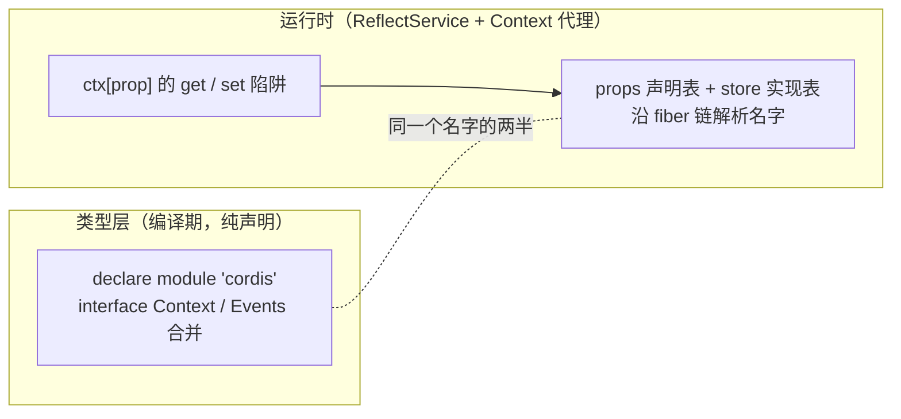

import { Canvas, Controls, Meta } from '@storybook/addon-docs/blocks';
import * as TsPatternsStories from './ts-patterns.stories';

<Meta of={TsPatternsStories} name="Docs" />

# TypeScript 模式

前面十几课里，`declare module 'cordis'` 反复出现：[服务](?path=/docs/services--docs)用它声明 counter 槽位，[事件](?path=/docs/events--docs)用它声明事件名，[官方插件](?path=/docs/official-plugins--docs)里 timer 用它把方法混入 ctx。本课把这些散落的类型事实收拢成体系，回答插件作者的核心问题——**怎么用 TypeScript 的类型系统写出类型安全的 cordis 代码**。贯穿全课的模型是：cordis 的每个扩展点都由两半组成——运行时的 reflect 机制（Context 代理 + ReflectService）把名字解析成实现，类型层的声明合并把名字的契约写进接口。插件作者的工作是把两半写对齐：契约写成导出的接口、合并紧贴实现、名字带命名空间、发布时类型随包入口走。



| 扩展面 / 工具 | 标准写法 | 回查要点 |
| --- | --- | --- |
| Events 事件名 | `interface Events` 合并 | 签名即契约；`this` 与 waterfall 末参有双重含义 |
| Context 服务槽位 | `interface Context` 合并 | 合并契约接口；`ctx.get` / `ctx.provide` 泛型随之收紧 |
| 能力混入 | `interface Context extends Pick<Service, 方法名>` | 配 `ctx.mixin`；mixin 列表受双重 keyof 约束 |
| `ctx.get` / `ctx.provide` | 泛型重载 | 命中已声明名字才有类型；拼错名走 string 兜底不报错 |
| `ctx.reflect` | 内置服务 | 声明合并的运行时支撑；`ctx.reflect.get/set` 是 any 松散通道 |
| `Plugin.Function<T>` | `T` = output | 第二参必填性由 `T` 是否含 undefined 决定 |
| `Plugin.Transform<S, T>` | 可调用 schema | 输入侧类型；Config 要同时是函数与 Standard Schema |
| `@Inject(name)` | 类 / 方法装饰器 | 名字必须在 InjectKey（携带 `[Service.config]` 的槽位） |
| 包类型发布 | `types` + `exports.types` | 合并块放主入口，导入即生效；cordis 作 peerDependencies |

## 声明合并

合并是纯类型层的：不写也能跑，写了才有补全与检查——这在[服务](?path=/docs/services--docs)与[事件](?path=/docs/events--docs)两课都验证过。本节按「事件契约 → 服务槽位 → 能力混入」三张扩展面给出标准写法，最后用一个完整实例把三面接进真实运行。

### Events：事件契约

注册、触发、分发语义与命名空间惯例是[事件](?path=/docs/events--docs)与[分发模式](?path=/docs/dispatch-modes--docs)的主线，这里收拢的是**签名的完整表达力**——一个事件签名里能写什么、每种写法约束谁：

```ts
import { Context } from 'cordis';

declare module 'cordis' {
  interface Events {
    // 参数与返回值是监听器契约：on / once / 五个分发方法的泛型都从 Events[K] 推导
    'chat/message'(sessionId: string, content: string): void;
    // this 写在签名里：由带 thisArg 的分发提供（内置 internal/service 就这么声明）
    'shop/order'(this: Context, orderId: string): void;
    // waterfall 事件：最后一个参数是监听器的 next，
    // 也是触发方兜底实现的类型——一个签名同时服务两个角色
    'fmt/source'(source: string, next: () => string): string;
    // 返回值类型参与 serial / bail 的短路合同
    'auth/role'(userId: string): Promise<'admin' | 'user'>;
  }
}
```

四个要点（均按 4.0.0-rc.8 类型核对）：

- **签名即契约的推导路径。** `ctx.on` 的监听器参数、`ctx.emit` 的触发参数都用 `Parameters<Events[K]>` 推导，写错任一侧都是编译错误。
- **`this` 只约束类型层。** 签名里写了 `this: Context`，普通 emit（不带 thisArg）运行时 `this` 仍是 `null`——它描述的是「定向分发时 thisArg 该是什么」。
- **waterfall 末参的双重身份。** 触发方 `ctx.waterfall('fmt/source', s, () => s)` 传入的兜底实现，其类型就是签名里的 `next`——监听方拿 `next()` 委托下游，触发方给链尾兜底，两边共用同一段签名。监听器允许不调用 `next`（直接短路）时，把末参写成可选 `next?: () => string`（[分发模式](?path=/docs/dispatch-modes--docs)实例的处理方式）。
- **返回值是分发合同的一半。** `serial` / `bail` / `waterfall` 会消费监听器返回值（`false` / `null` / `undefined` 之外的都算有效值），签名里的返回类型就是在为触发方承诺结果形态。

### Context：服务槽位

```ts
import { Context } from 'cordis';

export interface HeraldApi {
  readonly calls: number;
  announce(topic: string): string;
}

declare module 'cordis' {
  interface Context {
    herald: HeraldApi;
  }
}

declare const root: Context;

root.herald.announce('cordis'); // 补全 + 参数检查
const maybe = root.get('herald'); // HeraldApi | undefined —— get 重载带上了「可能不在」

const impl: HeraldApi = {
  calls: 0,
  announce(topic) {
    return topic;
  },
};
root.provide('herald', impl); // 值类型必须匹配 HeraldApi
// root.provide('herld', impl); // ✗ 不报错：拼错的名字走 string 兜底重载
```

三条要点：

- **合并写契约，不写实现类。** `herald: HeraldApi` 而不是 `herald: HeraldService`——「名字是接口、实现可替换」在类型层的表达；消费者拿到的补全面就是契约面。
- **槽位类型写「在线时的形态」，不写 undefined。** 根上下文属性访问查不到时实际返回 `undefined`，但把它写进槽位会让每次使用都判空。惯例：槽位写非空类型，「可能不在」交给 `ctx.get('herald')`——它的重载返回 `undefined | this[K]`，已经把可空性表达出来了。
- **泛型重载只对已声明的名字生效。** 拼错的名字静默落到 string 重载，类型层不查——命名对齐靠纪律（见最佳实践与常见问题）。

### 更多增强面：Pick 投影与 Intercept

两种源码自身在用的进阶写法：

```ts
// 能力混入：把服务的方法投影到 Context（timer 的官方写法）
declare module 'cordis' {
  interface Context extends Pick<NotifierService, 'push' | 'clear'> {
    notifier: NotifierService;
  }
}

// 运行时的半边：mixin 列表里的名字必须已在 Context 上声明，
// 否则 TS2769 —— keyof this & keyof source 的双重约束倒逼「先合并、再混入」
ctx.mixin('notifier', ['push', 'clear']);
```

- **Pick 投影让方法签名只有一份。** `push` / `clear` 的类型只写在服务类上，Context 上的混入类型自动跟随——改服务方法签名，ctx 上的类型同步变化，不用维护两份。
- **Intercept 是第三张合并面。** logger 的类型声明里合并了 `interface Intercept { logger: LoggerService.Intercept }`——`ctx.intercept()` 的可拦截配置槽位也走声明合并。第三方插件极少用到，知道这面存在即可。
- **源码自身的先例。** `fiber.d.ts` 用同一个手法把 `Pick<Fiber, 'effect'>` 投影给 Context；运行时混入的是 `['runtime', 'effect']` 两个成员，类型面只声明了 `effect`——`ctx.runtime` 是纯运行时成员，类型层不可见（对照表见下节）。

### 三面接起来：herald 实例

下面的实例是一个「声明合并完整」的迷你插件 herald：Context 槽位（`HeraldApi` 契约 + `Service` 子类实现）、Events 事件名（`'herald/chime'`）、插件 Config（`HeraldConfig` 经 schema 校验后作为构造器第二参到达）三条类型链路同时在浏览器里的真实 cordis 上运行。点击画布走两条链路——先 `root.emit('herald/chime', pitch)` 触发类型化事件，再 `root.herald.announce(topic)` 消费服务。

<Canvas of={TsPatternsStories.Interactive} />
<Controls of={TsPatternsStories.Interactive} />

| 读者操作 | 可观察证据 |
| --- | --- |
| 点击画布 | 「事件收到」显示当前音高——签名里的 `number` 在运行时原样到达监听器；「announce 返回」同步更新 |
| 调整「事件音高」 | 下一次点击「事件收到」随之变化——触发参数与监听器参数由同一段签名约束 |
| 调整「announce 主题」 | 下一次点击「announce 返回」中的主题变化 |
| 切换「Config decorate」 | 提供者按新配置重载（卸旧上新），返回值在 `《topic》` 与 `topic` 之间切换——`HeraldConfig` 的 output 真的到达了实现 |
| 关闭「提供者在线」 | 「提供者状态」变已卸载，「announce 返回」变「服务不可用」；再点击，「事件收到」照常更新——事件链路挂在消费者作用域上，不随服务消失 |
| 打开 Show code | 看到该 Canvas 实际执行的 herald-plugin.ts：契约接口、声明合并、schema、Service 子类与消费分支 |

实例同时暴露一个诚实的边界：关闭提供者后，类型层仍然说 `ctx.herald` 是 `HeraldApi`，运行时却给出 `undefined`——合并描述的是「这个名字被声明为什么」，不是「现在有没有实现」。

## 组织与多包协作

**放哪。** 合并紧贴实现：写在服务 / 插件实现文件的顶部，随包主入口导出（timer 的先例）——安装并 import 该包，合并自动生效。应用侧临时补声明（给没有类型的第三方槽位）：单独一个 d.ts（如 `cordis-augment.d.ts`）参与编译即可，但文件里必须有 import（下面的坑）。`declare module` 是编译期结构，只能出现在模块顶层，不存在「运行时动态合并」。

**多包合并同一名字的规则。** 同一槽位或事件名可以被任意多个包合并，条件是类型**结构一致**；结构不一致直接报 TS2717。最容易误导的是两个包各自声明了同名接口（各写一份 `interface HeraldApi`）——报错信息两边名字相同，看起来像胡话，实际比较的是结构。标准解法是契约只声明一次、由定义方导出：

```ts
// @scope/herald 包入口：契约与合并都从这里导出
export interface HeraldApi {
  readonly calls: number;
  announce(topic: string): string;
}
declare module 'cordis' {
  interface Context {
    herald: HeraldApi;
  }
}

// 另一个包 / 应用侧：import 同一份声明再合并——结构一致，合法
import type { HeraldApi } from '@scope/herald';

declare module 'cordis' {
  interface Context {
    herald: HeraldApi;
  }
}
```

**最隐蔽的坑：环境声明遮蔽**（本课 tsc 7.0.2 + rc.8 实测复现）。合并所在的文件如果没有 import 'cordis'，TypeScript 会把这段 `declare module 'cordis'` 当作**环境模块声明**而不是增强——它遮蔽真实包：编译不报错，你自己的槽位也有类型，但包内部对 './context' 的全部增强（`ctx.on` / `ctx.get` / `ctx.plugin` 等混入方法）统统失效，使用处报一片 Property does not exist。修法一行：

```ts
// cordis-augment.d.ts
import type { Context } from 'cordis'; // 有这行，才是「模块增强」

declare module 'cordis' {
  interface Context {
    herald: HeraldApi;
  }
}
```

**命名空间。** 事件名用 `'herald/chime'` 这类前缀（[事件](?path=/docs/events--docs)课的惯例）；服务名用单词小写；`internal/` 前缀保留给框架。命名空间解决的是运行时撞名，也顺带让类型合并的冲突面变小。

## reflect 工具面

先回答定位：`ctx.reflect` 是**内置服务**——Context 接口的固定成员 `reflect: ReflectService`，不是类型工具。它是声明合并背后的运行时支撑：类型层的每一面合并，在运行时都有对应物。最直接的证据是 ReflectService 构造器与各 d.ts 的一一对照（源码 `packages/core/src/reflect.ts`，按 rc.8 核对）：

| 类型层（d.ts 里的 `declare module './context'`） | 运行时（构造器里的 mixin 调用） |
| --- | --- |
| reflect.d.ts：`get` / `set` / `provide` / `accessor` / `mixin` | `this.mixin('reflect', [同五个名字])` |
| registry.d.ts：`inject` / `plugin` | `this.mixin('registry', ['inject', 'plugin'])` |
| events.d.ts：`on` / `once` / `parallel` / `emit` / `serial` / `bail` / `waterfall` | `this.mixin('events', [同八个名字])` |
| fiber.d.ts：`Pick<Fiber, 'effect'>` | `this.mixin('fiber', ['runtime', 'effect'])` |

也就是说，`ctx.on` 这些方法本身就是「服务能力混入」的第一批用户：你为 HeraldService 做的事（声明合并 + `ctx.mixin`），框架为自己完整做了一遍。Context 是一个 Proxy，属性读写走 get / set 陷阱，未命中自身成员时沿 fiber 链查 `store` 里的实现——完整访问规则（symbol、保留字、`_` / `$` 前缀、隔离域停止向上等）在官方 reflect.md 有权威描述（2.3 已核实与 rc.8 一致）；调度与追踪的源码细节归[源码导读](?path=/docs/source-code--docs)。

插件作者用得到的公开工具面（按官方 reflect.md 与类型核对）：

| API | 形态 | 说明 |
| --- | --- | --- |
| `ctx.get(name, strict?)` | 泛型 | 跳过检查取服务：已声明名字返回 `undefined | this[K]`；根上下文判断服务存在的安全路径 |
| `ctx.set(name, value)` | 实验性 | 提供者 fiber 内原地换值，不通知依赖者（[服务](?path=/docs/services--docs)课已讲边界） |
| `ctx.provide(name, value)` | 实验性 | 把任意对象裸注册进槽位，返回清理函数 |
| `ctx.mixin(source, mixins)` | 实验性 | 把 source 服务的成员混入 ctx；类型受双重 keyof 约束 |
| `ctx.accessor(name, options)` | 实验性 | 声明访问器属性（源码面存在，官方文档未列出） |

三个边界：

- **`ReflectService` 不在导出面。** `index.d.ts` 没有 re-export reflect 模块，运行时 export 列表也没有它——`import { ReflectService } from 'cordis'` 直接报错。要拿它的类型用索引访问：`type Reflect = Context['reflect']`。
- **`ctx.reflect.get/set` 是 any 松散通道。** ReflectService 的方法签名全是 string / any——需要绕开泛型重载时用它，代价是显式放弃检查；日常取服务用 `ctx.get`。
- **`Impl` / `Property` 是内部簿记类型**（store 条目与属性声明表的形状），`ctx.reflect.trace/bind` 服务于调用者追踪代理——服务方法内 `this.ctx` 是影子上下文的机制源头。插件代码不应依赖这些内部面，细节见[源码导读](?path=/docs/source-code--docs)。

## 服务接口设计

### 接口与实现分离

类型安全的服务接口是三层结构（herald 实例的 herald-plugin.ts 就是完整范本）：契约接口导出（`HeraldApi`）→ 实现类 `implements` 契约并继承 `Service` → 服务名单一真源：

```ts
export class HeraldService extends Service implements HeraldApi {
  static provide = 'herald' as const;

  constructor(ctx: Context, private options: HeraldConfig) {
    // 类型层 name 必填，运行时其实可省略——写静态属性保持单一真源
    super(ctx, HeraldService.provide);
  }

  get calls() {
    return this._calls;
  }
  // ...
}
```

`super(ctx)` 单参在运行时合法（name 回落到子类的 `static provide`，[服务](?path=/docs/services--docs)课核实过这是 static provide 唯一生效点），但 rc.8 的类型声明是 `constructor(ctx, name: string)`——不传直接 TS2554。写 `super(ctx, HeraldService.provide)` 两边都对，且名字只声明一份。这是 4.0 未稳定期「类型与实现不一致」的实例之一（`ctx.on` 返回值标注是另一个，见[事件](?path=/docs/events--docs)常见问题）。

### Plugin.Function 泛型链与 Transform

`ctx.plugin` 怎么知道第二参传什么？类型链是 `ctx.plugin<P extends Plugin>(plugin, ...args: Spread<GetPluginConfig<P>>)`——从插件值本身反推：函数插件看第二参、类插件看构造器第二参、对象插件看 `apply` 第二参。`Plugin.Function<T>` 的 `T` 是 output——apply 收到的是 schema 校验后的形态（[配置](?path=/docs/config--docs)课口径）。必填性由条件类型 `Spread` 决定：

```ts
const required: Plugin.Function<BellConfig> = (ctx, config) => {};

root.plugin(required); // ✗ TS2554：BellConfig 不含 undefined，第二参必填
root.plugin(required, { times: 3 }); // ✓

// 要让 config 可选：T 显式包含 undefined（apply 里就要处理缺省）
const optional: Plugin.Function<BellConfig | undefined> = (ctx, config) => {
  const c = config ?? { times: 3 };
};

root.plugin(optional); // ✓
```

**Transform：输入侧类型。** 普通 schema 插件的 `Config` 类型是 `StandardSchemaV1<any, T>`——输入侧定死 `any`，「配置来自文件 / 网络、形态比 output 宽」表达不出来。`Plugin.Transform<S, T>` 是给输入侧 `S` 留的通道（`GetPluginConfig` 优先从 Transform 提取 S）。rc.8 的现实约束（tsc 实测）：Plugin 联合要求 `Base.Config` 是 schema**对象**，Transform 又要求 `Config` 是**函数**——同时满足两者的唯一形态是「可调用 schema」：

```ts
import { Context } from 'cordis';

interface BellConfig {
  times: number;
}
interface RawConfig {
  times: number | string;
}

// 可调用 schema：函数本体 + 挂在 ~standard 里的 validate
const callableConfig = Object.assign(
  (raw: RawConfig) => ({ times: Number(raw.times) }),
  {
    '~standard': {
      version: 1 as const,
      vendor: 'demo',
      validate: (value: unknown) => ({ value: value as BellConfig }),
    },
  },
);

export const flexible = Object.assign(
  (ctx: Context, config: BellConfig) => {},
  { schema: true as const, Config: callableConfig },
);

root.plugin(flexible, { times: '3' }); // ✓ 第二参按 RawConfig（输入侧）检查
root.plugin(flexible, { times: true }); // ✗ TS2322：true 不在 string | number
```

两个细节：`validate` 必须挂在 `~standard` 内部（Standard Schema V1 的 Props 要求，放错位置整个赋值失败）；`Config` 写成普通函数会掉出 Plugin 联合（TS2345，不满足 Base.Config 的 schema 形态）。这不是怪癖表演——cordis 3.x 的 Schema 本来就是可调用对象，4.0 的 Transform 是为这种形态保留的类型通道。

## @Inject 装饰器

[依赖注入](?path=/docs/dependency-injection--docs)课给过运行时语义与两个坑；本课收拢类型形态。`Inject` 从 'cordis' 直接导出，类与方法两种装饰器形态（均 tsc 验证）：

```ts
import { Context, Inject } from 'cordis';

// 类形态：把注入记录到静态 inject 表（声明式的 static inject）
@Inject('db')
class EnhancedDb extends DbService {}

// 方法形态：依赖就绪后以该方法为回调执行；第二参是该依赖的 intercept 配置
class Consumer {
  constructor(private ctx: Context) {}

  @Inject('db', { url: 'sqlite://memory' })
  onDbReady() {
    // 依赖已就绪，this.ctx.db 可用
  }
}
```

两条类型层边界：

- **名字必须进 InjectKey。** `Inject` 的签名约束 name 是 `InjectKey`——Context 上「槽位类型携带 `[Service.config]` 的键」。纯 API 接口声明的槽位不在其中：`@Inject('plainSvc')` 报 TS2345，错误信息里会列出当前全部合法键。两种解法——槽位直接声明为 `Service` 子类类型（`db: DbService`），或给契约接口补一个成员、保住消费面的干净：

```ts
import { symbols } from 'cordis';

export interface DbApi {
  query(sql: string): string;
  [symbols.config]: DbConfig; // 让 'db' 进入 InjectKey
}

declare module 'cordis' {
  interface Context {
    db: DbApi;
  }
}
```

- **装饰器是 stage-3 语法。** 本工作区的 Node / Vite 管道不解析（[依赖注入](?path=/docs/dependency-injection--docs)课用 tsc 命令行编译验证的先例：`tsc --target ES2022 --module ESNext --moduleResolution Bundler`）。本节代码块按同一路径验证。

依赖就绪时机、级联重载与声明式 `inject` 的取舍是 2.4 的主线，这里只管类型形态。

## 发布插件包的类型

给第三方用的插件包，类型发布四件事（以官方 @cordisjs/plugin-timer 的 package.json 为范本）：

1. **入口类型**：`types: lib/index.d.ts` 加 `exports['.'].types` 指向同一文件——声明合并只对「TS 能解析到类型」的包生效。
2. **cordis 作 peerDependencies**（timer 写的是 `"cordis": "^4.0.0-rc.5"`）。不要把 cordis 打进 dependencies：合并的目标接口（Context / Events）必须与消费者用的是同一份，装出第二份 cordis 会让合并落到另一个类型上。
3. **合并块放主入口**：`declare module 'cordis'` 写在 src/index.ts——import 包即生效，消费者不需要自己补声明。
4. **契约导出**：`export interface HeraldApi`——消费者才能在自己的 d.ts 里 `import type` 合并（多包协作小节的模式），`ctx.get('herald')` 的返回类型也才可命名。

版本提醒：4.0 API 未稳定，合并块针对的是特定 cordis 版本的接口面；升级 cordis 时把 peer 范围与合并块一起复核。

## 最佳实践

- **契约只声明一次，从定义方导入。** 多包合并冲突的根因是第二份声明漂移，不是合并本身；结构一致的两份声明虽然合法，但维护两份迟早不一致。
- **合并紧贴实现入口；应用侧补丁放独立 d.ts 且带 import。** 缺 import 的环境声明会遮蔽整个包，是最贵的一次「不报错」。
- **名字当公共 API 设计。** 事件名 `'pkg/event'` 前缀、服务名单词小写、`internal/` 保留给框架；类型层不查拼写，命名对齐靠纪律。
- **槽位类型写在线形态，可空性交给 `ctx.get`。** 把 undefined 写进槽位会让每次属性访问都判空，把「可能不在」藏进 get 的返回类型正好。
- **按需上 Transform。** 输入侧类型确有需求（宽输入 + 收敛 output）才写可调用 schema；普通插件 `StandardSchemaV1` 加 `Plugin.Function<T>` 已经够用。
- **类型断言前先想契约。** 每一处 `as any` 绕过的，多半是合并没写、写错位置或名字没对齐——先修合并，再谈断言。

## 常见问题

- 加了一段 `declare module 'cordis'`，自己的槽位有类型了，但 `ctx.on` / `ctx.get` / `ctx.plugin` 全报 Property does not exist？
  合并所在的文件没有 import 'cordis'——TypeScript 把它当作环境模块声明，遮蔽了真实包，包内部对 './context' 的增强全部失效。文件顶部加 `import type { Context } from 'cordis';` 即可（本课 tsc 实测复现与修复）。
- 两个包都声明了同名服务槽位，报 TS2717，但错误信息里两边类型名完全一样？
  错误信息显示的是类型名，比较的是结构：两份独立声明的接口结构不一致（哪怕都叫 HeraldApi）。删掉一份，改为从定义方 `import type` 同一份契约再合并。
- `super(ctx)` 报 Expected 2 arguments，可运行时明明支持省略 name？
  类型与实现不一致（4.0 未稳定）：运行时 name 省略时回落 `static provide`，类型声明却必填。写 `super(ctx, YourService.provide)`——单一真源，两边一致。
- `@Inject('mysvc')` 报「不能赋给 InjectKey」？
  InjectKey 只包含「槽位类型携带 `[Service.config]` 的键」，纯 API 接口的槽位不在其中。把槽位声明为 Service 子类类型，或给契约接口补 `[symbols.config]: Config` 成员（`symbols` 从 'cordis' 导出）。
- `ctx.provide('herld', obj)` 拼错了服务名，类型层毫无反应？
  正常：泛型重载只对已声明的名字生效，未声明名字落到 string 兜底重载。运行时的对应现象是服务挂在不存在的名字上、消费者永远拿不到——命名对齐靠约定与评审。
- 想直接 `import { FiberState }` 做状态映射，bundler 环境下报错或拿到空对象？
  `FiberState` 是 `const enum`——跨包发布后 bundler（含 Vite 的 esbuild 管道）不做 enum 内联，直接引用会失败。各课范例的统一处理是按数值本地镜像一份标签映射（`const STATE_LABELS: Record<number, string>`，与 rc.8 的 0-5 一一对应）。

## 总结回顾

摘要：

cordis 的扩展点由两半组成：类型层的声明合并（Events 事件契约、Context 服务槽位、Pick 投影的能力混入）写给编译器，运行时的 reflect（Context 代理 + ReflectService 的 props / store 解析，框架自身的 ctx.on 等方法就是它的第一批混入用户）把名字兑现成实现。合并紧贴实现入口、契约只声明一次、名字带命名空间，多包协作就不会撞出 TS2717；合并文件缺 import 会变成遮蔽整个包的环境声明，是最隐蔽的坑。服务接口的标准形态是「导出契约接口 + Service 子类 implements + `super(ctx, X.provide)` 单一真源」；`Plugin.Function<T>` 的 T 是 output、必填性由 T 是否含 undefined 决定，输入侧类型靠可调用 schema 配 Transform。`@Inject` 的类 / 方法形态受 InjectKey 约束（槽位类型要携带 `[Service.config]`）；发包时 types 指向入口、cordis 作 peer、合并块随主入口导出。

一句话：

> 声明合并写给编译器，reflect 在运行时兑现——把同一个名字的两半写对齐，就是 cordis 插件的类型安全。

知识要点：

- 三张扩展面各自的标准写法是什么？分别写给谁看？
- 多个包合并同一槽位 / 事件名时，合法与冲突的边界是什么？标准组织方式是什么？
- 合并文件缺 import 会发生什么？怎么修？
- ctx.reflect 是类型工具还是运行时服务？它的公开工具面有哪些成员？
- ReflectService 为什么 import 不到？怎么拿到它的类型？
- `super(ctx)` 的类型坑与单一真源写法是什么？
- `ctx.plugin` 第二参的类型与必填性由什么决定？Transform 解决什么问题、需要什么形态的 Config？
- `@Inject` 的名字参数受什么约束？纯 API 接口槽位的两种解法是什么？
- 插件包类型发布的四个要点是什么？cordis 为什么必须作 peerDependencies？

## 参考资料

- [官方 API 参考：Reflect](https://github.com/cordiverse/docs/blob/main/zh-CN/api/core/reflect.md)：ctx 属性访问规则与 get / set / provide 的官方语义（2.3 核实与 4.0 一致）
- [TypeScript Handbook: Declaration Merging](https://www.typescriptlang.org/docs/handbook/declaration-merging.html)：接口合并规则、模块增强与环境模块声明的区分（本文「环境声明遮蔽」与 TS2717 行为的语言层依据）
- [cordis 源码：packages/core/src/reflect.ts](https://github.com/cordiverse/cordis/blob/master/packages/core/src/reflect.ts)：ReflectService、Context 代理陷阱与构造器 mixin 列表（按安装的 4.0.0-rc.8 核对）
- [cordis 源码：packages/core/src/registry.ts](https://github.com/cordiverse/cordis/blob/master/packages/core/src/registry.ts)：Plugin 命名空间、GetPluginConfig / Spread 泛型链与 Inject 装饰器实现
- [cordis 源码：@cordisjs/plugin-timer](https://github.com/cordiverse/cordis/blob/master/packages/timer/src/index.ts)：Pick 投影 + mixin 的官方先例与包发布形态（types / exports / peerDependencies）
- [@standard-schema/spec](https://github.com/standard-schema/standard-schema)：Standard Schema V1 的类型契约（可调用 schema 的 ~standard 形态）
