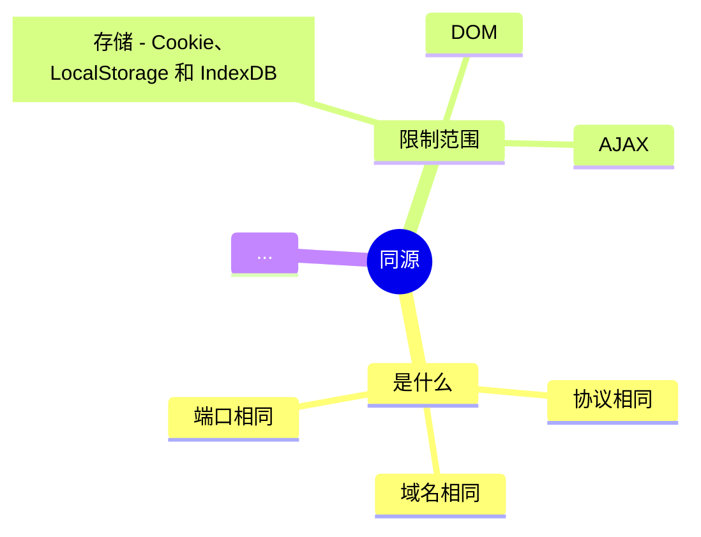

# 浏览器同源政策

```mermaid
mindmap
  root((同源))
    是什么
      协议相同
      域名相同
      端口相同
    限制范围
      存储["存储 - Cookie、LocalStorage 和 IndexDB"]
      DOM
      AJAX
    ...
```

## 参考文献

- [浏览器同源政策及其规避方法](https://www.ruanyifeng.com/blog/2016/04/same-origin-policy.html)
