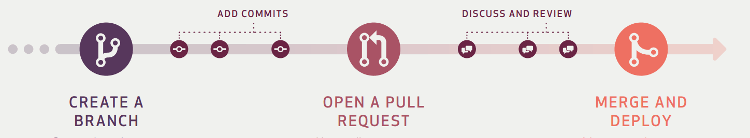

# 工作流


## 为什么


## 实现方案

### [Git Flow](https://github.com/nvie/gitflow)


- 主分支 Master：代码库应该有一个、且仅有一个主分支。所有提供给用户使用的正式版本，都在这个主分支上发布。
- 开发分支 Develop：主分支只用来分布重大版本，日常开发应该在另一条分支上完成。我们把开发用的分支，叫做 Develop。这个分支可以用来生成代码的最新隔夜版本（nightly）。如果想正式对外发布，就在 Master 分支上，对 Develop 分支进行"合并"（merge）。

    ```sh
    # 创建开发分支 Develop
    git checkout -b develop master

    # 切换到Master分支
　　git checkout master

　　# 对Develop分支进行合并
　　git merge --no-ff develop
    ```

    ps：使用 `--no-ff` 参数后，会执行正常合并，在 Master 分支上生成一个新节点。为了保证版本演进的清晰，我们希望采用这种做法。

- 临时性分支

    - 功能（feature）分支：第一种是功能分支，它是为了开发某种特定功能，从 Develop 分支上面分出来的。开发完成后，要再并入 Develop。
    - 预发布（release）分支：是指发布正式版本之前（即合并到Master分支之前），我们可能需要有一个预发布的版本进行测试。预发布分支是从 Develop 分支上面分出来的，预发布结束以后，必须合并进Develop和Master分支。
    - 修补bug（fixbug）分支：修补bug分支是从Master分支上面分出来的。修补结束以后，再合并进Master和Develop分支。

总结：Git flow的优点是清晰可控，缺点是相对复杂，需要同时维护两个长期分支。大多数工具都将master当作默认分支，可是开发是在develop分支进行的，这导致经常要切换分支，非常烦人。更大问题在于，这个模式是基于"版本发布"的，目标是一段时间以后产出一个新版本。但是，很多网站项目是"持续发布"，代码一有变动，就部署一次。这时，master分支和develop分支的差别不大，没必要维护两个长期分支。

### [Github Flow](http://scottchacon.com/2011/08/31/github-flow.html)

Github flow 是 Git flow 的简化版，专门配合"持续发布"。它是 Github.com 使用的工作流程。



> 第一步：根据需求，从master拉出新分支，不区分功能分支或补丁分支。
>
> 第二步：新分支开发完成后，或者需要讨论的时候，就向master发起一个pull request（简称PR）。
>
> 第三步：Pull Request既是一个通知，让别人注意到你的请求，又是一种对话机制，大家一起评审和讨论你的代码。对话过程中，你还可以不断提交代码。
>
> 第四步：你的Pull Request被接受，合并进master，重新部署后，原来你拉出来的那个分支就被删除。（先部署再合并也可。）

总结：Github flow 的最大优点就是简单，对于"持续发布"的产品，可以说是最合适的流程。问题在于它的假设：master分支的更新与产品的发布是一致的。也就是说，master分支的最新代码，默认就是当前的线上代码。可是，有些时候并非如此，代码合并进入master分支，并不代表它就能立刻发布。比如，苹果商店的APP提交审核以后，等一段时间才能上架。这时，如果还有新的代码提交，master分支就会与刚发布的版本不一致。另一个例子是，有些公司有发布窗口，只有指定时间才能发布，这也会导致线上版本落后于master分支。上面这种情况，只有master一个主分支就不够用了。通常，你不得不在master分支以外，另外新建一个production分支跟踪线上版本。

### [Gitlab flow](https://docs.gitlab.com/ee/workflow/gitlab_flow.html)

Gitlab flow 是 Git flow 与 Github flow 的综合。它吸取了两者的优点，既有适应不同开发环境的弹性，又有单一主分支的简单和便利。它是 Gitlab.com 推荐的做法。

Gitlab flow 的最大原则叫做"上游优先"（upsteam first），即只存在一个主分支master，它是所有其他分支的"上游"。只有上游分支采纳的代码变化，才能应用到其他分支。


对于"持续发布"的项目，它建议在master分支以外，再建立不同的环境分支。比如，"开发环境"的分支是master，"预发环境"的分支是pre-production，"生产环境"的分支是production。

开发分支是预发分支的"上游"，预发分支又是生产分支的"上游"。代码的变化，必须由"上游"向"下游"发展。比如，生产环境出现了bug，这时就要新建一个功能分支，先把它合并到master，确认没有问题，再cherry-pick到pre-production，这一步也没有问题，才进入production。

只有紧急情况，才允许跳过上游，直接合并到下游分支。

## 参考文献

- [Git分支管理策略](https://www.ruanyifeng.com/blog/2012/07/git.html)
- [Git 工作流程](https://www.ruanyifeng.com/blog/2015/12/git-workflow.html)
